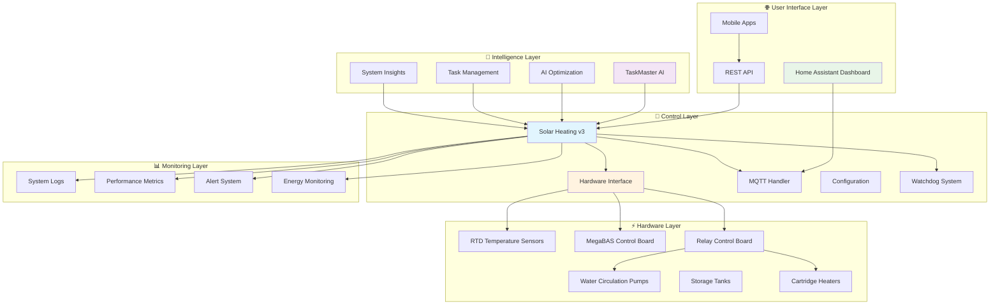
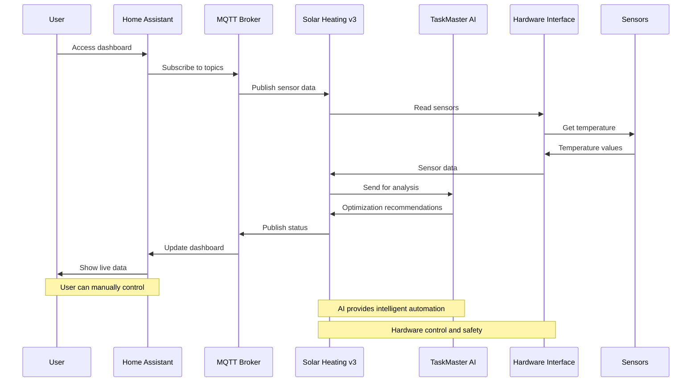
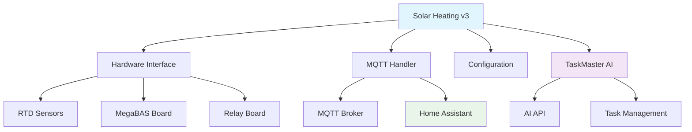

# Solar Heating System - Component Map

A visual guide to all components and their relationships in your solar heating system.

## 🗺️ **System Component Overview**



## 🔗 **Component Navigation Guide**

### **🏠 Core System Components**

| Component | Purpose | Documentation | Status |
|-----------|---------|---------------|---------|
| **Solar Heating v3** | Main control system | [README](python/v3/README.md) | ✅ Active |
| **Hardware Interface** | Hardware abstraction | [Hardware Interface](python/v3/hardware_interface.py) | ✅ Active |
| **MQTT Handler** | Communication layer | [MQTT Handler](python/v3/mqtt_handler.py) | ✅ Active |
| **Configuration** | System settings | [Config](python/v3/config.py) | ✅ Active |

### **🤖 AI & Intelligence**

| Component | Purpose | Documentation | Status |
|-----------|---------|---------------|---------|
| **TaskMaster AI** | AI integration | [README](taskmaster/README_TASKMASTER.md) | ✅ Active |
| **Task Service** | Task management | [Service](taskmaster/taskmaster_service.py) | ✅ Active |
| **AI Integration** | API integration | [Integration](taskmaster/taskmaster_integration.py) | ✅ Active |

### **🏡 Smart Home Integration**

| Component | Purpose | Documentation | Status |
|-----------|---------|---------------|---------|
| **Home Assistant** | Dashboard & control | [Setup](docs/HOME_ASSISTANT_SETUP.md) | ✅ Active |
| **Dashboard v3** | Main dashboard | [Config](docs/home_assistant_dashboard_v3.yaml) | ✅ Active |
| **Dashboard Simple** | Simplified view | [Config](docs/home_assistant_dashboard_v3_simple.yaml) | ✅ Active |

### **📊 Monitoring & Sensors**

| Component | Purpose | Documentation | Status |
|-----------|---------|---------------|---------|
| **Rate of Change** | Advanced sensors | [Summary](docs/RATE_OF_CHANGE_SENSORS_SUMMARY.md) | ✅ Active |
| **Real-time Energy** | Energy monitoring | [Setup](docs/REALTIME_ENERGY_SENSOR_SETUP.md) | ✅ Active |
| **System Monitoring** | Performance tracking | [Options](docs/MONITORING_OPTIONS.md) | ✅ Active |
| **Watchdog System** | Reliability | [Watchdog](docs/WATCHDOG_SYSTEM.md) | ✅ Active |

### **🚀 Deployment & Operations**

| Component | Purpose | Documentation | Status |
|-----------|---------|---------------|---------|
| **Deployment** | Production setup | [Guide](python/deployment/README.md) | ✅ Active |
| **Docker** | Container deployment | [Compose](python/v3/docker-compose.yml) | ✅ Active |
| **Systemd Services** | Service management | [Service](python/v3/solar_heating_v3.service) | ✅ Active |

## 📁 **File Organization Structure**

```
/
├── 📚 docs/                           # System documentation
│   ├── SYSTEM_OVERVIEW.md             # 🆕 Master system overview
│   ├── COMPONENT_MAP.md               # 🆕 This component map
│   ├── HOME_ASSISTANT_SETUP.md        # Smart home integration
│   ├── REALTIME_ENERGY_SENSOR_SETUP.md # Energy monitoring
│   ├── RATE_OF_CHANGE_SENSORS_SUMMARY.md # Advanced sensors
│   ├── MONITORING_OPTIONS.md          # System monitoring
│   ├── WATCHDOG_SYSTEM.md             # Reliability features
│   └── home_assistant_dashboard_*.yaml # Dashboard configs
├── 🚀 python/                         # Python implementation
│   ├── v1/                            # ❌ DEPRECATED
│   ├── v2/                            # ❌ DEPRECATED
│   ├── v3/                            # ✅ ACTIVE - Main system
│   └── deployment/                    # ✅ ACTIVE - Deployment scripts
├── ⚡ taskmaster/                      # ✅ ACTIVE - AI integration
├── ⚙️ config/                          # Configuration files
└── 📖 README.md                       # Project overview
```

## 🔄 **Data Flow Between Components**



## 🎯 **Component Dependencies**

### **Core Dependencies**



### **Integration Points**

- **MQTT Broker**: Central communication hub
- **Home Assistant**: User interface and control
- **TaskMaster AI**: Intelligence and optimization
- **Hardware**: Physical sensors and actuators

## 🚀 **Getting Started Paths**

### **Path 1: Quick Demo**
1. **Start Here**: [SYSTEM_OVERVIEW.md](SYSTEM_OVERVIEW.md)
2. **Run Demo**: `python/v3/main_system.py` (simulation mode)
3. **See Results**: Basic temperature monitoring

### **Path 2: Full Setup**
1. **Hardware**: [Hardware Setup](python/v3/connect_hardware.sh)
2. **Configuration**: [Config Guide](python/v3/README.md#configuration)
3. **Home Assistant**: [HA Setup](docs/HOME_ASSISTANT_SETUP.md)
4. **AI Integration**: [TaskMaster Setup](taskmaster/README_TASKMASTER.md)

### **Path 3: Production**
1. **Deployment**: [Deployment Guide](python/deployment/README.md)
2. **Monitoring**: [Monitoring Setup](docs/MONITORING_OPTIONS.md)
3. **Reliability**: [Watchdog Setup](docs/WATCHDOG_SYSTEM.md)

## 🔍 **Component Status & Health**

### **✅ Active Components**
- **Solar Heating v3**: Production ready, fully documented
- **TaskMaster AI**: Integrated, API ready
- **Home Assistant**: Fully configured, dashboards ready
- **Hardware Interface**: Tested, simulation mode available
- **Monitoring**: Comprehensive logging and alerts

### **🔄 In Development**
- **Advanced AI Features**: Enhanced optimization algorithms
- **Mobile App**: Native mobile application
- **Cloud Integration**: Remote monitoring and control

### **📋 Planned Features**
- **Predictive Maintenance**: AI-powered maintenance scheduling
- **Energy Optimization**: Advanced energy efficiency algorithms
- **Multi-Site Support**: Multiple heating system management

## 🤝 **Component Communication**

### **MQTT Topics Used**

| Component | Publishes | Subscribes |
|-----------|-----------|------------|
| **Solar Heating v3** | `solar_heating_v3/*` | `control/*`, `hass/*` |
| **TaskMaster AI** | `taskmaster/*` | `solar_heating_v3/*` |
| **Home Assistant** | `hass/*` | `solar_heating_v3/*` |
| **Monitoring** | `monitoring/*` | `solar_heating_v3/*` |

### **API Endpoints**

- **REST API**: System control and status
- **MQTT API**: Real-time communication
- **TaskMaster API**: AI integration
- **Hardware API**: Direct hardware control

## 📚 **Documentation Coverage**

### **Complete Coverage** ✅
- **Solar Heating v3**: 5/5 documents complete
  - ✅ `REQUIREMENTS_SOLAR_HEATING_V3.md`
  - ✅ `DESIGN_SOLAR_HEATING_V3.md` 
  - ✅ `USER_GUIDE_SOLAR_HEATING_V3.md`
  - ✅ `SUMMARY_SOLAR_HEATING_V3.md`
  - ✅ `IMPLEMENTATION_SOLAR_HEATING_V3.md`
- Rate of Change Sensors (5/5 documents)
- System Overview (1/1 document)
- Component Map (1/1 document)

### **Partial Coverage** 🔄
- TaskMaster AI (1/5 documents)
- Home Assistant Integration (1/5 documents)

### **Missing Documentation** ❌
- AI system technical details
- Integration implementation guides

## 🎯 **Next Steps for Documentation**

1. **✅ Complete Main System Docs**: All 5 documents created for Solar Heating v3
2. **Complete AI Docs**: Create comprehensive TaskMaster AI documentation
3. **Complete Integration Docs**: Create Home Assistant integration guides
4. **Add Examples**: Include practical examples and use cases
5. **Update Links**: Ensure all cross-references are current

---

**Use this map to navigate between components and understand how everything fits together. Each component links to its detailed documentation for deeper exploration.**
