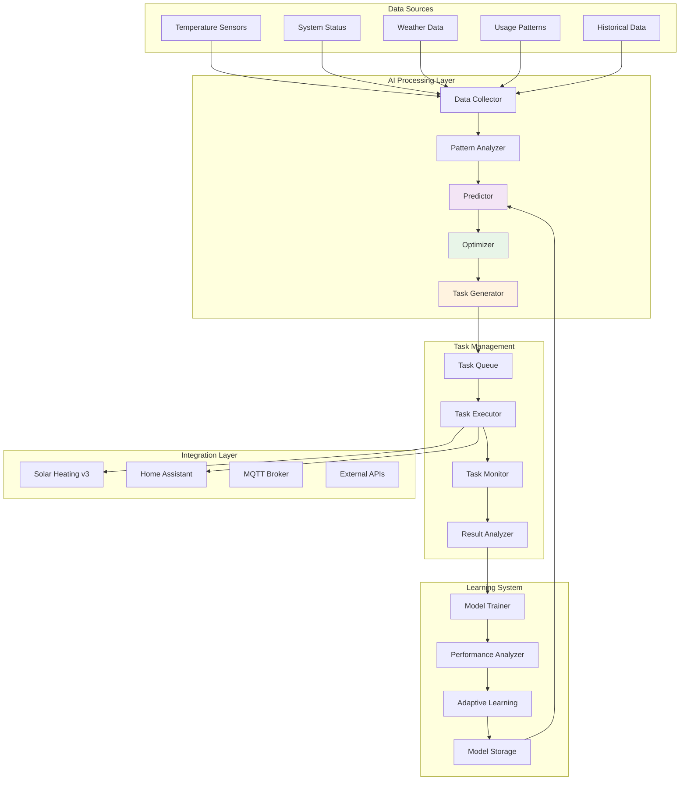
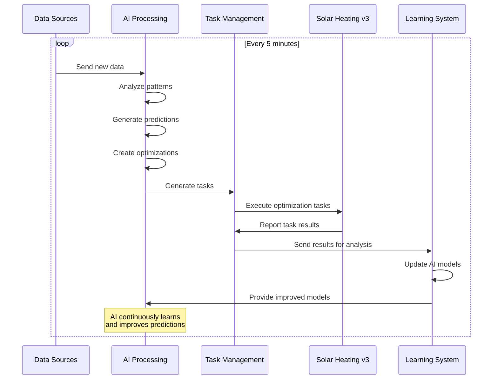
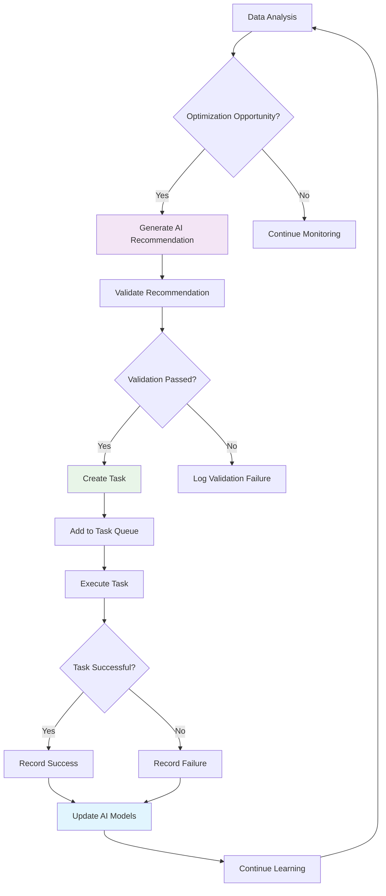
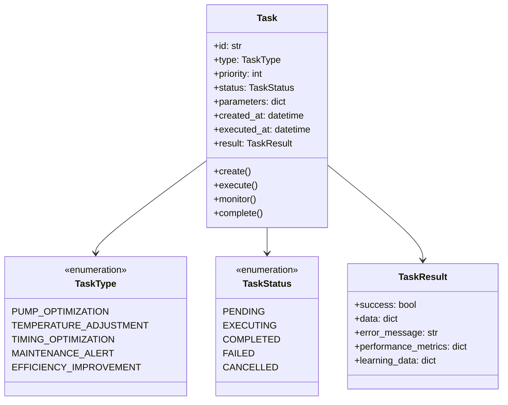
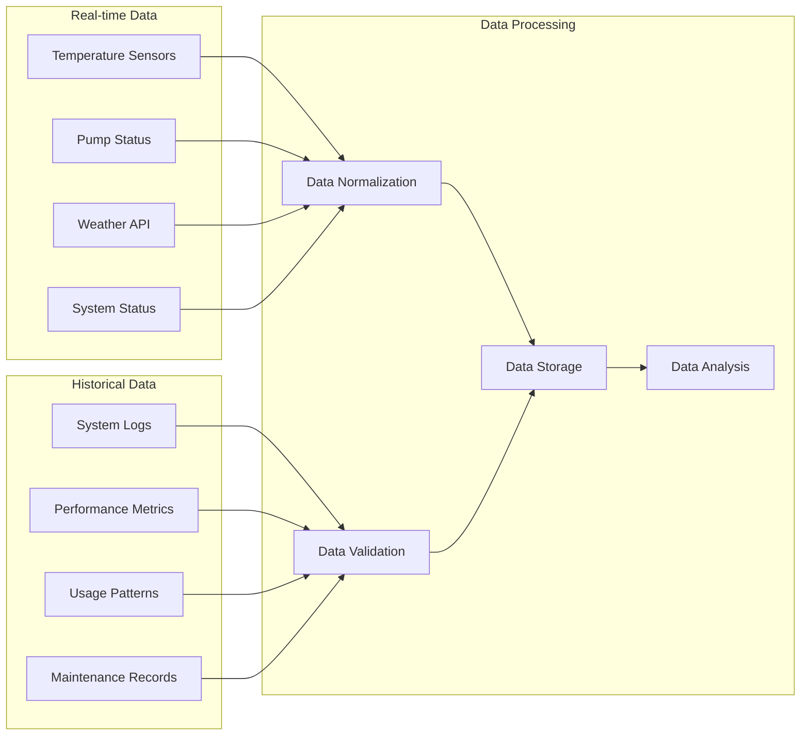
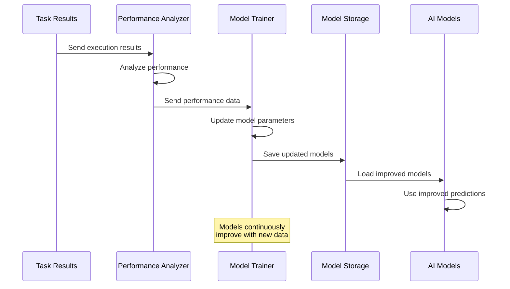
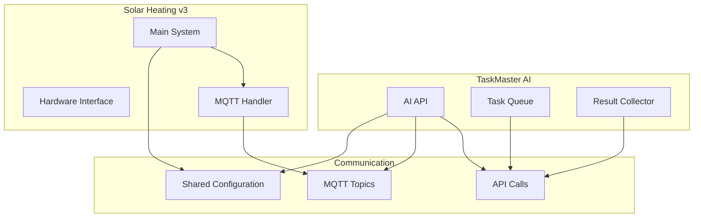
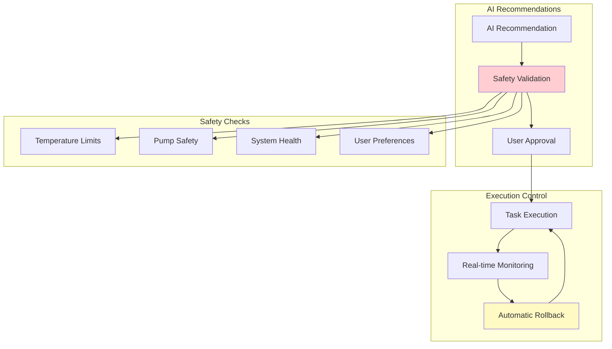

# Design: TaskMaster AI Integration

## 🏗️ **How the AI System Works**

This document explains the technical design and architecture of the TaskMaster AI integration, including how AI components interact, the learning algorithms, and the integration points with your solar heating system.

## 🏛️ **System Architecture**

### **High-Level AI Architecture**



### **Component Responsibilities**

| Component | Responsibility | Key Functions |
|-----------|----------------|---------------|
| **Data Collector** | Data aggregation | Collect data from all sources, normalize, and store |
| **Pattern Analyzer** | Pattern recognition | Identify patterns in temperature, usage, and weather |
| **Predictor** | Future predictions | Predict temperatures, usage, and system needs |
| **Optimizer** | System optimization | Generate optimization recommendations |
| **Task Generator** | Task creation | Create executable tasks from AI recommendations |
| **Task Executor** | Task execution | Execute AI tasks and monitor results |
| **Model Trainer** | AI learning | Train and update AI models based on results |

## 🔄 **AI Workflow**

### **Main AI Processing Loop**



### **Task Creation and Execution Flow**



## 🧠 **AI Algorithms and Learning**

### **Pattern Recognition Algorithm**

The AI uses **multi-dimensional pattern recognition** to identify optimization opportunities:

```python
class PatternAnalyzer:
    def __init__(self):
        self.patterns = {}
        self.confidence_threshold = 0.85
        
    def analyze_temperature_patterns(self, temperature_data):
        """Analyze temperature patterns for optimization opportunities"""
        patterns = {
            'daily_cycle': self.find_daily_cycles(temperature_data),
            'weather_correlation': self.correlate_with_weather(temperature_data),
            'usage_patterns': self.analyze_usage_patterns(temperature_data),
            'efficiency_trends': self.analyze_efficiency_trends(temperature_data)
        }
        
        return self.calculate_pattern_confidence(patterns)
    
    def find_daily_cycles(self, data):
        """Find daily temperature cycles"""
        # FFT analysis for daily patterns
        # Peak detection for optimal heating times
        # Valley detection for optimal pump start times
        pass
    
    def correlate_with_weather(self, temp_data, weather_data):
        """Correlate temperature with weather conditions"""
        # Linear regression for weather correlation
        # Cloud cover impact analysis
        # Wind speed impact analysis
        pass
```

### **Prediction Algorithm**

The AI uses **ensemble prediction methods** combining multiple algorithms:

```python
class Predictor:
    def __init__(self):
        self.models = {
            'linear_regression': LinearRegressionModel(),
            'time_series': TimeSeriesModel(),
            'neural_network': NeuralNetworkModel(),
            'ensemble': EnsembleModel()
        }
        
    def predict_temperature(self, current_data, weather_forecast, time_horizon):
        """Predict temperature for given time horizon"""
        predictions = {}
        
        for model_name, model in self.models.items():
            predictions[model_name] = model.predict(
                current_data, weather_forecast, time_horizon
            )
        
        # Ensemble prediction (weighted average)
        ensemble_prediction = self.ensemble_predict(predictions)
        
        # Confidence calculation
        confidence = self.calculate_prediction_confidence(predictions)
        
        return ensemble_prediction, confidence
    
    def ensemble_predict(self, predictions):
        """Combine predictions using weighted ensemble"""
        weights = self.calculate_model_weights()
        ensemble = 0
        
        for model_name, prediction in predictions.items():
            ensemble += weights[model_name] * prediction
            
        return ensemble
```

### **Optimization Algorithm**

The AI uses **multi-objective optimization** to balance efficiency, cost, and comfort:

```python
class Optimizer:
    def __init__(self):
        self.objectives = ['efficiency', 'cost', 'comfort', 'safety']
        self.constraints = self.load_optimization_constraints()
        
    def optimize_system_settings(self, predictions, current_state):
        """Optimize system settings for best performance"""
        # Define optimization problem
        problem = {
            'variables': {
                'pump_start_temp': (60, 80),  # Range in °C
                'pump_stop_temp': (40, 60),   # Range in °C
                'heating_threshold': (5, 15), # Range in °C
                'timing_offset': (-30, 30)    # Range in minutes
            },
            'objectives': [
                'maximize_efficiency',
                'minimize_cost',
                'maximize_comfort',
                'ensure_safety'
            ],
            'constraints': self.constraints
        }
        
        # Solve optimization problem
        solution = self.solve_optimization(problem, predictions, current_state)
        
        return solution
    
    def solve_optimization(self, problem, predictions, current_state):
        """Solve multi-objective optimization problem"""
        # Use genetic algorithm or similar for multi-objective optimization
        # Return Pareto-optimal solutions
        pass
```

## 🔧 **Task Management System**

### **Task Structure and Types**



### **Task Execution Engine**

```python
class TaskExecutor:
    def __init__(self, solar_system, home_assistant):
        self.solar_system = solar_system
        self.home_assistant = home_assistant
        self.execution_history = []
        
    def execute_task(self, task):
        """Execute an AI-generated task"""
        try:
            # Validate task parameters
            self.validate_task(task)
            
            # Execute based on task type
            if task.type == TaskType.PUMP_OPTIMIZATION:
                result = self.execute_pump_optimization(task)
            elif task.type == TaskType.TEMPERATURE_ADJUSTMENT:
                result = self.execute_temperature_adjustment(task)
            elif task.type == TaskType.TIMING_OPTIMIZATION:
                result = self.execute_timing_optimization(task)
            else:
                result = self.execute_generic_task(task)
            
            # Record execution result
            self.record_execution_result(task, result)
            
            return result
            
        except Exception as e:
            error_result = TaskResult(
                success=False,
                error_message=str(e)
            )
            self.record_execution_result(task, error_result)
            return error_result
    
    def execute_pump_optimization(self, task):
        """Execute pump optimization task"""
        params = task.parameters
        
        # Update pump control parameters
        self.solar_system.update_pump_settings(
            start_temp=params['start_temp'],
            stop_temp=params['stop_temp'],
            timing_offset=params['timing_offset']
        )
        
        # Monitor results
        result = self.monitor_pump_optimization(task)
        
        return result
```

## 📊 **Data Collection and Processing**

### **Data Sources and Collection**



### **Data Processing Pipeline**

```python
class DataCollector:
    def __init__(self):
        self.data_sources = {}
        self.processors = {}
        self.storage = DataStorage()
        
    def collect_real_time_data(self):
        """Collect real-time data from all sources"""
        data = {}
        
        # Collect temperature data
        data['temperatures'] = self.collect_temperature_data()
        
        # Collect system status
        data['system_status'] = self.collect_system_status()
        
        # Collect weather data
        data['weather'] = self.collect_weather_data()
        
        # Collect pump status
        data['pump_status'] = self.collect_pump_status()
        
        return data
    
    def process_data(self, raw_data):
        """Process and normalize collected data"""
        processed_data = {}
        
        for data_type, data in raw_data.items():
            processor = self.processors.get(data_type)
            if processor:
                processed_data[data_type] = processor.process(data)
            else:
                processed_data[data_type] = data
        
        return processed_data
    
    def store_data(self, processed_data):
        """Store processed data for analysis"""
        timestamp = datetime.utcnow()
        
        for data_type, data in processed_data.items():
            self.storage.store(
                data_type=data_type,
                timestamp=timestamp,
                data=data
            )
```

## 🧠 **Learning and Adaptation System**

### **Model Training and Updates**



### **Adaptive Learning Algorithm**

```python
class AdaptiveLearning:
    def __init__(self):
        self.learning_rate = 0.01
        self.adaptation_threshold = 0.1
        
    def adapt_models(self, performance_data):
        """Adapt AI models based on performance data"""
        adaptations = {}
        
        for model_name, performance in performance_data.items():
            if self.needs_adaptation(performance):
                adaptation = self.calculate_adaptation(performance)
                adaptations[model_name] = adaptation
        
        return adaptations
    
    def needs_adaptation(self, performance):
        """Determine if model needs adaptation"""
        # Check if performance is below threshold
        if performance['accuracy'] < 0.85:
            return True
        
        # Check if performance is degrading
        if performance['trend'] < -self.adaptation_threshold:
            return True
        
        return False
    
    def calculate_adaptation(self, performance):
        """Calculate model adaptation parameters"""
        adaptation = {
            'learning_rate_adjustment': self.adjust_learning_rate(performance),
            'parameter_updates': self.calculate_parameter_updates(performance),
            'model_structure_changes': self.suggest_structure_changes(performance)
        }
        
        return adaptation
```

## 🔌 **Integration Points**

### **Solar Heating v3 Integration**



### **Home Assistant Integration**

```python
class HomeAssistantIntegration:
    def __init__(self, ha_client, mqtt_handler):
        self.ha_client = ha_client
        self.mqtt_handler = mqtt_handler
        
    def create_ai_dashboard(self):
        """Create AI insights dashboard in Home Assistant"""
        dashboard_config = {
            'title': 'AI Insights',
            'views': [
                self.create_ai_overview_view(),
                self.create_optimization_view(),
                self.create_learning_view(),
                self.create_recommendations_view()
            ]
        }
        
        return self.ha_client.create_dashboard(dashboard_config)
    
    def create_ai_overview_view(self):
        """Create AI overview dashboard view"""
        return {
            'title': 'AI Overview',
            'type': 'custom:grid-layout',
            'cards': [
                {
                    'type': 'custom:ai-status-card',
                    'title': 'AI System Status',
                    'ai_status': 'active'
                },
                {
                    'type': 'custom:ai-predictions-card',
                    'title': 'Temperature Predictions',
                    'prediction_horizon': '24h'
                },
                {
                    'type': 'custom:ai-optimizations-card',
                    'title': 'Recent Optimizations',
                    'max_items': 5
                }
            ]
        }
    
    def send_ai_notification(self, message, priority='info'):
        """Send AI notification via Home Assistant"""
        notification_data = {
            'title': 'AI Insight',
            'message': message,
            'priority': priority,
            'timestamp': datetime.utcnow().isoformat()
        }
        
        self.mqtt_handler.publish(
            topic='homeassistant/notify/ai',
            payload=notification_data
        )
```

## 🚨 **Safety and Validation**

### **AI Safety Systems**



### **Safety Validation Algorithm**

```python
class SafetyValidator:
    def __init__(self, safety_config):
        self.safety_config = safety_config
        self.validation_rules = self.load_validation_rules()
        
    def validate_task(self, task):
        """Validate AI task for safety"""
        validation_results = {
            'temperature_safety': self.validate_temperature_safety(task),
            'pump_safety': self.validate_pump_safety(task),
            'system_safety': self.validate_system_safety(task),
            'user_preferences': self.validate_user_preferences(task)
        }
        
        # Overall validation result
        is_safe = all(validation_results.values())
        
        return {
            'is_safe': is_safe,
            'validation_results': validation_results,
            'safety_score': self.calculate_safety_score(validation_results)
        }
    
    def validate_temperature_safety(self, task):
        """Validate temperature-related safety"""
        if 'temperature' in task.parameters:
            temp = task.parameters['temperature']
            
            # Check against safety limits
            if temp > self.safety_config['max_temperature']:
                return False
            
            if temp < self.safety_config['min_temperature']:
                return False
        
        return True
    
    def validate_pump_safety(self, task):
        """Validate pump operation safety"""
        if task.type == TaskType.PUMP_OPTIMIZATION:
            # Check pump operation limits
            # Verify pump health status
            # Check for conflicting operations
            pass
        
        return True
```

## 🔧 **Configuration and Customization**

### **AI Configuration Options**

```python
class AIConfiguration:
    def __init__(self):
        self.config = {
            'learning': {
                'enabled': True,
                'learning_rate': 0.01,
                'adaptation_threshold': 0.1,
                'model_update_frequency': 3600  # 1 hour
            },
            'optimization': {
                'enabled': True,
                'optimization_interval': 300,   # 5 minutes
                'prediction_horizon': 86400,    # 24 hours
                'confidence_threshold': 0.85
            },
            'safety': {
                'enabled': True,
                'max_temperature': 90.0,
                'min_temperature': 20.0,
                'require_user_approval': False,
                'automatic_rollback': True
            },
            'integration': {
                'solar_heating_enabled': True,
                'home_assistant_enabled': True,
                'mqtt_enabled': True,
                'external_apis_enabled': True
            }
        }
    
    def load_from_environment(self):
        """Load configuration from environment variables"""
        # Load AI configuration from environment
        pass
    
    def validate_configuration(self):
        """Validate AI configuration"""
        # Validate configuration values
        pass
```

## 🔗 **Related Documentation**

- **[Requirements Document](REQUIREMENTS_TASKMASTER_AI.md)** - What we built and why
- **[Implementation Guide](IMPLEMENTATION_TASKMASTER_AI.md)** - Technical implementation details
- **[User Guide](USER_GUIDE_TASKMASTER_AI.md)** - How to use the AI features
- **[Summary](SUMMARY_TASKMASTER_AI.md)** - Complete AI system overview
- **[System Overview](../SYSTEM_OVERVIEW.md)** - Complete system understanding
- **[Component Map](../COMPONENT_MAP.md)** - System component relationships

---

**This document explains how the TaskMaster AI integration works at a technical level, including the AI algorithms, learning systems, and integration points. It serves as the technical foundation for AI system implementation and maintenance.**
