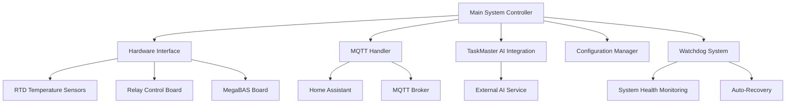
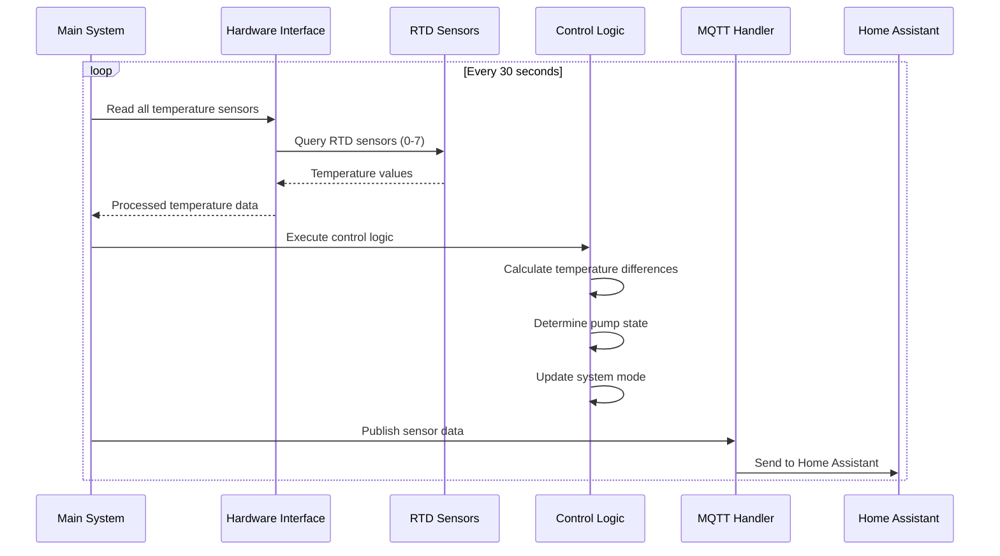
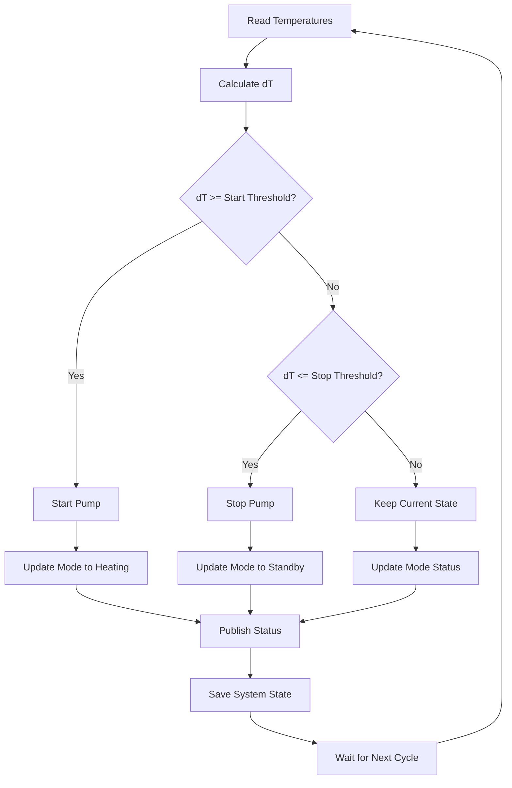

# Detailed Solar Heating v3 Core System Implementation Guide

## 🎯 **Overview**

This comprehensive guide covers the complete implementation details of the Solar Heating System v3, including architecture, algorithms, data flow, and technical specifications.

## 🏗️ **System Architecture**

### **Core Components**



### **File Structure and Responsibilities**

```
python/v3/
├── main_system.py              # 🎮 Main system orchestrator
│   ├── Temperature monitoring loop
│   ├── Control logic algorithms
│   ├── Energy calculation engine
│   ├── Mode management system
│   └── State persistence
│
├── hardware_interface.py       # 🔌 Hardware abstraction layer
│   ├── RTD sensor management
│   ├── Relay control interface
│   ├── MegaBAS board interface
│   └── Hardware simulation mode
│
├── mqtt_handler.py            # 📡 MQTT communication layer
│   ├── Home Assistant integration
│   ├── Sensor data publishing
│   ├── Command handling
│   └── Connection management
│
├── config.py                  # ⚙️ Configuration management
│   ├── System parameters
│   ├── Control thresholds
│   ├── MQTT settings
│   └── Feature toggles
│
├── taskmaster_integration.py  # 🤖 AI integration
│   ├── External AI service communication
│   ├── Task creation and management
│   ├── Fallback local processing
│   └── Error handling
│
├── watchdog.py                # 🛡️ System reliability
│   ├── Health monitoring
│   ├── Auto-recovery mechanisms
│   ├── Performance tracking
│   └── Alert generation
│
└── deployment/
    ├── docker-compose.yml     # 🐳 Container deployment
    ├── solar_heating_v3.service # 🔧 Systemd service
    └── connect_hardware.sh    # 🔌 Hardware setup
```

## 🔄 **Data Flow Architecture**

### **Temperature Reading Loop**



### **Control Logic Flow**



## 🌡️ **Temperature Management System**

### **Sensor Configuration**

| Sensor ID | Location | Purpose | Range | Accuracy |
|-----------|----------|---------|-------|----------|
| RTD 0 | Solar Collector | Primary heating source | -50°C to 200°C | ±0.1°C |
| RTD 1 | Storage Tank Top | Hot water storage | -50°C to 200°C | ±0.1°C |
| RTD 2 | Storage Tank Bottom | Cold water storage | -50°C to 200°C | ±0.1°C |
| RTD 3 | Return Line | System return temperature | -50°C to 200°C | ±0.1°C |
| RTD 4 | Heat Exchanger | Heat transfer efficiency | -50°C to 200°C | ±0.1°C |
| RTD 5 | Ambient | Environmental monitoring | -50°C to 200°C | ±0.1°C |
| RTD 6 | Spare | Future expansion | -50°C to 200°C | ±0.1°C |
| RTD 7 | Spare | Future expansion | -50°C to 200°C | ±0.1°C |

### **Temperature Reading Algorithm**

```python
def read_temperature_sensors(self):
    """Read all RTD temperature sensors with error handling"""
    temperatures = {}
    
    for sensor_id in range(8):
        try:
            # Read raw temperature from RTD board
            raw_temp = self.hardware.read_rtd_temperature(sensor_id)
            
            # Validate temperature reading
            if raw_temp is not None and -50 <= raw_temp <= 200:
                temperatures[f'rtd_sensor_{sensor_id}'] = round(raw_temp, 1)
            else:
                # Handle invalid readings
                temperatures[f'rtd_sensor_{sensor_id}'] = None
                self._handle_sensor_error(sensor_id, raw_temp)
                
        except Exception as e:
            logger.error(f"Error reading RTD sensor {sensor_id}: {e}")
            temperatures[f'rtd_sensor_{sensor_id}'] = None
    
    return temperatures
```

### **Temperature Difference Calculation**

```python
def calculate_temperature_difference(self):
    """Calculate temperature difference for control logic"""
    solar_collector = self.temperatures.get('solar_collector_temp', 0)
    storage_tank = self.temperatures.get('storage_tank_temp', 0)
    
    # Calculate dT (temperature difference)
    dT = solar_collector - storage_tank if solar_collector and storage_tank else 0
    
    # Store calculated values
    self.temperatures['solar_collector_dt'] = round(dT, 1)
    
    return dT
```

## ⚙️ **Control Logic Implementation**

### **Pump Control Algorithm**

```python
def execute_pump_control_logic(self, dT):
    """Execute pump control based on temperature difference"""
    
    # Emergency stop conditions
    if solar_collector >= self.control_params['temp_kok']:
        if self.system_state['primary_pump']:
            self._emergency_pump_stop()
            return
    
    # Normal control logic with hysteresis
    if dT >= self.control_params['dTStart_tank_1']:  # Start threshold (8°C)
        if not self.system_state['primary_pump']:
            self._start_pump(dT)
    
    elif dT <= self.control_params['dTStop_tank_1']:  # Stop threshold (4°C)
        if self.system_state['primary_pump']:
            self._stop_pump(dT)
    
    else:
        # Hysteresis zone - maintain current state
        self._maintain_current_state(dT)
```

### **Hysteresis Control**

The system uses hysteresis to prevent rapid pump cycling:

- **Start Threshold**: 8°C (pump starts when dT ≥ 8°C)
- **Stop Threshold**: 4°C (pump stops when dT ≤ 4°C)
- **Hysteresis Zone**: 4°C < dT < 8°C (maintains current state)

This prevents the pump from rapidly starting and stopping when temperatures are near the threshold.

### **Mode Management System**

```python
def update_system_mode(self):
    """Update system mode with detailed reasoning"""
    old_mode = self.system_state.get('mode', 'unknown')
    new_mode = None
    
    # Mode priority logic
    if self.system_state.get('test_mode', False):
        new_mode = 'test'
    elif self.system_state.get('manual_control', False):
        new_mode = 'manual'
    elif self.system_state.get('overheated', False):
        new_mode = 'overheated'
    elif self.system_state.get('primary_pump', False):
        new_mode = 'heating'
    else:
        new_mode = 'standby'
    
    # Log mode changes with reasoning
    if new_mode != old_mode:
        self._log_mode_change(old_mode, new_mode)
        self.system_state['mode'] = new_mode
```

## 🔋 **Energy Calculation Engine**

### **Stored Energy Calculation**

The system calculates stored energy using the formula:

```
E = m × c × ΔT

Where:
- E = Energy (kWh)
- m = Mass of water (360L = 360kg)
- c = Specific heat capacity of water (4.18 kJ/kg·K)
- ΔT = Temperature difference from reference (4°C)
```

### **Energy Collection Tracking**

```python
def calculate_energy_collection(self):
    """Calculate energy collected since last measurement"""
    current_time = time.time()
    current_stored_energy = self.temperatures.get('stored_energy_kwh', 0)
    
    # Get previous values
    last_energy = self.system_state.get('last_energy_calculation', current_time)
    last_stored_energy = self.system_state.get('last_stored_energy', current_stored_energy)
    
    if last_energy:
        time_diff = current_time - last_energy
        energy_diff = current_stored_energy - last_stored_energy
        
        if energy_diff > 0:  # Only count positive energy gains
            # Calculate energy rate (kWh/hour)
            energy_rate_per_hour = (energy_diff / time_diff) * 3600
            
            # Add to hourly and daily totals
            hourly_contribution = energy_rate_per_hour * (time_diff / 3600)
            self.system_state['energy_collected_hour'] += hourly_contribution
            self.system_state['energy_collected_today'] += hourly_contribution
```

### **Heat Source Attribution**

The system identifies which heat source is contributing energy:

```python
def identify_heat_sources(self, energy_diff):
    """Identify active heat sources and allocate energy"""
    active_sources = []
    
    # Check solar heating (pump running and collector hotter than tank)
    solar_active = (self.system_state.get('primary_pump', False) and 
                  self.temperatures.get('solar_collector_temp', 0) > 
                  self.temperatures.get('storage_tank_temp', 0) + 5)
    
    # Check cartridge heater
    cartridge_active = self.system_state.get('cartridge_heater', False)
    
    # Check pellet furnace (assumed if no other source but energy increasing)
    pellet_active = (not active_sources and energy_diff > 0)
    
    return active_sources
```

## 🕐 **Hourly Aggregation System**

### **Data Collection Strategy**

```python
async def status_publishing_loop(self):
    """Status publishing with hourly aggregation"""
    while self.running:
        current_time = time.time()
        seconds_into_hour = current_time % 3600
        is_end_of_hour = seconds_into_hour >= 3590  # Last 10 seconds
        
        if is_end_of_hour:
            # Publish complete hourly aggregation
            await self._publish_hourly_aggregation()
            await asyncio.sleep(10)  # Wait for hour boundary
        else:
            # Publish basic status (no hourly energy data)
            await self._publish_basic_status()
            sleep_time = min(300, 3600 - seconds_into_hour - 10)
            await asyncio.sleep(sleep_time)
```

### **Aggregation Logic**

- **During Hour**: Collect data continuously, publish basic status every 5 minutes
- **End of Hour**: Publish complete hourly energy totals
- **Data Reset**: Reset hourly counters for next hour

## 💾 **State Persistence System**

### **System State Management**

```python
def save_system_state(self):
    """Save operational metrics and energy data to persistent storage"""
    state_data = {
        # Operational metrics
        'pump_runtime_hours': self.system_state.get('pump_runtime_hours', 0.0),
        'heating_cycles_count': self.system_state.get('heating_cycles_count', 0),
        'total_heating_time': self.system_state.get('total_heating_time', 0.0),
        'total_heating_time_lifetime': self.system_state.get('total_heating_time_lifetime', 0.0),
        
        # Energy collection data (daily counters)
        'energy_collected_today': self.system_state.get('energy_collected_today', 0.0),
        'solar_energy_today': self.system_state.get('solar_energy_today', 0.0),
        'cartridge_energy_today': self.system_state.get('cartridge_energy_today', 0.0),
        'pellet_energy_today': self.system_state.get('pellet_energy_today', 0.0),
        
        # Reset tracking
        'last_midnight_reset_date': self.system_state.get('last_midnight_reset_date', ''),
        'last_day_reset': self.system_state.get('last_day_reset', 0),
        
        # Timestamps
        'last_save_time': time.time(),
        'last_save_date': datetime.now().isoformat()
    }
    
    with open('system_operational_state.json', 'w') as f:
        json.dump(state_data, f, indent=2)
```

### **Midnight Reset Logic**

```python
def is_midnight_reset_needed(self):
    """Check if midnight reset is needed with improved logic"""
    now = datetime.now()
    current_time = now.time()
    current_seconds = current_time.hour * 3600 + current_time.minute * 60 + current_time.second
    
    # Handle both before and after midnight cases
    if current_seconds >= 23 * 3600 + 59 * 60 + 50:  # After 23:59:50
        time_diff = (24 * 3600) - current_seconds
    elif current_seconds <= 10:  # Within 10 seconds after midnight
        time_diff = current_seconds
    else:
        time_diff = 999  # Not near midnight
    
    # Allow reset within 10 seconds of midnight
    if time_diff <= 10:
        last_reset_date = self.system_state.get('last_midnight_reset_date', '')
        today = now.date().isoformat()
        
        if last_reset_date != today:
            return True
    
    return False
```

## 🔧 **Configuration Management**

### **System Parameters**

```python
class Config(BaseModel):
    # Temperature Control
    set_temp_tank_1: float = Field(default=60.0, description="Target tank temperature")
    dTStart_tank_1: float = Field(default=8.0, description="Pump start threshold")
    dTStop_tank_1: float = Field(default=4.0, description="Pump stop threshold")
    temp_kok: float = Field(default=100.0, description="Emergency stop temperature")
    
    # System Behavior
    temperature_update_interval: int = Field(default=30, description="Temperature reading interval")
    log_level: str = Field(default="INFO", description="Logging level")
    test_mode: bool = Field(default=False, description="Enable test mode")
    
    # MQTT Configuration
    mqtt_broker: str = Field(default="192.168.0.110", description="MQTT broker address")
    mqtt_port: int = Field(default=1883, description="MQTT broker port")
    mqtt_username: str = Field(default="mqtt_beaches", description="MQTT username")
    mqtt_password: str = Field(default="uQX6NiZ.7R", description="MQTT password")
    
    # TaskMaster AI
    taskmaster_enabled: bool = Field(default=False, description="Enable TaskMaster AI")
    taskmaster_api_key: str = Field(default="", description="TaskMaster AI API key")
```

## 🛡️ **Error Handling and Recovery**

### **Hardware Error Handling**

```python
def handle_sensor_error(self, sensor_id, value):
    """Handle sensor reading errors with anti-spam logging"""
    if not hasattr(self, '_sensor_errors'):
        self._sensor_errors = set()
    
    if sensor_id not in self._sensor_errors:
        logger.error(f"Invalid RTD temperature reading: {value}°C for sensor {sensor_id}")
        self._sensor_errors.add(sensor_id)
    
    # Clear error if sensor recovers
    if hasattr(self, '_sensor_errors') and sensor_id in self._sensor_errors:
        if value is not None and -50 <= value <= 200:
            logger.info(f"RTD sensor {sensor_id} is working again")
            self._sensor_errors.remove(sensor_id)
```

### **System Recovery Mechanisms**

```python
def emergency_shutdown(self):
    """Emergency shutdown procedure"""
    logger.critical("EMERGENCY SHUTDOWN INITIATED")
    
    try:
        # Stop all pumps
        self.hardware.set_relay_state(1, False)  # Primary pump
        self.hardware.set_relay_state(2, False)  # Secondary pump
        
        # Turn off heaters
        self.hardware.set_relay_state(3, False)  # Cartridge heater
        
        # Update system state
        self.system_state['primary_pump'] = False
        self.system_state['cartridge_heater'] = False
        self.system_state['emergency_shutdown'] = True
        
        # Save state
        self._save_system_state()
        
        logger.critical("Emergency shutdown completed")
        
    except Exception as e:
        logger.critical(f"Error during emergency shutdown: {e}")
```

## 📊 **Performance Monitoring**

### **System Metrics**

The system tracks various performance metrics:

- **Pump Runtime**: Total hours of pump operation
- **Heating Cycles**: Number of heating cycles
- **Energy Collection**: Daily and hourly energy totals
- **Temperature Accuracy**: Sensor reading quality
- **System Uptime**: Overall system availability

### **Health Monitoring**

```python
def check_system_health(self):
    """Check overall system health"""
    health_status = {
        'hardware_connected': self.hardware.test_hardware_connection(),
        'mqtt_connected': self.mqtt.is_connected(),
        'sensor_errors': len(getattr(self, '_sensor_errors', set())),
        'last_temperature_update': self.system_state.get('last_temperature_update', 0),
        'system_uptime': time.time() - self.system_state.get('start_time', time.time())
    }
    
    return health_status
```

## 🚀 **Deployment and Scaling**

### **System Requirements**

- **Hardware**: Raspberry Pi 4 (4GB RAM recommended)
- **Storage**: 32GB+ microSD card
- **Network**: Ethernet connection for MQTT
- **Power**: 5V/3A power supply
- **Operating System**: Raspberry Pi OS (64-bit)

### **Performance Optimization**

- **Async Operations**: Non-blocking temperature readings
- **Connection Pooling**: Efficient MQTT connection management
- **State Caching**: Reduced file I/O operations
- **Error Recovery**: Automatic retry mechanisms

## 🔍 **Debugging and Troubleshooting**

### **Log Analysis**

```bash
# Monitor system logs
tail -f /home/pi/solar_heating/logs/solar_heating_v3.log

# Check for errors
grep "ERROR" /home/pi/solar_heating/logs/solar_heating_v3.log

# Monitor mode changes
grep "Mode changed" /home/pi/solar_heating/logs/solar_heating_v3.log

# Check temperature readings
grep "Temperature" /home/pi/solar_heating/logs/solar_heating_v3.log
```

### **Common Issues and Solutions**

1. **Sensor Reading Errors**: Check hardware connections
2. **MQTT Connection Issues**: Verify broker configuration
3. **Pump Not Starting**: Check temperature thresholds
4. **Mode Not Updating**: Verify control logic execution
5. **Energy Calculation Errors**: Check temperature sensor accuracy

## 📚 **Related Documentation**

- **`DETAILED_TASKMASTER_AI_INTEGRATION.md`** - AI integration details
- **`DETAILED_HOME_ASSISTANT_INTEGRATION.md`** - Smart home integration
- **`DETAILED_HARDWARE_SETUP.md`** - Hardware connection guide
- **`DETAILED_DEPLOYMENT_GUIDE.md`** - Production deployment
- **`USER_GUIDE_SOLAR_HEATING_V3.md`** - User operation guide

---

**This guide provides complete technical implementation details for the Solar Heating System v3. For specific component details, refer to the other detailed component guides.**
