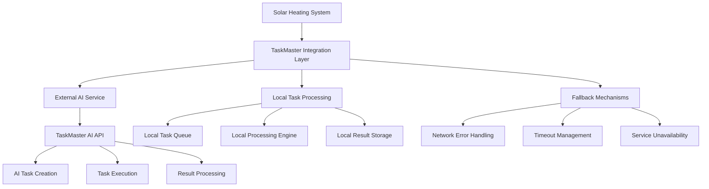

# Detailed TaskMaster AI Integration Guide

## 🎯 **Overview**

This comprehensive guide covers the complete TaskMaster AI integration system, including architecture, API communication, task management, fallback mechanisms, and error handling.

## 🤖 **TaskMaster AI Architecture**

### **Integration Components**



### **File Structure**

```
taskmaster/
├── taskmaster_integration.py  # 🤖 Main integration layer
├── taskmaster_service.py      # 🔧 Service management
├── taskmaster_config.py       # ⚙️ Configuration
└── taskmaster_demo.py         # 🧪 Demo and testing

python/v3/
├── taskmaster_integration.py  # 🔗 V3 system integration
└── config.py                  # ⚙️ TaskMaster configuration
```

## 🔧 **Integration Architecture**

### **Core Integration Class**

```python
class TaskMasterIntegration:
    """TaskMaster AI integration for solar heating system"""
    
    def __init__(self, config):
        self.config = config
        self.api_key = config.taskmaster_api_key
        self.base_url = config.taskmaster_base_url
        self.enabled = config.taskmaster_enabled
        self.local_tasks = []
        self.fallback_mode = False
        
    async def create_task(self, task_name: str, parameters: Dict[str, Any]) -> Dict[str, Any]:
        """Create task with fallback to local processing"""
        if not self.enabled:
            return self._create_local_task(task_name, parameters)
        
        try:
            # Attempt external AI service
            return await self._create_external_task(task_name, parameters)
        except (httpx.ConnectError, httpx.TimeoutException) as e:
            # Network issues - fallback to local
            logger.warning(f"TaskMaster AI connection failed: {e} - using local task")
            return self._create_local_task(task_name, parameters)
        except Exception as e:
            # Other errors - fallback to local
            logger.error(f"TaskMaster AI error: {e} - using local task")
            return self._create_local_task(task_name, parameters)
```

### **External AI Service Communication**

```python
async def _create_external_task(self, task_name: str, parameters: Dict[str, Any]) -> Dict[str, Any]:
    """Create task using external TaskMaster AI service"""
    async with httpx.AsyncClient(timeout=10.0) as client:
        headers = {
            "Authorization": f"Bearer {self.api_key}",
            "Content-Type": "application/json"
        }
        
        payload = {
            "task_name": task_name,
            "parameters": parameters,
            "system_context": {
                "system_type": "solar_heating_v3",
                "version": "3.0",
                "timestamp": time.time()
            }
        }
        
        response = await client.post(
            f"{self.base_url}/api/v1/tasks",
            headers=headers,
            json=payload
        )
        
        if response.status_code == 200:
            return response.json()
        else:
            raise Exception(f"API error: {response.status_code} - {response.text}")
```

### **Local Task Processing**

```python
def _create_local_task(self, task_name: str, parameters: Dict[str, Any]) -> Dict[str, Any]:
    """Create local task when external service is unavailable"""
    task_id = f"local_{int(time.time())}_{len(self.local_tasks)}"
    
    local_task = {
        "task_id": task_id,
        "task_name": task_name,
        "parameters": parameters,
        "status": "created",
        "created_at": time.time(),
        "source": "local_fallback",
        "result": self._process_local_task(task_name, parameters)
    }
    
    self.local_tasks.append(local_task)
    logger.info(f"Created local task: {task_name} (ID: {task_id})")
    
    return local_task

def _process_local_task(self, task_name: str, parameters: Dict[str, Any]) -> Dict[str, Any]:
    """Process task locally with basic logic"""
    if task_name == "pump_control":
        return self._process_pump_control_local(parameters)
    elif task_name == "temperature_analysis":
        return self._process_temperature_analysis_local(parameters)
    elif task_name == "energy_optimization":
        return self._process_energy_optimization_local(parameters)
    else:
        return {"status": "processed", "message": "Local processing completed"}
```

## 🔄 **Task Types and Processing**

### **Pump Control Tasks**

```python
async def process_pump_control(self, action: str, context: Dict[str, Any]):
    """Process pump control tasks"""
    task_parameters = {
        "action": action,
        "context": context,
        "system_state": {
            "current_mode": context.get("mode", "unknown"),
            "temperature_difference": context.get("dT", 0),
            "pump_runtime": context.get("pump_runtime_hours", 0),
            "cycle_count": context.get("heating_cycles_count", 0)
        }
    }
    
    result = await self.create_task("pump_control", task_parameters)
    
    # Process AI recommendations
    if result.get("recommendations"):
        self._apply_pump_recommendations(result["recommendations"])
    
    return result

def _process_pump_control_local(self, parameters: Dict[str, Any]) -> Dict[str, Any]:
    """Local pump control processing"""
    action = parameters.get("action", "unknown")
    context = parameters.get("context", {})
    
    # Basic local logic
    if action == "start":
        return {
            "status": "approved",
            "reason": "Temperature difference sufficient",
            "confidence": 0.8
        }
    elif action == "stop":
        return {
            "status": "approved", 
            "reason": "Temperature difference below threshold",
            "confidence": 0.9
        }
    else:
        return {
            "status": "unknown",
            "reason": "Unknown action",
            "confidence": 0.0
        }
```

### **Temperature Analysis Tasks**

```python
async def process_temperature_analysis(self, temperature_data: Dict[str, Any]):
    """Process temperature analysis tasks"""
    task_parameters = {
        "temperature_data": temperature_data,
        "analysis_type": "trend_analysis",
        "time_window": "1_hour",
        "system_context": {
            "current_mode": self.system_state.get("mode", "unknown"),
            "pump_state": self.system_state.get("primary_pump", False),
            "ambient_conditions": temperature_data.get("ambient_temp", 0)
        }
    }
    
    result = await self.create_task("temperature_analysis", task_parameters)
    
    # Process analysis results
    if result.get("insights"):
        self._process_temperature_insights(result["insights"])
    
    return result

def _process_temperature_analysis_local(self, parameters: Dict[str, Any]) -> Dict[str, Any]:
    """Local temperature analysis processing"""
    temp_data = parameters.get("temperature_data", {})
    
    # Basic trend analysis
    collector_temp = temp_data.get("solar_collector", 0)
    tank_temp = temp_data.get("storage_tank", 0)
    dT = collector_temp - tank_temp
    
    insights = []
    
    if dT > 10:
        insights.append("High temperature difference - optimal heating conditions")
    elif dT < 5:
        insights.append("Low temperature difference - heating efficiency reduced")
    
    if collector_temp > 80:
        insights.append("High collector temperature - monitor for overheating")
    
    return {
        "status": "analyzed",
        "insights": insights,
        "temperature_difference": dT,
        "efficiency_score": min(100, max(0, dT * 10))
    }
```

### **Energy Optimization Tasks**

```python
async def process_energy_optimization(self, energy_data: Dict[str, Any]):
    """Process energy optimization tasks"""
    task_parameters = {
        "energy_data": energy_data,
        "optimization_goals": [
            "maximize_solar_efficiency",
            "minimize_energy_waste",
            "optimize_heating_cycles"
        ],
        "constraints": {
            "max_pump_runtime": 12,  # hours per day
            "min_temperature": 50,   # minimum tank temperature
            "max_temperature": 80    # maximum tank temperature
        }
    }
    
    result = await self.create_task("energy_optimization", task_parameters)
    
    # Apply optimization recommendations
    if result.get("optimizations"):
        self._apply_energy_optimizations(result["optimizations"])
    
    return result

def _process_energy_optimization_local(self, parameters: Dict[str, Any]) -> Dict[str, Any]:
    """Local energy optimization processing"""
    energy_data = parameters.get("energy_data", {})
    
    # Basic optimization logic
    optimizations = []
    
    daily_energy = energy_data.get("energy_collected_today", 0)
    pump_runtime = energy_data.get("pump_runtime_hours", 0)
    
    if pump_runtime > 0:
        efficiency = daily_energy / pump_runtime
        if efficiency < 2.0:  # kWh per hour
            optimizations.append("Consider adjusting pump start threshold for better efficiency")
    
    if daily_energy < 10:  # kWh
        optimizations.append("Low daily energy collection - check system performance")
    
    return {
        "status": "optimized",
        "optimizations": optimizations,
        "efficiency_rating": min(100, max(0, efficiency * 50)),
        "recommendations": optimizations
    }
```

## 🔧 **Service Management**

### **TaskMaster Service Class**

```python
class TaskMasterService:
    """TaskMaster AI service management"""
    
    def __init__(self, config):
        self.integration = TaskMasterIntegration(config)
        self.service_status = "stopped"
        self.task_queue = asyncio.Queue()
        self.results_cache = {}
        
    async def initialize(self):
        """Initialize TaskMaster service"""
        try:
            if self.integration.enabled:
                # Test connection to external service
                await self._test_connection()
                self.service_status = "running"
                logger.info("TaskMaster AI service initialized successfully")
            else:
                self.service_status = "local_only"
                logger.info("TaskMaster AI service running in local mode")
        except Exception as e:
            self.service_status = "error"
            logger.error(f"Failed to initialize TaskMaster AI service: {e}")
    
    async def _test_connection(self):
        """Test connection to external TaskMaster AI service"""
        try:
            test_result = await self.integration.create_task("health_check", {})
            if test_result.get("status") == "success":
                logger.info("TaskMaster AI service connection test successful")
            else:
                raise Exception("Service test failed")
        except Exception as e:
            logger.warning(f"TaskMaster AI service connection test failed: {e}")
            raise
    
    async def process_system_status(self, system_status: Dict[str, Any]):
        """Process system status with TaskMaster AI"""
        if self.service_status == "stopped":
            return
        
        try:
            # Create system analysis task
            task_result = await self.integration.create_task("system_analysis", {
                "system_status": system_status,
                "analysis_type": "comprehensive",
                "timestamp": time.time()
            })
            
            # Process results
            if task_result.get("recommendations"):
                await self._process_recommendations(task_result["recommendations"])
            
            # Cache results
            self.results_cache["last_system_analysis"] = {
                "timestamp": time.time(),
                "result": task_result
            }
            
        except Exception as e:
            logger.error(f"Error processing system status with TaskMaster AI: {e}")
```

### **Task Queue Management**

```python
async def process_task_queue(self):
    """Process pending tasks in queue"""
    while True:
        try:
            # Get task from queue
            task = await self.task_queue.get()
            
            # Process task
            result = await self.integration.create_task(
                task["task_name"], 
                task["parameters"]
            )
            
            # Store result
            task["result"] = result
            task["completed_at"] = time.time()
            
            # Notify completion
            if task.get("callback"):
                await task["callback"](result)
            
            # Mark task as done
            self.task_queue.task_done()
            
        except Exception as e:
            logger.error(f"Error processing task queue: {e}")
            await asyncio.sleep(1)  # Wait before retrying

async def add_task(self, task_name: str, parameters: Dict[str, Any], callback=None):
    """Add task to processing queue"""
    task = {
        "task_name": task_name,
        "parameters": parameters,
        "callback": callback,
        "created_at": time.time(),
        "status": "queued"
    }
    
    await self.task_queue.put(task)
    logger.debug(f"Added task to queue: {task_name}")
```

## 🛡️ **Error Handling and Fallback**

### **Network Error Handling**

```python
async def _handle_network_error(self, error: Exception, task_name: str):
    """Handle network-related errors"""
    if isinstance(error, httpx.ConnectError):
        logger.warning(f"TaskMaster AI connection failed for {task_name}: {error}")
        self.fallback_mode = True
        return await self._create_local_task(task_name, {})
    
    elif isinstance(error, httpx.TimeoutException):
        logger.warning(f"TaskMaster AI timeout for {task_name}: {error}")
        return await self._create_local_task(task_name, {})
    
    elif isinstance(error, httpx.HTTPStatusError):
        logger.error(f"TaskMaster AI HTTP error for {task_name}: {error.response.status_code}")
        return await self._create_local_task(task_name, {})
    
    else:
        logger.error(f"Unexpected TaskMaster AI error for {task_name}: {error}")
        return await self._create_local_task(task_name, {})
```

### **Service Availability Monitoring**

```python
async def monitor_service_health(self):
    """Monitor TaskMaster AI service health"""
    while True:
        try:
            if self.integration.enabled and self.fallback_mode:
                # Try to reconnect
                await self._test_connection()
                self.fallback_mode = False
                logger.info("TaskMaster AI service reconnected")
            
            # Health check
            health_result = await self.integration.create_task("health_check", {})
            
            if health_result.get("status") != "success":
                self.fallback_mode = True
                logger.warning("TaskMaster AI service health check failed")
            
        except Exception as e:
            self.fallback_mode = True
            logger.warning(f"TaskMaster AI service health check error: {e}")
        
        # Check every 5 minutes
        await asyncio.sleep(300)
```

### **Local Processing Fallback**

```python
class LocalTaskProcessor:
    """Local task processing when external service is unavailable"""
    
    def __init__(self):
        self.processing_rules = {
            "pump_control": self._process_pump_control,
            "temperature_analysis": self._process_temperature_analysis,
            "energy_optimization": self._process_energy_optimization,
            "system_analysis": self._process_system_analysis
        }
    
    def process_task(self, task_name: str, parameters: Dict[str, Any]) -> Dict[str, Any]:
        """Process task locally"""
        processor = self.processing_rules.get(task_name)
        
        if processor:
            try:
                return processor(parameters)
            except Exception as e:
                logger.error(f"Error in local task processing for {task_name}: {e}")
                return {"status": "error", "message": str(e)}
        else:
            return {"status": "unsupported", "message": f"Local processing not available for {task_name}"}
    
    def _process_system_analysis(self, parameters: Dict[str, Any]) -> Dict[str, Any]:
        """Local system analysis processing"""
        system_status = parameters.get("system_status", {})
        
        analysis = {
            "status": "analyzed",
            "timestamp": time.time(),
            "insights": [],
            "recommendations": []
        }
        
        # Basic system analysis
        mode = system_status.get("mode", "unknown")
        pump_runtime = system_status.get("pump_runtime_hours", 0)
        
        if mode == "heating" and pump_runtime > 8:
            analysis["insights"].append("Extended heating cycle detected")
            analysis["recommendations"].append("Monitor system efficiency")
        
        if mode == "standby" and pump_runtime == 0:
            analysis["insights"].append("System in standby mode")
            analysis["recommendations"].append("Check temperature conditions")
        
        return analysis
```

## ⚙️ **Configuration Management**

### **TaskMaster Configuration**

```python
class TaskMasterConfig:
    """TaskMaster AI configuration"""
    
    def __init__(self):
        self.enabled = False  # Default to disabled
        self.api_key = ""
        self.base_url = "https://api.taskmaster.ai"
        self.timeout = 10.0
        self.retry_attempts = 3
        self.retry_delay = 5.0
        self.fallback_enabled = True
        self.local_processing = True
        
    def load_from_config(self, config):
        """Load configuration from main system config"""
        self.enabled = config.taskmaster_enabled
        self.api_key = config.taskmaster_api_key
        self.base_url = config.taskmaster_base_url
        
    def validate_config(self) -> bool:
        """Validate TaskMaster configuration"""
        if self.enabled:
            if not self.api_key:
                logger.error("TaskMaster AI enabled but no API key provided")
                return False
            
            if not self.base_url:
                logger.error("TaskMaster AI enabled but no base URL provided")
                return False
        
        return True
```

## 📊 **Performance Monitoring**

### **Task Performance Metrics**

```python
class TaskPerformanceMonitor:
    """Monitor TaskMaster AI task performance"""
    
    def __init__(self):
        self.task_metrics = {
            "total_tasks": 0,
            "successful_tasks": 0,
            "failed_tasks": 0,
            "local_fallback_tasks": 0,
            "average_response_time": 0.0,
            "last_24h_tasks": 0
        }
        self.response_times = []
    
    def record_task(self, task_name: str, success: bool, response_time: float, local_fallback: bool = False):
        """Record task performance metrics"""
        self.task_metrics["total_tasks"] += 1
        
        if success:
            self.task_metrics["successful_tasks"] += 1
        else:
            self.task_metrics["failed_tasks"] += 1
        
        if local_fallback:
            self.task_metrics["local_fallback_tasks"] += 1
        
        # Update response time average
        self.response_times.append(response_time)
        if len(self.response_times) > 100:  # Keep last 100 measurements
            self.response_times.pop(0)
        
        self.task_metrics["average_response_time"] = sum(self.response_times) / len(self.response_times)
    
    def get_performance_report(self) -> Dict[str, Any]:
        """Get performance report"""
        success_rate = 0.0
        if self.task_metrics["total_tasks"] > 0:
            success_rate = (self.task_metrics["successful_tasks"] / self.task_metrics["total_tasks"]) * 100
        
        fallback_rate = 0.0
        if self.task_metrics["total_tasks"] > 0:
            fallback_rate = (self.task_metrics["local_fallback_tasks"] / self.task_metrics["total_tasks"]) * 100
        
        return {
            "total_tasks": self.task_metrics["total_tasks"],
            "success_rate": round(success_rate, 2),
            "fallback_rate": round(fallback_rate, 2),
            "average_response_time": round(self.task_metrics["average_response_time"], 3),
            "last_updated": time.time()
        }
```

## 🧪 **Testing and Development**

### **TaskMaster Demo Script**

```python
async def demo_taskmaster_integration():
    """Demo TaskMaster AI integration"""
    print("🤖 TaskMaster AI Integration Demo")
    print("=" * 50)
    
    # Initialize service
    config = TaskMasterConfig()
    service = TaskMasterService(config)
    await service.initialize()
    
    # Test pump control task
    print("\n🔧 Testing Pump Control Task...")
    pump_result = await service.integration.create_task("pump_control", {
        "action": "start",
        "context": {
            "dT": 8.5,
            "mode": "heating",
            "pump_runtime_hours": 2.5
        }
    })
    print(f"Result: {pump_result}")
    
    # Test temperature analysis task
    print("\n🌡️ Testing Temperature Analysis Task...")
    temp_result = await service.integration.create_task("temperature_analysis", {
        "temperature_data": {
            "solar_collector": 45.2,
            "storage_tank": 36.7,
            "ambient_temp": 15.0
        }
    })
    print(f"Result: {temp_result}")
    
    # Test energy optimization task
    print("\n⚡ Testing Energy Optimization Task...")
    energy_result = await service.integration.create_task("energy_optimization", {
        "energy_data": {
            "energy_collected_today": 15.5,
            "pump_runtime_hours": 6.2,
            "solar_energy_today": 12.3
        }
    })
    print(f"Result: {energy_result}")
    
    print("\n✅ Demo completed successfully!")

if __name__ == "__main__":
    asyncio.run(demo_taskmaster_integration())
```

## 🔍 **Debugging and Troubleshooting**

### **Common Issues and Solutions**

1. **Connection Failures**
   - Check API key configuration
   - Verify network connectivity
   - Test with demo script

2. **Timeout Errors**
   - Increase timeout settings
   - Check service availability
   - Monitor response times

3. **Local Fallback Issues**
   - Verify local processing logic
   - Check task queue management
   - Monitor fallback metrics

### **Debug Commands**

```bash
# Test TaskMaster AI connection
python3 taskmaster/taskmaster_demo.py

# Monitor TaskMaster logs
grep "TaskMaster" /home/pi/solar_heating/logs/solar_heating_v3.log

# Check service status
python3 -c "from taskmaster.taskmaster_service import TaskMasterService; print('Service status:', TaskMasterService().service_status)"
```

## 📚 **Related Documentation**

- **`DETAILED_SOLAR_HEATING_V3_IMPLEMENTATION.md`** - Core system implementation
- **`DETAILED_HOME_ASSISTANT_INTEGRATION.md`** - Smart home integration
- **`DETAILED_HARDWARE_SETUP.md`** - Hardware connection guide
- **`DETAILED_DEPLOYMENT_GUIDE.md`** - Production deployment
- **`USER_GUIDE_TASKMASTER_AI.md`** - User operation guide

---

**This guide provides complete technical details for TaskMaster AI integration. The system is designed to gracefully handle service unavailability with robust local fallback mechanisms.**
