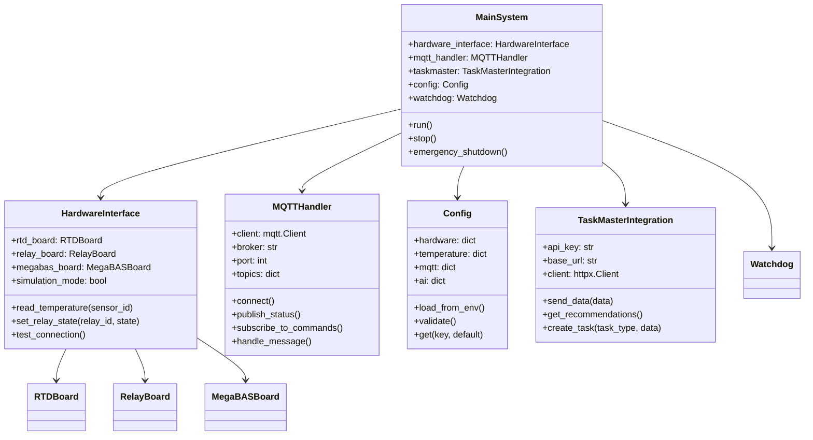

# Implementation: Solar Heating System v3

## 🔧 **Technical Implementation Details**

This document provides the technical implementation details for the Solar Heating v3 system, including code structure, key algorithms, and implementation patterns.

## 🏗️ **Code Architecture**

### **File Structure**

```
python/v3/
├── main_system.py              # Main system controller
├── hardware_interface.py       # Hardware abstraction layer
├── mqtt_handler.py            # MQTT communication
├── config.py                  # Configuration management
├── taskmaster_integration.py  # AI integration
├── watchdog.py                # System reliability
├── requirements.txt           # Python dependencies
├── docker-compose.yml         # Container deployment
├── solar_heating_v3.service  # Systemd service
└── connect_hardware.sh        # Hardware setup script
```

### **Core Classes and Relationships**



## 🔄 **Main System Implementation**

### **Main Control Loop**

```python
class MainSystem:
    def __init__(self):
        self.config = Config()
        self.hardware = HardwareInterface(self.config)
        self.mqtt = MQTTHandler(self.config)
        self.taskmaster = TaskMasterIntegration(self.config)
        self.watchdog = Watchdog()
        self.running = False
        
    def run(self):
        """Main system control loop"""
        try:
            self.initialize()
            self.running = True
            
            while self.running:
                # Read all sensors
                temperatures = self.read_all_temperatures()
                
                # Apply control logic
                pump_states = self.apply_control_logic(temperatures)
                
                # Check safety conditions
                if self.check_safety_conditions(temperatures):
                    self.emergency_shutdown()
                    break
                
                # Update hardware states
                self.update_hardware_states(pump_states)
                
                # Send data to AI
                self.send_data_to_ai(temperatures, pump_states)
                
                # Publish MQTT status
                self.publish_status(temperatures, pump_states)
                
                # Process incoming commands
                self.process_commands()
                
                # Wait for next cycle
                time.sleep(self.config.get('temperature_update_interval', 30))
                
        except Exception as e:
            self.logger.error(f"System error: {e}")
            self.emergency_shutdown()
        finally:
            self.cleanup()
    
    def read_all_temperatures(self):
        """Read all temperature sensors"""
        temperatures = {}
        for sensor_id in range(4):  # 4 RTD sensors
            try:
                temp = self.hardware.read_temperature(sensor_id)
                temperatures[f"sensor_{sensor_id}"] = temp
            except Exception as e:
                self.logger.error(f"Error reading sensor {sensor_id}: {e}")
                temperatures[f"sensor_{sensor_id}"] = None
        return temperatures
    
    def apply_control_logic(self, temperatures):
        """Apply temperature-based control logic"""
        solar_temp = temperatures.get("sensor_0", 0)  # Solar collector
        tank_temp = temperatures.get("sensor_1", 0)   # Storage tank
        
        if solar_temp is None or tank_temp is None:
            return {"pump_primary": "error"}
        
        # Calculate temperature difference
        dT = solar_temp - tank_temp
        
        # Get configuration values
        set_temp = self.config.get("set_temp_tank_1", 70.0)
        dT_start = self.config.get("dTStart_tank_1", 8.0)
        dT_stop = self.config.get("dTStop_tank_1", 4.0)
        
        # Apply control logic
        if tank_temp < set_temp:
            if dT >= dT_start:
                return {"pump_primary": "start"}
            else:
                return {"pump_primary": "keep_current"}
        else:
            if dT <= dT_stop:
                return {"pump_primary": "stop"}
            else:
                return {"pump_primary": "keep_current"}
```

### **Safety System Implementation**

```python
class SafetySystem:
    def __init__(self, config):
        self.config = config
        self.emergency_shutdown_triggered = False
        
    def check_safety_conditions(self, temperatures):
        """Check all safety conditions"""
        # Check boiling temperature
        if self.check_boiling_temperature(temperatures):
            return True
            
        # Check high temperature threshold
        if self.check_high_temperature(temperatures):
            return True
            
        # Check low temperature threshold
        if self.check_low_temperature(temperatures):
            return True
            
        # Check hardware health
        if self.check_hardware_health():
            return True
            
        return False
    
    def check_boiling_temperature(self, temperatures):
        """Check for boiling temperature emergency"""
        solar_temp = temperatures.get("sensor_0", 0)
        boiling_temp = self.config.get("temp_kok", 150.0)
        
        if solar_temp > boiling_temp:
            self.logger.critical(f"BOILING TEMPERATURE DETECTED: {solar_temp}°C")
            return True
        return False
    
    def check_high_temperature(self, temperatures):
        """Check for high temperature warnings"""
        high_threshold = self.config.get("temp_threshold_high", 80.0)
        
        for sensor_id, temp in temperatures.items():
            if temp and temp > high_threshold:
                self.logger.warning(f"High temperature on {sensor_id}: {temp}°C")
                # Don't trigger emergency, just warn
                
        return False
    
    def emergency_shutdown(self):
        """Execute emergency shutdown"""
        if self.emergency_shutdown_triggered:
            return  # Already shutdown
            
        self.emergency_shutdown_triggered = True
        self.logger.critical("EMERGENCY SHUTDOWN INITIATED")
        
        # Stop all pumps
        self.stop_all_pumps()
        
        # Disable all heaters
        self.disable_all_heaters()
        
        # Publish emergency status
        self.publish_emergency_status()
        
        # Wait for manual reset
        self.wait_for_manual_reset()
```

## ⚡ **Hardware Interface Implementation**

### **RTD Temperature Sensor Interface**

```python
class RTDBoard:
    def __init__(self, board_address=0):
        self.board_address = board_address
        self.rtd = None
        self.initialize()
    
    def initialize(self):
        """Initialize RTD board"""
        try:
            import rtd
            self.rtd = rtd.RTD(board_address=self.board_address)
            self.logger.info(f"RTD board initialized at address {self.board_address}")
        except ImportError:
            self.logger.error("RTD library not available")
            self.rtd = None
        except Exception as e:
            self.logger.error(f"Failed to initialize RTD board: {e}")
            self.rtd = None
    
    def read_temperature(self, sensor_id):
        """Read temperature from specific sensor"""
        if not self.rtd:
            raise RuntimeError("RTD board not initialized")
        
        try:
            # Read raw RTD value
            raw_value = self.rtd.read(sensor_id)
            
            # Convert to temperature (Celsius)
            temperature = self.convert_rtd_to_temperature(raw_value)
            
            # Apply calibration if available
            calibrated_temp = self.apply_calibration(sensor_id, temperature)
            
            return calibrated_temp
            
        except Exception as e:
            self.logger.error(f"Error reading RTD sensor {sensor_id}: {e}")
            raise
    
    def convert_rtd_to_temperature(self, raw_value):
        """Convert RTD resistance to temperature"""
        # Standard PT100 RTD conversion
        # R0 = 100 ohms at 0°C
        # T = (R - R0) / (alpha * R0)
        R0 = 100.0  # ohms at 0°C
        alpha = 0.00385  # PT100 temperature coefficient
        
        if raw_value <= 0:
            return -200  # Error value
            
        resistance = raw_value
        temperature = (resistance - R0) / (alpha * R0)
        
        return temperature
    
    def apply_calibration(self, sensor_id, temperature):
        """Apply sensor-specific calibration"""
        # Load calibration data from config
        calibration = self.config.get(f"rtd_calibration_{sensor_id}", {})
        
        if not calibration:
            return temperature
        
        # Apply offset and scale corrections
        offset = calibration.get("offset", 0.0)
        scale = calibration.get("scale", 1.0)
        
        calibrated_temp = (temperature + offset) * scale
        
        return calibrated_temp
```

### **Relay Control Interface**

```python
class RelayBoard:
    def __init__(self, board_address=2):
        self.board_address = board_address
        self.relay = None
        self.relay_states = [False] * 4  # 4 relays
        self.initialize()
    
    def initialize(self):
        """Initialize relay board"""
        try:
            import relay4
            self.relay = relay4.Relay4(board_address=self.board_address)
            self.logger.info(f"Relay board initialized at address {self.board_address}")
        except ImportError:
            self.logger.error("Relay4 library not available")
            self.relay = None
        except Exception as e:
            self.logger.error(f"Failed to initialize relay board: {e}")
            self.relay = None
    
    def set_relay_state(self, relay_id, state):
        """Set relay state (True = ON, False = OFF)"""
        if not self.relay:
            raise RuntimeError("Relay board not initialized")
        
        if relay_id < 0 or relay_id >= 4:
            raise ValueError(f"Invalid relay ID: {relay_id}")
        
        try:
            if state:
                self.relay.on(relay_id + 1)  # Relay4 uses 1-based indexing
                self.relay_states[relay_id] = True
                self.logger.info(f"Relay {relay_id} turned ON")
            else:
                self.relay.off(relay_id + 1)
                self.relay_states[relay_id] = False
                self.logger.info(f"Relay {relay_id} turned OFF")
                
        except Exception as e:
            self.logger.error(f"Error setting relay {relay_id}: {e}")
            raise
    
    def get_relay_state(self, relay_id):
        """Get current relay state"""
        if relay_id < 0 or relay_id >= 4:
            raise ValueError(f"Invalid relay ID: {relay_id}")
        
        return self.relay_states[relay_id]
    
    def test_relay(self, relay_id):
        """Test relay by cycling it on/off"""
        if relay_id < 0 or relay_id >= 4:
            raise ValueError(f"Invalid relay ID: {relay_id}")
        
        try:
            # Turn on
            self.set_relay_state(relay_id, True)
            time.sleep(0.5)
            
            # Turn off
            self.set_relay_state(relay_id, False)
            
            return True
            
        except Exception as e:
            self.logger.error(f"Relay test failed for {relay_id}: {e}")
            return False
```

## 📡 **MQTT Handler Implementation**

### **MQTT Communication**

```python
class MQTTHandler:
    def __init__(self, config):
        self.config = config
        self.client = None
        self.broker = config.get("mqtt_broker", "localhost")
        self.port = config.get("mqtt_port", 1883)
        self.username = config.get("mqtt_username")
        self.password = config.get("mqtt_password")
        self.topics = self.define_topics()
        self.connected = False
        
    def connect(self):
        """Connect to MQTT broker"""
        try:
            import paho.mqtt.client as mqtt
            
            self.client = mqtt.Client()
            
            # Set authentication if provided
            if self.username and self.password:
                self.client.username_pw_set(self.username, self.password)
            
            # Set callbacks
            self.client.on_connect = self.on_connect
            self.client.on_message = self.on_message
            self.client.on_disconnect = self.on_disconnect
            
            # Connect to broker
            self.client.connect(self.broker, self.port, 60)
            self.client.loop_start()
            
        except Exception as e:
            self.logger.error(f"Failed to connect to MQTT broker: {e}")
            raise
    
    def define_topics(self):
        """Define MQTT topics"""
        return {
            "temperature": "solar_heating_v3/temperature",
            "status": "solar_heating_v3/status",
            "control": "solar_heating_v3/control",
            "alerts": "solar_heating_v3/alerts",
            "homeassistant": "homeassistant",
            "hass_control": "hass/+/control",
            "system_control": "control/+"
        }
    
    def publish_temperature(self, sensor_id, temperature, unit="°C"):
        """Publish temperature data"""
        topic = f"{self.topics['temperature']}/{sensor_id}"
        
        payload = {
            "temperature": temperature,
            "unit": unit,
            "timestamp": datetime.utcnow().isoformat(),
            "sensor_id": sensor_id,
            "status": "normal" if temperature is not None else "error"
        }
        
        self.publish(topic, payload)
    
    def publish_pump_status(self, pump_id, status, **kwargs):
        """Publish pump status"""
        topic = f"{self.topics['status']}/pump/{pump_id}"
        
        payload = {
            "pump_id": pump_id,
            "status": status,
            "timestamp": datetime.utcnow().isoformat(),
            **kwargs
        }
        
        self.publish(topic, payload)
    
    def publish(self, topic, payload):
        """Publish message to MQTT topic"""
        if not self.connected:
            self.logger.warning("MQTT not connected, cannot publish")
            return
        
        try:
            message = json.dumps(payload)
            result = self.client.publish(topic, message, qos=1)
            
            if result.rc != mqtt.MQTT_ERR_SUCCESS:
                self.logger.error(f"Failed to publish to {topic}: {result.rc}")
            else:
                self.logger.debug(f"Published to {topic}: {message}")
                
        except Exception as e:
            self.logger.error(f"Error publishing to {topic}: {e}")
    
    def on_connect(self, client, userdata, flags, rc):
        """MQTT connection callback"""
        if rc == 0:
            self.connected = True
            self.logger.info("Connected to MQTT broker")
            
            # Subscribe to control topics
            self.subscribe_to_control_topics()
            
            # Publish Home Assistant discovery
            self.publish_ha_discovery()
        else:
            self.logger.error(f"Failed to connect to MQTT broker: {rc}")
    
    def subscribe_to_control_topics(self):
        """Subscribe to control and command topics"""
        topics = [
            self.topics["hass_control"],
            self.topics["system_control"]
        ]
        
        for topic in topics:
            self.client.subscribe(topic)
            self.logger.info(f"Subscribed to {topic}")
    
    def on_message(self, client, userdata, msg):
        """MQTT message callback"""
        try:
            payload = json.loads(msg.payload.decode())
            topic = msg.topic
            
            self.logger.debug(f"Received message on {topic}: {payload}")
            
            # Handle different message types
            if topic.startswith("hass/"):
                self.handle_hass_message(topic, payload)
            elif topic.startswith("control/"):
                self.handle_control_message(topic, payload)
            else:
                self.logger.warning(f"Unknown topic: {topic}")
                
        except json.JSONDecodeError:
            self.logger.error(f"Invalid JSON payload on {msg.topic}")
        except Exception as e:
            self.logger.error(f"Error handling message on {msg.topic}: {e}")
```

## 🤖 **TaskMaster AI Integration**

### **AI Communication**

```python
class TaskMasterIntegration:
    def __init__(self, config):
        self.config = config
        self.api_key = config.get("taskmaster_api_key")
        self.base_url = config.get("taskmaster_base_url", "https://api.taskmaster.ai")
        self.enabled = config.get("taskmaster_enabled", False)
        self.client = None
        
        if self.enabled and self.api_key:
            self.initialize()
    
    def initialize(self):
        """Initialize TaskMaster AI client"""
        try:
            import httpx
            self.client = httpx.Client(
                headers={
                    "Authorization": f"Bearer {self.api_key}",
                    "Content-Type": "application/json"
                },
                timeout=30.0
            )
            self.logger.info("TaskMaster AI client initialized")
        except ImportError:
            self.logger.error("httpx library not available")
            self.client = None
        except Exception as e:
            self.logger.error(f"Failed to initialize TaskMaster AI: {e}")
            self.client = None
    
    def send_system_data(self, temperatures, pump_states, system_status):
        """Send system data to TaskMaster AI"""
        if not self.enabled or not self.client:
            return
        
        try:
            data = {
                "timestamp": datetime.utcnow().isoformat(),
                "temperatures": temperatures,
                "pump_states": pump_states,
                "system_status": system_status,
                "system_id": self.config.get("system_id", "solar_heating_v3")
            }
            
            response = self.client.post(
                f"{self.base_url}/api/v1/system-data",
                json=data
            )
            
            if response.status_code == 200:
                result = response.json()
                self.logger.debug(f"Data sent to TaskMaster AI: {result}")
                return result
            else:
                self.logger.error(f"Failed to send data: {response.status_code}")
                return None
                
        except Exception as e:
            self.logger.error(f"Error sending data to TaskMaster AI: {e}")
            return None
    
    def get_optimization_recommendations(self):
        """Get AI optimization recommendations"""
        if not self.enabled or not self.client:
            return []
        
        try:
            response = self.client.get(
                f"{self.base_url}/api/v1/recommendations",
                params={"system_id": self.config.get("system_id", "solar_heating_v3")}
            )
            
            if response.status_code == 200:
                recommendations = response.json()
                self.logger.info(f"Received {len(recommendations)} recommendations")
                return recommendations
            else:
                self.logger.error(f"Failed to get recommendations: {response.status_code}")
                return []
                
        except Exception as e:
            self.logger.error(f"Error getting recommendations: {e}")
            return []
    
    def create_task(self, task_type, data):
        """Create a new AI task"""
        if not self.enabled or not self.client:
            return None
        
        try:
            task_data = {
                "type": task_type,
                "data": data,
                "system_id": self.config.get("system_id", "solar_heating_v3"),
                "created_at": datetime.utcnow().isoformat()
            }
            
            response = self.client.post(
                f"{self.base_url}/api/v1/tasks",
                json=task_data
            )
            
            if response.status_code == 201:
                task = response.json()
                self.logger.info(f"Created task: {task['id']}")
                return task
            else:
                self.logger.error(f"Failed to create task: {response.status_code}")
                return None
                
        except Exception as e:
            self.logger.error(f"Error creating task: {e}")
            return None
```

## 🔧 **Configuration Management**

### **Environment Configuration**

```python
class Config:
    def __init__(self):
        self.config = {}
        self.load_from_env()
        self.validate()
    
    def load_from_env(self):
        """Load configuration from environment variables"""
        import os
        
        # Hardware configuration
        self.config["hardware"] = {
            "platform": os.getenv("SOLAR_HARDWARE_PLATFORM", "raspberry_pi_zero_2_w"),
            "rtd_board_address": int(os.getenv("SOLAR_RTD_BOARD_ADDRESS", "0")),
            "megabas_board_address": int(os.getenv("SOLAR_MEGABAS_BOARD_ADDRESS", "3")),
            "relay_board_address": int(os.getenv("SOLAR_RELAY_BOARD_ADDRESS", "2"))
        }
        
        # Temperature configuration
        self.config["temperature"] = {
            "update_interval": int(os.getenv("SOLAR_TEMPERATURE_UPDATE_INTERVAL", "30")),
            "threshold_high": float(os.getenv("SOLAR_TEMPERATURE_THRESHOLD_HIGH", "80.0")),
            "threshold_low": float(os.getenv("SOLAR_TEMPERATURE_THRESHOLD_LOW", "20.0")),
            "set_temp_tank_1": float(os.getenv("SOLAR_SET_TEMP_TANK_1", "70.0")),
            "dTStart_tank_1": float(os.getenv("SOLAR_DTSTART_TANK_1", "8.0")),
            "dTStop_tank_1": float(os.getenv("SOLAR_DTSTOP_TANK_1", "4.0")),
            "kylning_kollektor": float(os.getenv("SOLAR_KYLNING_KOLLEKTOR", "90.0")),
            "temp_kok": float(os.getenv("SOLAR_TEMP_KOK", "150.0"))
        }
        
        # MQTT configuration
        self.config["mqtt"] = {
            "broker": os.getenv("SOLAR_MQTT_BROKER", "localhost"),
            "port": int(os.getenv("SOLAR_MQTT_PORT", "1883")),
            "username": os.getenv("SOLAR_MQTT_USERNAME"),
            "password": os.getenv("SOLAR_MQTT_PASSWORD"),
            "client_id": os.getenv("SOLAR_MQTT_CLIENT_ID", "solar_heating_v3")
        }
        
        # Home Assistant configuration
        self.config["homeassistant"] = {
            "enabled": os.getenv("SOLAR_HASS_ENABLED", "true").lower() == "true",
            "discovery_prefix": os.getenv("SOLAR_HASS_DISCOVERY_PREFIX", "homeassistant")
        }
        
        # TaskMaster AI configuration
        self.config["taskmaster"] = {
            "enabled": os.getenv("SOLAR_TASKMASTER_ENABLED", "false").lower() == "true",
            "api_key": os.getenv("SOLAR_TASKMASTER_API_KEY"),
            "base_url": os.getenv("SOLAR_TASKMASTER_BASE_URL", "https://api.taskmaster.ai")
        }
        
        # System configuration
        self.config["system"] = {
            "test_mode": os.getenv("SOLAR_TEST_MODE", "false").lower() == "true",
            "debug_mode": os.getenv("SOLAR_DEBUG_MODE", "false").lower() == "true",
            "log_level": os.getenv("SOLAR_LOG_LEVEL", "info"),
            "system_id": os.getenv("SOLAR_SYSTEM_ID", "solar_heating_v3")
        }
    
    def validate(self):
        """Validate configuration values"""
        errors = []
        
        # Validate temperature thresholds
        temp_config = self.config["temperature"]
        if temp_config["threshold_high"] <= temp_config["threshold_low"]:
            errors.append("High temperature threshold must be greater than low threshold")
        
        if temp_config["set_temp_tank_1"] > temp_config["temp_kok"]:
            errors.append("Tank set temperature cannot exceed boiling temperature")
        
        # Validate MQTT configuration
        mqtt_config = self.config["mqtt"]
        if not mqtt_config["broker"]:
            errors.append("MQTT broker address is required")
        
        # Validate TaskMaster AI configuration
        taskmaster_config = self.config["taskmaster"]
        if taskmaster_config["enabled"] and not taskmaster_config["api_key"]:
            errors.append("TaskMaster API key is required when AI is enabled")
        
        if errors:
            error_msg = "Configuration validation failed:\n" + "\n".join(f"- {error}" for error in errors)
            raise ValueError(error_msg)
    
    def get(self, key, default=None):
        """Get configuration value using dot notation"""
        keys = key.split(".")
        value = self.config
        
        for k in keys:
            if isinstance(value, dict) and k in value:
                value = value[k]
            else:
                return default
        
        return value
    
    def set(self, key, value):
        """Set configuration value using dot notation"""
        keys = key.split(".")
        config = self.config
        
        for k in keys[:-1]:
            if k not in config:
                config[k] = {}
            config = config[k]
        
        config[keys[-1]] = value
```

## 🚨 **Watchdog System Implementation**

### **System Reliability**

```python
class Watchdog:
    def __init__(self, config):
        self.config = config
        self.last_heartbeat = time.time()
        self.heartbeat_interval = config.get("watchdog_heartbeat_interval", 60)
        self.max_missed_heartbeats = config.get("watchdog_max_missed_heartbeats", 3)
        self.missed_heartbeats = 0
        self.running = False
        
    def start(self):
        """Start watchdog monitoring"""
        self.running = True
        self.watchdog_thread = threading.Thread(target=self._monitor_loop)
        self.watchdog_thread.daemon = True
        self.watchdog_thread.start()
        self.logger.info("Watchdog started")
    
    def stop(self):
        """Stop watchdog monitoring"""
        self.running = False
        if hasattr(self, 'watchdog_thread'):
            self.watchdog_thread.join()
        self.logger.info("Watchdog stopped")
    
    def heartbeat(self):
        """Send heartbeat signal"""
        self.last_heartbeat = time.time()
        self.missed_heartbeats = 0
    
    def _monitor_loop(self):
        """Watchdog monitoring loop"""
        while self.running:
            time.sleep(self.heartbeat_interval)
            
            if not self.running:
                break
            
            # Check if heartbeat is overdue
            time_since_heartbeat = time.time() - self.last_heartbeat
            
            if time_since_heartbeat > self.heartbeat_interval:
                self.missed_heartbeats += 1
                self.logger.warning(f"Missed heartbeat #{self.missed_heartbeats}")
                
                if self.missed_heartbeats >= self.max_missed_heartbeats:
                    self.logger.critical("Maximum missed heartbeats exceeded, triggering restart")
                    self._trigger_restart()
            else:
                # Reset missed heartbeats if we're getting them
                self.missed_heartbeats = 0
    
    def _trigger_restart(self):
        """Trigger system restart"""
        try:
            # Publish restart notification
            self._publish_restart_notification()
            
            # Wait a moment for notification to be sent
            time.sleep(2)
            
            # Restart the system
            os.execv(sys.executable, ['python'] + sys.argv)
            
        except Exception as e:
            self.logger.error(f"Failed to restart system: {e}")
            # Fallback: exit and let systemd restart
            sys.exit(1)
    
    def _publish_restart_notification(self):
        """Publish restart notification to MQTT"""
        try:
            # This would be implemented if MQTT is available
            pass
        except Exception as e:
            self.logger.error(f"Failed to publish restart notification: {e}")
```

## 🔋 **Energy Calculation Implementation**

### **Stored Energy Calculation**

The system calculates stored energy using proper physics for a 360L water tank:

```python
# Calculate stored energy values using proper physics for 360L tank
zero_value = 4  # Temperature of water coming from well (4°C)
tank_volume_liters = 360  # Tank volume
tank_volume_kg = tank_volume_liters  # 1 liter of water = 1 kg
specific_heat_capacity = 4.2  # kJ/kg°C for water

# Calculate energy per sensor based on temperature difference and proportional volume
# Each sensor represents roughly 40L of water (360L / 9 sensors)
volume_per_sensor_liters = tank_volume_liters / 9
volume_per_sensor_kg = volume_per_sensor_liters

# Energy = mass × specific_heat × temperature_difference
energy_kj = volume_per_sensor_kg * specific_heat_capacity * (temp - zero_value)

# Convert to kWh: (kJ) / 3600
stored_energy_kwh = round(sum(stored_energy) / 3600, 2)
```

### **Energy Range Validation**

The system validates energy calculations against realistic limits:

```python
# Log expected energy range for 360L tank (4°C to 90°C = max ~36 kWh)
max_expected_energy = round((tank_volume_kg * specific_heat_capacity * (90 - zero_value)) / 3600, 2)
if stored_energy_kwh[0] > max_expected_energy * 1.1:  # Allow 10% tolerance
    logger.warning(f"⚠️  Stored energy ({stored_energy_kwh[0]} kWh) exceeds expected maximum ({max_expected_energy} kWh) for {tank_volume_liters}L tank!")
else:
    logger.info(f"✅ Energy calculation within expected range: {stored_energy_kwh[0]} kWh (max expected: {max_expected_energy} kWh)")
```

### **Previous Issue and Fix**

**Problem**: The original calculation used an incorrect multiplier (`* 35`) that resulted in unrealistic energy values (800+ kWh).

**Solution**: Replaced the arbitrary multiplier with proper physics calculations based on:
- Actual tank volume (360L)
- Water specific heat capacity (4.2 kJ/kg°C)
- Temperature difference from well water (4°C)
- Proper unit conversion (kJ to kWh)

**Result**: Energy values now show realistic range (0-36 kWh) for a 360L tank.

## 🔗 **Related Documentation**

- **[Requirements Document](REQUIREMENTS_SOLAR_HEATING_V3.md)** - What we built and why
- **[Design Document](DESIGN_SOLAR_HEATING_V3.md)** - How the system works
- **[User Guide](USER_GUIDE_SOLAR_HEATING_V3.md)** - How to use the system
- **[System Overview](../SYSTEM_OVERVIEW.md)** - Complete system understanding
- **[Component Map](../COMPONENT_MAP.md)** - System component relationships

---

**This document provides the technical implementation details for the Solar Heating v3 system, including code structure, key algorithms, and implementation patterns. It serves as the technical reference for developers and maintainers.**
