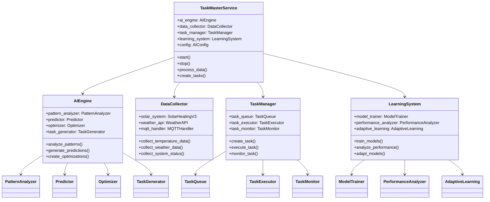

# Implementation: TaskMaster AI Integration

## 🔧 **Technical Implementation Details**

This document provides the technical implementation details for the TaskMaster AI integration, including code structure, key algorithms, and implementation patterns.

## 🏗️ **Code Architecture**

### **File Structure**

```
taskmaster/
├── taskmaster_service.py          # Main AI service
├── taskmaster_integration.py     # Core AI integration
├── taskmaster_config.py          # AI configuration
├── taskmaster_demo.py            # Demonstration script
├── requirements.txt               # Python dependencies
├── README_TASKMASTER.md          # AI system documentation
└── __init__.py                   # Package initialization
```

### **Core Classes and Relationships**



## 🔄 **Main Service Implementation**

### **TaskMaster Service Main Class**

```python
class TaskMasterService:
    def __init__(self, config):
        self.config = AIConfig(config)
        self.ai_engine = AIEngine(self.config)
        self.data_collector = DataCollector(self.config)
        self.task_manager = TaskManager(self.config)
        self.learning_system = LearningSystem(self.config)
        self.running = False
        self.logger = self.setup_logging()
        
    def start(self):
        """Start the TaskMaster AI service"""
        try:
            self.logger.info("Starting TaskMaster AI service")
            
            # Initialize components
            self.initialize_components()
            
            # Start data collection
            self.start_data_collection()
            
            # Start AI processing loop
            self.start_ai_processing()
            
            # Start learning system
            self.start_learning_system()
            
            self.running = True
            self.logger.info("TaskMaster AI service started successfully")
            
        except Exception as e:
            self.logger.error(f"Failed to start TaskMaster AI service: {e}")
            raise
    
    def initialize_components(self):
        """Initialize all AI components"""
        # Initialize AI engine
        self.ai_engine.initialize()
        
        # Initialize data collector
        self.data_collector.initialize()
        
        # Initialize task manager
        self.task_manager.initialize()
        
        # Initialize learning system
        self.learning_system.initialize()
    
    def start_data_collection(self):
        """Start continuous data collection"""
        self.data_collection_thread = threading.Thread(
            target=self._data_collection_loop,
            daemon=True
        )
        self.data_collection_thread.start()
    
    def start_ai_processing(self):
        """Start AI processing loop"""
        self.ai_processing_thread = threading.Thread(
            target=self._ai_processing_loop,
            daemon=True
        )
        self.ai_processing_thread.start()
    
    def _data_collection_loop(self):
        """Continuous data collection loop"""
        while self.running:
            try:
                # Collect real-time data
                data = self.data_collector.collect_all_data()
                
                # Store data for analysis
                self.data_collector.store_data(data)
                
                # Wait for next collection cycle
                time.sleep(self.config.get('data_collection_interval', 60))
                
            except Exception as e:
                self.logger.error(f"Data collection error: {e}")
                time.sleep(10)  # Wait before retry
    
    def _ai_processing_loop(self):
        """Continuous AI processing loop"""
        while self.running:
            try:
                # Get latest data
                data = self.data_collector.get_latest_data()
                
                # Analyze patterns
                patterns = self.ai_engine.analyze_patterns(data)
                
                # Generate predictions
                predictions = self.ai_engine.generate_predictions(data, patterns)
                
                # Create optimizations
                optimizations = self.ai_engine.create_optimizations(data, predictions)
                
                # Generate and execute tasks
                if optimizations:
                    tasks = self.ai_engine.generate_tasks(optimizations)
                    for task in tasks:
                        self.task_manager.create_task(task)
                
                # Wait for next processing cycle
                time.sleep(self.config.get('ai_processing_interval', 300))
                
            except Exception as e:
                self.logger.error(f"AI processing error: {e}")
                time.sleep(30)  # Wait before retry
```

## 🧠 **AI Engine Implementation**

### **Pattern Analyzer**

```python
class PatternAnalyzer:
    def __init__(self, config):
        self.config = config
        self.patterns = {}
        self.confidence_threshold = config.get('confidence_threshold', 0.85)
        self.analysis_methods = self.load_analysis_methods()
        
    def analyze_patterns(self, data):
        """Analyze data for patterns"""
        patterns = {}
        
        # Analyze temperature patterns
        patterns['temperature'] = self.analyze_temperature_patterns(data)
        
        # Analyze usage patterns
        patterns['usage'] = self.analyze_usage_patterns(data)
        
        # Analyze weather correlation
        patterns['weather'] = self.analyze_weather_correlation(data)
        
        # Analyze efficiency patterns
        patterns['efficiency'] = self.analyze_efficiency_patterns(data)
        
        return patterns
    
    def analyze_temperature_patterns(self, data):
        """Analyze temperature patterns for optimization opportunities"""
        temp_data = data.get('temperatures', {})
        if not temp_data:
            return {}
        
        patterns = {}
        
        # Daily cycle analysis
        patterns['daily_cycle'] = self.find_daily_cycles(temp_data)
        
        # Weekly pattern analysis
        patterns['weekly_pattern'] = self.find_weekly_patterns(temp_data)
        
        # Seasonal trend analysis
        patterns['seasonal_trend'] = self.find_seasonal_trends(temp_data)
        
        # Anomaly detection
        patterns['anomalies'] = self.detect_temperature_anomalies(temp_data)
        
        return patterns
    
    def find_daily_cycles(self, temp_data):
        """Find daily temperature cycles using FFT analysis"""
        try:
            import numpy as np
            from scipy import signal
            
            # Extract temperature values and timestamps
            timestamps = [d['timestamp'] for d in temp_data]
            temperatures = [d['temperature'] for d in temp_data]
            
            # Convert to numpy arrays
            temp_array = np.array(temperatures)
            time_array = np.array([pd.to_datetime(ts) for ts in timestamps])
            
            # Find daily period (24 hours in seconds)
            daily_period = 24 * 3600
            
            # Perform FFT analysis
            fft_result = np.fft.fft(temp_array)
            freqs = np.fft.fftfreq(len(temp_array))
            
            # Find peak frequency (should be around daily period)
            peak_idx = np.argmax(np.abs(fft_result[1:len(fft_result)//2])) + 1
            peak_freq = freqs[peak_idx]
            
            # Calculate confidence
            confidence = np.abs(fft_result[peak_idx]) / np.max(np.abs(fft_result))
            
            return {
                'period': daily_period,
                'frequency': peak_freq,
                'confidence': confidence,
                'amplitude': np.abs(fft_result[peak_idx])
            }
            
        except ImportError:
            self.logger.warning("NumPy/Scipy not available, using basic analysis")
            return self.basic_daily_analysis(temp_data)
    
    def basic_daily_analysis(self, temp_data):
        """Basic daily pattern analysis without advanced libraries"""
        # Group temperatures by hour of day
        hourly_temps = {}
        for data_point in temp_data:
            hour = pd.to_datetime(data_point['timestamp']).hour
            if hour not in hourly_temps:
                hourly_temps[hour] = []
            hourly_temps[hour].append(data_point['temperature'])
        
        # Calculate average temperature for each hour
        hourly_averages = {}
        for hour, temps in hourly_temps.items():
            hourly_averages[hour] = sum(temps) / len(temps)
        
        # Find peak and valley hours
        peak_hour = max(hourly_averages, key=hourly_averages.get)
        valley_hour = min(hourly_averages, key=hourly_averages.get)
        
        return {
            'peak_hour': peak_hour,
            'valley_hour': valley_hour,
            'peak_temp': hourly_averages[peak_hour],
            'valley_temp': hourly_averages[valley_hour],
            'confidence': 0.7  # Lower confidence for basic analysis
        }
```

### **Predictor Implementation**

```python
class Predictor:
    def __init__(self, config):
        self.config = config
        self.models = self.initialize_models()
        self.model_weights = self.calculate_model_weights()
        
    def initialize_models(self):
        """Initialize prediction models"""
        models = {}
        
        try:
            # Linear regression model
            from sklearn.linear_model import LinearRegression
            models['linear_regression'] = LinearRegression()
        except ImportError:
            self.logger.warning("Scikit-learn not available, using basic models")
            models['linear_regression'] = BasicLinearModel()
        
        # Time series model
        models['time_series'] = TimeSeriesModel()
        
        # Neural network model (if available)
        try:
            from sklearn.neural_network import MLPRegressor
            models['neural_network'] = MLPRegressor(
                hidden_layer_sizes=(100, 50),
                max_iter=1000,
                random_state=42
            )
        except ImportError:
            self.logger.warning("Neural network not available")
            models['neural_network'] = None
        
        # Ensemble model
        models['ensemble'] = EnsembleModel()
        
        return models
    
    def predict_temperature(self, current_data, weather_forecast, time_horizon):
        """Predict temperature for given time horizon"""
        predictions = {}
        
        # Prepare features for prediction
        features = self.prepare_features(current_data, weather_forecast)
        
        # Get predictions from each model
        for model_name, model in self.models.items():
            if model is not None:
                try:
                    prediction = model.predict(features, time_horizon)
                    predictions[model_name] = prediction
                except Exception as e:
                    self.logger.error(f"Error with {model_name}: {e}")
                    predictions[model_name] = None
        
        # Calculate ensemble prediction
        ensemble_prediction = self.calculate_ensemble_prediction(predictions)
        
        # Calculate confidence
        confidence = self.calculate_prediction_confidence(predictions)
        
        return ensemble_prediction, confidence
    
    def prepare_features(self, current_data, weather_forecast):
        """Prepare features for prediction models"""
        features = {}
        
        # Current system state
        features['current_temperature'] = current_data.get('current_temperature', 0)
        features['pump_status'] = current_data.get('pump_status', 'off')
        features['system_mode'] = current_data.get('system_mode', 'auto')
        
        # Time features
        now = datetime.utcnow()
        features['hour_of_day'] = now.hour
        features['day_of_week'] = now.weekday()
        features['month'] = now.month
        features['is_weekend'] = now.weekday() >= 5
        
        # Weather features
        if weather_forecast:
            features['weather_condition'] = weather_forecast.get('condition', 'unknown')
            features['cloud_cover'] = weather_forecast.get('cloud_cover', 0)
            features['wind_speed'] = weather_forecast.get('wind_speed', 0)
            features['solar_radiation'] = weather_forecast.get('solar_radiation', 0)
        
        # Historical features
        features['recent_temperatures'] = current_data.get('recent_temperatures', [])
        features['recent_pump_activity'] = current_data.get('recent_pump_activity', [])
        
        return features
    
    def calculate_ensemble_prediction(self, predictions):
        """Calculate ensemble prediction using weighted average"""
        valid_predictions = {k: v for k, v in predictions.items() if v is not None}
        
        if not valid_predictions:
            return None
        
        # Calculate weighted average
        weighted_sum = 0
        total_weight = 0
        
        for model_name, prediction in valid_predictions.items():
            weight = self.model_weights.get(model_name, 1.0)
            weighted_sum += weight * prediction
            total_weight += weight
        
        if total_weight > 0:
            return weighted_sum / total_weight
        else:
            return None
    
    def calculate_prediction_confidence(self, predictions):
        """Calculate confidence in ensemble prediction"""
        valid_predictions = {k: v for k, v in predictions.items() if v is not None}
        
        if not valid_predictions:
            return 0.0
        
        # Calculate variance between predictions
        if len(valid_predictions) > 1:
            values = list(valid_predictions.values())
            variance = np.var(values)
            
            # Higher variance = lower confidence
            confidence = max(0.0, 1.0 - (variance / 100.0))
        else:
            confidence = 0.8  # Single model prediction
        
        return confidence
```

### **Optimizer Implementation**

```python
class Optimizer:
    def __init__(self, config):
        self.config = config
        self.objectives = config.get('optimization_objectives', ['efficiency', 'cost', 'comfort'])
        self.constraints = self.load_optimization_constraints()
        self.optimization_method = config.get('optimization_method', 'genetic_algorithm')
        
    def optimize_system_settings(self, predictions, current_state):
        """Optimize system settings for best performance"""
        # Define optimization problem
        problem = self.define_optimization_problem(predictions, current_state)
        
        # Solve optimization problem
        if self.optimization_method == 'genetic_algorithm':
            solution = self.solve_with_genetic_algorithm(problem)
        elif self.optimization_method == 'gradient_descent':
            solution = self.solve_with_gradient_descent(problem)
        else:
            solution = self.solve_with_basic_optimization(problem)
        
        return solution
    
    def define_optimization_problem(self, predictions, current_state):
        """Define the optimization problem"""
        problem = {
            'variables': {
                'pump_start_temp': {
                    'min': 60.0,
                    'max': 80.0,
                    'current': current_state.get('pump_start_temp', 70.0),
                    'step': 1.0
                },
                'pump_stop_temp': {
                    'min': 40.0,
                    'max': 60.0,
                    'current': current_state.get('pump_stop_temp', 50.0),
                    'step': 1.0
                },
                'heating_threshold': {
                    'min': 5.0,
                    'max': 15.0,
                    'current': current_state.get('heating_threshold', 8.0),
                    'step': 0.5
                },
                'timing_offset': {
                    'min': -30,
                    'max': 30,
                    'current': current_state.get('timing_offset', 0),
                    'step': 5
                }
            },
            'objectives': self.objectives,
            'constraints': self.constraints,
            'predictions': predictions,
            'current_state': current_state
        }
        
        return problem
    
    def solve_with_genetic_algorithm(self, problem):
        """Solve optimization using genetic algorithm"""
        try:
            from deap import base, creator, tools, algorithms
            import random
            
            # Define fitness function
            def evaluate(individual):
                return self.evaluate_solution(individual, problem)
            
            # Create genetic algorithm components
            creator.create("FitnessMulti", base.Fitness, weights=(1.0, -1.0, 1.0))
            creator.create("Individual", list, fitness=creator.FitnessMulti)
            
            toolbox = base.Toolbox()
            toolbox.register("attr_float", self.generate_random_parameter, problem)
            toolbox.register("individual", tools.initRepeat, creator.Individual, 
                           toolbox.attr_float, n=len(problem['variables']))
            toolbox.register("population", tools.initRepeat, list, toolbox.individual)
            toolbox.register("evaluate", evaluate)
            toolbox.register("mate", tools.cxTwoPoint)
            toolbox.register("mutate", tools.mutGaussian, mu=0, sigma=1, indpb=0.1)
            toolbox.register("select", tools.selNSGA2)
            
            # Create initial population
            pop = toolbox.population(n=50)
            
            # Run genetic algorithm
            algorithms.eaMuPlusLambda(pop, toolbox, mu=25, lambda_50, 
                                   cxpb=0.7, mutpb=0.3, ngen=100)
            
            # Get best solution
            best_individual = tools.selBest(pop, k=1)[0]
            
            return self.individual_to_solution(best_individual, problem)
            
        except ImportError:
            self.logger.warning("DEAP not available, using basic optimization")
            return self.solve_with_basic_optimization(problem)
    
    def evaluate_solution(self, individual, problem):
        """Evaluate a solution for multi-objective optimization"""
        # Convert individual to solution parameters
        solution = self.individual_to_solution(individual, problem)
        
        # Calculate objective values
        efficiency = self.calculate_efficiency(solution, problem)
        cost = self.calculate_cost(solution, problem)
        comfort = self.calculate_comfort(solution, problem)
        
        return efficiency, cost, comfort
    
    def calculate_efficiency(self, solution, problem):
        """Calculate system efficiency for given solution"""
        # This would use the predictions and current state
        # to estimate system efficiency
        base_efficiency = 0.8
        
        # Adjust based on temperature settings
        temp_efficiency = self.calculate_temperature_efficiency(solution)
        
        # Adjust based on timing
        timing_efficiency = self.calculate_timing_efficiency(solution)
        
        return base_efficiency * temp_efficiency * timing_efficiency
    
    def calculate_cost(self, solution, problem):
        """Calculate operational cost for given solution"""
        # Estimate energy consumption
        energy_consumption = self.estimate_energy_consumption(solution, problem)
        
        # Apply energy pricing
        energy_cost = energy_consumption * self.get_energy_price()
        
        return energy_cost
    
    def calculate_comfort(self, solution, problem):
        """Calculate comfort level for given solution"""
        # Comfort is inversely related to temperature variations
        temp_variations = self.calculate_temperature_variations(solution, problem)
        
        # Higher variations = lower comfort
        comfort = max(0.0, 1.0 - (temp_variations / 10.0))
        
        return comfort
```

## 🔧 **Task Management Implementation**

### **Task Creation and Execution**

```python
class TaskGenerator:
    def __init__(self, config):
        self.config = config
        self.task_templates = self.load_task_templates()
        
    def generate_tasks(self, optimizations):
        """Generate executable tasks from AI optimizations"""
        tasks = []
        
        for optimization in optimizations:
            task = self.create_task_from_optimization(optimization)
            if task:
                tasks.append(task)
        
        return tasks
    
    def create_task_from_optimization(self, optimization):
        """Create a task from an optimization recommendation"""
        optimization_type = optimization.get('type')
        
        if optimization_type == 'pump_optimization':
            return self.create_pump_optimization_task(optimization)
        elif optimization_type == 'temperature_adjustment':
            return self.create_temperature_adjustment_task(optimization)
        elif optimization_type == 'timing_optimization':
            return self.create_timing_optimization_task(optimization)
        elif optimization_type == 'maintenance_alert':
            return self.create_maintenance_alert_task(optimization)
        else:
            self.logger.warning(f"Unknown optimization type: {optimization_type}")
            return None
    
    def create_pump_optimization_task(self, optimization):
        """Create pump optimization task"""
        task = Task(
            id=str(uuid.uuid4()),
            type=TaskType.PUMP_OPTIMIZATION,
            priority=optimization.get('priority', 1),
            parameters={
                'start_temp': optimization.get('pump_start_temp'),
                'stop_temp': optimization.get('pump_stop_temp'),
                'timing_offset': optimization.get('timing_offset', 0),
                'reason': optimization.get('reason', 'AI optimization'),
                'confidence': optimization.get('confidence', 0.0)
            },
            created_at=datetime.utcnow(),
            status=TaskStatus.PENDING
        )
        
        return task
    
    def create_temperature_adjustment_task(self, optimization):
        """Create temperature adjustment task"""
        task = Task(
            id=str(uuid.uuid4()),
            type=TaskType.TEMPERATURE_ADJUSTMENT,
            priority=optimization.get('priority', 1),
            parameters={
                'target_temp': optimization.get('target_temperature'),
                'adjustment_type': optimization.get('adjustment_type', 'set'),
                'reason': optimization.get('reason', 'AI optimization'),
                'confidence': optimization.get('confidence', 0.0)
            },
            created_at=datetime.utcnow(),
            status=TaskStatus.PENDING
        )
        
        return task
```

### **Task Execution Engine**

```python
class TaskExecutor:
    def __init__(self, solar_system, home_assistant, config):
        self.solar_system = solar_system
        self.home_assistant = home_assistant
        self.config = config
        self.execution_history = []
        self.safety_validator = SafetyValidator(config)
        
    def execute_task(self, task):
        """Execute an AI-generated task"""
        try:
            # Validate task for safety
            safety_result = self.safety_validator.validate_task(task)
            if not safety_result['is_safe']:
                self.logger.warning(f"Task {task.id} failed safety validation")
                return self.create_failed_result(task, "Safety validation failed")
            
            # Execute based on task type
            if task.type == TaskType.PUMP_OPTIMIZATION:
                result = self.execute_pump_optimization(task)
            elif task.type == TaskType.TEMPERATURE_ADJUSTMENT:
                result = self.execute_temperature_adjustment(task)
            elif task.type == TaskType.TIMING_OPTIMIZATION:
                result = self.execute_timing_optimization(task)
            elif task.type == TaskType.MAINTENANCE_ALERT:
                result = self.execute_maintenance_alert(task)
            else:
                result = self.execute_generic_task(task)
            
            # Record execution result
            self.record_execution_result(task, result)
            
            return result
            
        except Exception as e:
            error_result = self.create_failed_result(task, str(e))
            self.record_execution_result(task, error_result)
            return error_result
    
    def execute_pump_optimization(self, task):
        """Execute pump optimization task"""
        params = task.parameters
        
        try:
            # Update pump control parameters
            self.solar_system.update_pump_settings(
                start_temp=params['start_temp'],
                stop_temp=params['stop_temp'],
                timing_offset=params['timing_offset']
            )
            
            # Monitor results for a period
            result = self.monitor_pump_optimization(task)
            
            # Mark task as completed
            task.status = TaskStatus.COMPLETED
            task.executed_at = datetime.utcnow()
            task.result = result
            
            return result
            
        except Exception as e:
            self.logger.error(f"Pump optimization execution failed: {e}")
            return self.create_failed_result(task, str(e))
    
    def execute_temperature_adjustment(self, task):
        """Execute temperature adjustment task"""
        params = task.parameters
        
        try:
            # Update temperature settings
            if params['adjustment_type'] == 'set':
                self.solar_system.set_target_temperature(params['target_temp'])
            elif params['adjustment_type'] == 'adjust':
                current_temp = self.solar_system.get_target_temperature()
                new_temp = current_temp + params['target_temp']
                self.solar_system.set_target_temperature(new_temp)
            
            # Create success result
            result = TaskResult(
                success=True,
                data={'new_temperature': params['target_temp']},
                performance_metrics={'temperature_set': True}
            )
            
            # Mark task as completed
            task.status = TaskStatus.COMPLETED
            task.executed_at = datetime.utcnow()
            task.result = result
            
            return result
            
        except Exception as e:
            self.logger.error(f"Temperature adjustment execution failed: {e}")
            return self.create_failed_result(task, str(e))
    
    def monitor_pump_optimization(self, task):
        """Monitor pump optimization results"""
        # Monitor for 1 hour to see results
        start_time = time.time()
        monitoring_duration = 3600  # 1 hour
        
        initial_efficiency = self.calculate_current_efficiency()
        efficiency_history = []
        
        while time.time() - start_time < monitoring_duration:
            current_efficiency = self.calculate_current_efficiency()
            efficiency_history.append(current_efficiency)
            
            time.sleep(300)  # Check every 5 minutes
        
        # Calculate improvement
        final_efficiency = self.calculate_current_efficiency()
        improvement = final_efficiency - initial_efficiency
        
        return TaskResult(
            success=True,
            data={
                'initial_efficiency': initial_efficiency,
                'final_efficiency': final_efficiency,
                'improvement': improvement,
                'efficiency_history': efficiency_history
            },
            performance_metrics={
                'efficiency_improvement': improvement,
                'monitoring_duration': monitoring_duration
            }
        )
    
    def create_failed_result(self, task, error_message):
        """Create a failed task result"""
        return TaskResult(
            success=False,
            error_message=error_message,
            data={'task_id': task.id, 'task_type': task.type.value}
        )
```

## 🔗 **Related Documentation**

- **[Requirements Document](REQUIREMENTS_TASKMASTER_AI.md)** - What we built and why
- **[Design Document](DESIGN_TASKMASTER_AI.md)** - How the AI system works
- **[User Guide](USER_GUIDE_TASKMASTER_AI.md)** - How to use the AI features
- **[Summary](SUMMARY_TASKMASTER_AI.md)** - Complete AI system overview
- **[System Overview](../SYSTEM_OVERVIEW.md)** - Complete system understanding
- **[Component Map](../COMPONENT_MAP.md)** - System component relationships

---

**This document provides the technical implementation details for the TaskMaster AI integration, including code structure, key algorithms, and implementation patterns. It serves as the technical reference for developers and maintainers.**
