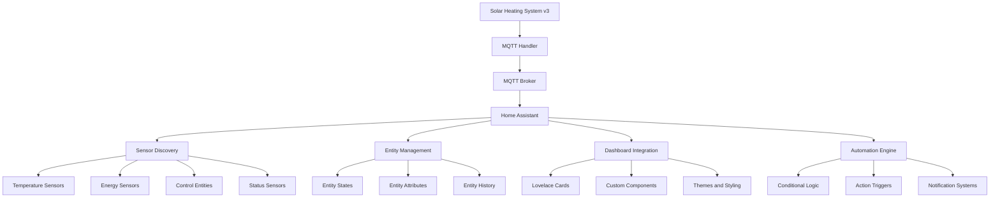

# Detailed Home Assistant Smart Home Integration Guide

## 🎯 **Overview**

This comprehensive guide covers the complete Home Assistant integration for the Solar Heating System v3, including MQTT discovery, sensor configuration, dashboard setup, automation, and advanced features.

## 🏠 **Home Assistant Integration Architecture**

### **Integration Components**



### **MQTT Topic Structure**

```
homeassistant/
├── sensor/
│   ├── solar_heating_*/state          # Temperature and energy sensors
│   ├── solar_heating_*/config         # Sensor discovery configs
│   └── solar_heating_*/attributes     # Sensor attributes
├── binary_sensor/
│   ├── solar_heating_*/state          # Binary status sensors
│   └── solar_heating_*/config         # Binary sensor configs
├── switch/
│   ├── solar_heating_*/state          # Control switches
│   ├── solar_heating_*/config         # Switch configs
│   └── solar_heating_*/set            # Switch commands
├── number/
│   ├── solar_heating_*/state          # Control numbers
│   ├── solar_heating_*/config         # Number configs
│   └── solar_heating_*/set            # Number commands
└── device_tracker/
    ├── solar_heating_*/state          # System status
    └── solar_heating_*/config         # Device config
```

## 🔧 **MQTT Discovery System**

### **Sensor Discovery Configuration**

```python
def publish_hass_discovery(self):
    """Publish Home Assistant discovery configurations"""
    
    # Temperature Sensors
    temperature_sensors = [
        {
            'name': 'Solar Collector Temperature',
            'entity_id': 'solar_collector_temp',
            'device_class': 'temperature',
            'unit_of_measurement': '°C',
            'state_class': 'measurement',
            'suggested_display_precision': 1
        },
        {
            'name': 'Storage Tank Temperature',
            'entity_id': 'storage_tank_temp',
            'device_class': 'temperature',
            'unit_of_measurement': '°C',
            'state_class': 'measurement',
            'suggested_display_precision': 1
        },
        {
            'name': 'Return Line Temperature',
            'entity_id': 'return_line_temp',
            'device_class': 'temperature',
            'unit_of_measurement': '°C',
            'state_class': 'measurement',
            'suggested_display_precision': 1
        }
    ]
    
    # Energy Sensors
    energy_sensors = [
        {
            'name': 'Energy Collected Today',
            'entity_id': 'energy_collected_today_kwh',
            'device_class': 'energy',
            'unit_of_measurement': 'kWh',
            'state_class': 'total_increasing',
            'suggested_display_precision': 2
        },
        {
            'name': 'Energy Collected This Hour',
            'entity_id': 'energy_collected_hour_kwh',
            'device_class': 'energy',
            'unit_of_measurement': 'kWh',
            'state_class': 'total_increasing',
            'suggested_display_precision': 3
        },
        {
            'name': 'Solar Energy Today',
            'entity_id': 'solar_energy_today_kwh',
            'device_class': 'energy',
            'unit_of_measurement': 'kWh',
            'state_class': 'total_increasing',
            'suggested_display_precision': 2
        }
    ]
    
    # Control Switches
    control_switches = [
        {
            'name': 'Primary Pump',
            'entity_id': 'primary_pump',
            'device_class': 'switch',
            'icon': 'mdi:pump'
        },
        {
            'name': 'Cartridge Heater',
            'entity_id': 'cartridge_heater',
            'device_class': 'switch',
            'icon': 'mdi:heater'
        },
        {
            'name': 'Manual Control',
            'entity_id': 'primary_pump_manual',
            'device_class': 'switch',
            'icon': 'mdi:hand-back'
        }
    ]
    
    # Control Numbers
    control_numbers = [
        {
            'name': 'Target Tank Temperature',
            'entity_id': 'set_temp_tank_1',
            'unit_of_measurement': '°C',
            'min_value': 30,
            'max_value': 80,
            'step': 1,
            'icon': 'mdi:thermometer'
        },
        {
            'name': 'Pump Start Threshold',
            'entity_id': 'dTStart_tank_1',
            'unit_of_measurement': '°C',
            'min_value': 3,
            'max_value': 40,
            'step': 1,
            'icon': 'mdi:thermometer-plus'
        },
        {
            'name': 'Pump Stop Threshold',
            'entity_id': 'dTStop_tank_1',
            'unit_of_measurement': '°C',
            'min_value': 2,
            'max_value': 20,
            'step': 1,
            'icon': 'mdi:thermometer-minus'
        }
    ]
```

### **Discovery Message Format**

```python
def create_discovery_config(self, sensor_config, device_info):
    """Create Home Assistant discovery configuration"""
    
    base_topic = f"homeassistant/{sensor_config['device_class']}/solar_heating_{sensor_config['entity_id']}"
    
    config = {
        "name": sensor_config['name'],
        "unique_id": f"solar_heating_{sensor_config['entity_id']}",
        "state_topic": f"{base_topic}/state",
        "device": device_info,
        "availability_topic": "solar_heating/status",
        "payload_available": "online",
        "payload_not_available": "offline"
    }
    
    # Add device class specific configurations
    if sensor_config.get('device_class'):
        config["device_class"] = sensor_config['device_class']
    
    if sensor_config.get('unit_of_measurement'):
        config["unit_of_measurement"] = sensor_config['unit_of_measurement']
    
    if sensor_config.get('state_class'):
        config["state_class"] = sensor_config['state_class']
    
    if sensor_config.get('suggested_display_precision'):
        config["suggested_display_precision"] = sensor_config['suggested_display_precision']
    
    # Add control specific configurations
    if sensor_config.get('device_class') == 'switch':
        config["command_topic"] = f"{base_topic}/set"
        config["payload_on"] = "ON"
        config["payload_off"] = "OFF"
        config["state_on"] = "ON"
        config["state_off"] = "OFF"
    
    elif sensor_config.get('device_class') == 'number':
        config["command_topic"] = f"{base_topic}/set"
        config["min"] = sensor_config.get('min_value', 0)
        config["max"] = sensor_config.get('max_value', 100)
        config["step"] = sensor_config.get('step', 1)
    
    return config
```

### **Device Information**

```python
def get_device_info(self):
    """Get device information for Home Assistant"""
    return {
        "identifiers": [["solar_heating", "v3"]],
        "name": "Solar Heating System v3",
        "manufacturer": "Custom",
        "model": "Solar Heating v3",
        "sw_version": "3.0.0",
        "configuration_url": "http://192.168.0.110:8123/config/integrations"
    }
```

## 📊 **Sensor Configuration**

### **Temperature Sensors**

| Sensor | Entity ID | Device Class | Unit | State Class | Description |
|--------|-----------|--------------|------|-------------|-------------|
| Solar Collector | `solar_collector_temp` | temperature | °C | measurement | Primary heating source temperature |
| Storage Tank | `storage_tank_temp` | temperature | °C | measurement | Hot water storage temperature |
| Return Line | `return_line_temp` | temperature | °C | measurement | System return temperature |
| Heat Exchanger | `heat_exchanger_temp` | temperature | °C | measurement | Heat transfer efficiency |
| Ambient | `ambient_temp` | temperature | °C | measurement | Environmental temperature |
| Average | `average_temperature` | temperature | °C | measurement | System average temperature |

### **Energy Sensors**

| Sensor | Entity ID | Device Class | Unit | State Class | Description |
|--------|-----------|--------------|------|-------------|-------------|
| Energy Today | `energy_collected_today_kwh` | energy | kWh | total_increasing | Daily energy collection |
| Energy Hour | `energy_collected_hour_kwh` | energy | kWh | total_increasing | Hourly energy collection |
| Solar Energy | `solar_energy_today_kwh` | energy | kWh | total_increasing | Daily solar energy |
| Cartridge Energy | `cartridge_energy_today_kwh` | energy | kWh | total_increasing | Daily cartridge energy |
| Pellet Energy | `pellet_energy_today_kwh` | energy | kWh | total_increasing | Daily pellet energy |
| Stored Energy | `stored_energy_kwh` | energy | kWh | measurement | Current stored energy |

### **Status Sensors**

| Sensor | Entity ID | Device Class | Description |
|--------|-----------|--------------|-------------|
| System Mode | `system_mode` | None | Current system mode |
| Heating Status | `is_heating` | heat | Active heating indicator |
| Pump Status | `primary_pump` | switch | Primary pump control |
| Heater Status | `cartridge_heater` | switch | Cartridge heater control |
| Manual Control | `primary_pump_manual` | switch | Manual control override |

### **Control Numbers**

| Control | Entity ID | Unit | Range | Step | Description |
|---------|-----------|------|-------|------|-------------|
| Target Temperature | `set_temp_tank_1` | °C | 30-80 | 1 | Target tank temperature |
| Start Threshold | `dTStart_tank_1` | °C | 3-40 | 1 | Pump start threshold |
| Stop Threshold | `dTStop_tank_1` | °C | 2-20 | 1 | Pump stop threshold |
| Emergency Temp | `temp_kok` | °C | 100-200 | 5 | Emergency stop temperature |

## 🎨 **Dashboard Configuration**

### **Lovelace Dashboard YAML**

```yaml
title: Solar Heating System v3
views:
  - title: Overview
    path: overview
    cards:
      # System Status Card
      - type: entities
        title: System Status
        entities:
          - sensor.solar_heating_system_mode
          - binary_sensor.solar_heating_is_heating
          - switch.solar_heating_primary_pump
          - switch.solar_heating_cartridge_heater
      
      # Temperature Overview
      - type: entities
        title: Temperature Overview
        entities:
          - sensor.solar_heating_solar_collector_temp
          - sensor.solar_heating_storage_tank_temp
          - sensor.solar_heating_return_line_temp
          - sensor.solar_heating_average_temperature
      
      # Energy Collection
      - type: entities
        title: Energy Collection
        entities:
          - sensor.solar_heating_energy_collected_today_kwh
          - sensor.solar_heating_energy_collected_hour_kwh
          - sensor.solar_heating_solar_energy_today_kwh
          - sensor.solar_heating_cartridge_energy_today_kwh
      
      # Control Panel
      - type: entities
        title: Control Panel
        entities:
          - number.solar_heating_set_temp_tank_1
          - number.solar_heating_dtstart_tank_1
          - number.solar_heating_dtstop_tank_1
          - switch.solar_heating_primary_pump_manual

  - title: History
    path: history
    cards:
      # Temperature History
      - type: history-graph
        title: Temperature History
        entities:
          - sensor.solar_heating_solar_collector_temp
          - sensor.solar_heating_storage_tank_temp
          - sensor.solar_heating_return_line_temp
        hours_to_show: 24
      
      # Energy History
      - type: history-graph
        title: Energy Collection History
        entities:
          - sensor.solar_heating_energy_collected_today_kwh
          - sensor.solar_heating_solar_energy_today_kwh
        hours_to_show: 24
      
      # System Status History
      - type: history-graph
        title: System Status History
        entities:
          - binary_sensor.solar_heating_is_heating
          - switch.solar_heating_primary_pump
        hours_to_show: 24

  - title: Control
    path: control
    cards:
      # Manual Control
      - type: entities
        title: Manual Control
        entities:
          - switch.solar_heating_primary_pump_manual
          - switch.solar_heating_cartridge_heater
      
      # System Parameters
      - type: entities
        title: System Parameters
        entities:
          - number.solar_heating_set_temp_tank_1
          - number.solar_heating_dtstart_tank_1
          - number.solar_heating_dtstop_tank_1
          - number.solar_heating_temp_kok
      
      # Advanced Controls
      - type: button
        name: Emergency Stop
        icon: mdi:stop-circle
        tap_action:
          action: call-service
          service: mqtt.publish
          service_data:
            topic: solar_heating/control/emergency_stop
            payload: "true"
```

### **Custom Cards**

```yaml
# Energy Collection Gauge
- type: gauge
  entity: sensor.solar_heating_energy_collected_today_kwh
  name: Daily Energy Collection
  unit: kWh
  min: 0
  max: 50
  severity:
    green: 0
    yellow: 20
    red: 40

# Temperature Difference Gauge
- type: gauge
  entity: sensor.solar_heating_solar_collector_dt
  name: Temperature Difference
  unit: °C
  min: 0
  max: 20
  severity:
    green: 8
    yellow: 5
    red: 2

# System Mode Badge
- type: badge
  entity: sensor.solar_heating_system_mode
  name: System Mode
```

## 🤖 **Automation Configuration**

### **Temperature-Based Automations**

```yaml
# High Temperature Alert
- id: solar_heating_high_temp_alert
  alias: "Solar Heating - High Temperature Alert"
  description: "Alert when solar collector temperature is too high"
  trigger:
    - platform: numeric_state
      entity_id: sensor.solar_heating_solar_collector_temp
      above: 80
      for:
        minutes: 5
  condition:
    - condition: state
      entity_id: binary_sensor.solar_heating_is_heating
      state: "on"
  action:
    - service: notify.mobile_app_your_phone
      data:
        title: "Solar Heating Alert"
        message: "Solar collector temperature is {{ states('sensor.solar_heating_solar_collector_temp') }}°C"
    - service: logbook.log
      data:
        name: Solar Heating System
        message: "High temperature alert triggered"

# Low Efficiency Alert
- id: solar_heating_low_efficiency_alert
  alias: "Solar Heating - Low Efficiency Alert"
  description: "Alert when energy collection efficiency is low"
  trigger:
    - platform: numeric_state
      entity_id: sensor.solar_heating_energy_collected_today_kwh
      below: 5
      for:
        hours: 2
  condition:
    - condition: time
      after: "08:00:00"
      before: "18:00:00"
  action:
    - service: notify.mobile_app_your_phone
      data:
        title: "Solar Heating Efficiency Alert"
        message: "Daily energy collection is only {{ states('sensor.solar_heating_energy_collected_today_kwh') }} kWh"
```

### **System Status Automations**

```yaml
# System Mode Change Notification
- id: solar_heating_mode_change_notification
  alias: "Solar Heating - Mode Change Notification"
  description: "Notify when system mode changes"
  trigger:
    - platform: state
      entity_id: sensor.solar_heating_system_mode
  action:
    - service: notify.mobile_app_your_phone
      data:
        title: "Solar Heating Mode Change"
        message: "System mode changed to {{ states('sensor.solar_heating_system_mode') }}"
    - service: logbook.log
      data:
        name: Solar Heating System
        message: "Mode changed to {{ states('sensor.solar_heating_system_mode') }}"

# Pump Status Change
- id: solar_heating_pump_status_change
  alias: "Solar Heating - Pump Status Change"
  description: "Notify when pump status changes"
  trigger:
    - platform: state
      entity_id: switch.solar_heating_primary_pump
  action:
    - service: notify.mobile_app_your_phone
      data:
        title: "Solar Heating Pump Status"
        message: "Primary pump {{ 'started' if is_state('switch.solar_heating_primary_pump', 'on') else 'stopped' }}"
```

### **Energy Monitoring Automations**

```yaml
# Daily Energy Report
- id: solar_heating_daily_energy_report
  alias: "Solar Heating - Daily Energy Report"
  description: "Send daily energy collection report"
  trigger:
    - platform: time
      at: "20:00:00"
  action:
    - service: notify.mobile_app_your_phone
      data:
        title: "Solar Heating Daily Report"
        message: |
          Daily Energy Collection: {{ states('sensor.solar_heating_energy_collected_today_kwh') }} kWh
          Solar Energy: {{ states('sensor.solar_heating_solar_energy_today_kwh') }} kWh
          Cartridge Energy: {{ states('sensor.solar_heating_cartridge_energy_today_kwh') }} kWh
          System Mode: {{ states('sensor.solar_heating_system_mode') }}

# Weekly Energy Summary
- id: solar_heating_weekly_energy_summary
  alias: "Solar Heating - Weekly Energy Summary"
  description: "Send weekly energy collection summary"
  trigger:
    - platform: time
      at: "09:00:00"
    - platform: time_pattern
      weekday: 1  # Monday
  action:
    - service: notify.mobile_app_your_phone
      data:
        title: "Solar Heating Weekly Summary"
        message: "Weekly energy collection summary available in Home Assistant"
```

## 🔧 **Advanced Configuration**

### **Custom Themes**

```yaml
# Solar Heating Theme
solar_heating_theme:
  primary-color: "#FF6B35"  # Solar orange
  accent-color: "#4ECDC4"   # Water blue
  dark-primary-color: "#FF8C42"
  light-primary-color: "#FFB366"
  primary-background-color: "#2C3E50"
  secondary-background-color: "#34495E"
  primary-text-color: "#ECF0F1"
  secondary-text-color: "#BDC3C7"
  disabled-text-color: "#7F8C8D"
  divider-color: "#34495E"
  error-color: "#E74C3C"
  warning-color: "#F39C12"
  success-color: "#27AE60"
  info-color: "#3498DB"
```

### **Custom Components**

```yaml
# Solar Heating Custom Component
solar_heating_custom:
  - platform: template
    sensors:
      solar_heating_efficiency:
        friendly_name: "Solar Heating Efficiency"
        unit_of_measurement: "%"
        value_template: >
          
          
          
            {{ (energy / runtime * 100) | round(1) }}
          
            0
          
      
      solar_heating_temperature_difference:
        friendly_name: "Temperature Difference"
        unit_of_measurement: "°C"
        value_template: >
          
          
          {{ (collector - tank) | round(1) }}
```

### **Scripts**

```yaml
# Solar Heating Control Scripts
solar_heating_emergency_stop:
  alias: "Solar Heating Emergency Stop"
  sequence:
    - service: mqtt.publish
      data:
        topic: solar_heating/control/emergency_stop
        payload: "true"
    - service: notify.mobile_app_your_phone
      data:
        title: "Solar Heating Emergency Stop"
        message: "Emergency stop activated"

solar_heating_manual_override:
  alias: "Solar Heating Manual Override"
  sequence:
    - service: switch.turn_on
      entity_id: switch.solar_heating_primary_pump_manual
    - service: notify.mobile_app_your_phone
      data:
        title: "Solar Heating Manual Override"
        message: "Manual control activated"

solar_heating_reset_daily_counters:
  alias: "Solar Heating Reset Daily Counters"
  sequence:
    - service: mqtt.publish
      data:
        topic: solar_heating/control/reset_daily_counters
        payload: "true"
    - service: notify.mobile_app_your_phone
      data:
        title: "Solar Heating Reset"
        message: "Daily counters reset"
```

## 📱 **Mobile App Integration**

### **Notification Configuration**

```yaml
# Mobile App Notifications
notify:
  - platform: group
    name: solar_heating_notifications
    services:
      - service: mobile_app_your_phone
      - service: mobile_app_family_phone
      - service: telegram_bot

# Telegram Bot Integration
telegram_bot:
  - platform: polling
    api_key: "YOUR_TELEGRAM_BOT_TOKEN"
    allowed_chat_ids:
      - 123456789  # Your Telegram chat ID
```

### **Mobile Dashboard**

```yaml
# Mobile-Optimized Dashboard
mobile_dashboard:
  title: Solar Heating Mobile
  views:
    - title: Status
      path: mobile_status
      cards:
        - type: entities
          title: Quick Status
          entities:
            - sensor.solar_heating_system_mode
            - sensor.solar_heating_solar_collector_temp
            - sensor.solar_heating_storage_tank_temp
            - sensor.solar_heating_energy_collected_today_kwh
            - switch.solar_heating_primary_pump
            - switch.solar_heating_cartridge_heater
```

## 🔍 **Troubleshooting**

### **Common Issues**

1. **Sensors Not Appearing**
   - Check MQTT broker connection
   - Verify discovery topic configuration
   - Restart Home Assistant

2. **Control Not Working**
   - Check MQTT command topics
   - Verify entity permissions
   - Test with MQTT tools

3. **Automations Not Triggering**
   - Check entity states
   - Verify automation conditions
   - Review Home Assistant logs

### **Debug Commands**

```bash
# Check MQTT topics
mosquitto_sub -h 192.168.0.110 -u mqtt_beaches -P uQX6NiZ.7R -t "homeassistant/#" -v

# Test sensor discovery
mosquitto_sub -h 192.168.0.110 -u mqtt_beaches -P uQX6NiZ.7R -t "homeassistant/sensor/solar_heating_*/config" -v

# Test control commands
mosquitto_pub -h 192.168.0.110 -u mqtt_beaches -P uQX6NiZ.7R -t "homeassistant/switch/solar_heating_primary_pump/set" -m "ON"
```

## 📚 **Related Documentation**

- **`DETAILED_SOLAR_HEATING_V3_IMPLEMENTATION.md`** - Core system implementation
- **`DETAILED_TASKMASTER_AI_INTEGRATION.md`** - AI integration details
- **`DETAILED_HARDWARE_SETUP.md`** - Hardware connection guide
- **`DETAILED_DEPLOYMENT_GUIDE.md`** - Production deployment
- **`USER_GUIDE_HOME_ASSISTANT.md`** - User operation guide

---

**This guide provides complete Home Assistant integration details for the Solar Heating System v3. The integration supports full sensor monitoring, control capabilities, and advanced automation features.**
