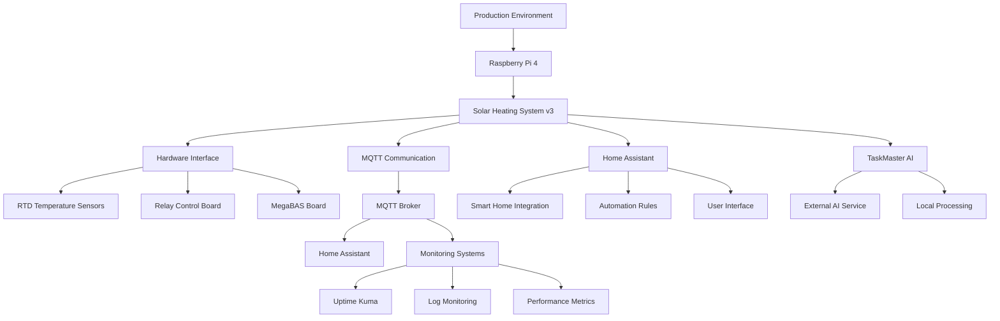

# Detailed Production Deployment Guide

## 🎯 **Overview**

This comprehensive guide covers the complete production deployment of the Solar Heating System v3, including system requirements, deployment strategies, monitoring, maintenance, and operational procedures.

## 🏗️ **Deployment Architecture**

### **Production System Architecture**



### **Deployment Components**

| Component | Purpose | Technology | Location |
|-----------|---------|------------|----------|
| **System Controller** | Core system logic | Python 3.13 | Raspberry Pi 4 |
| **Hardware Interface** | Sensor/actuator control | Sequent Microsystems | Local hardware |
| **MQTT Broker** | Communication hub | Mosquitto | Local network |
| **Home Assistant** | Smart home integration | Home Assistant Core | Local network |
| **Monitoring** | System health monitoring | Uptime Kuma | Local network |
| **Backup System** | Data persistence | Local storage | Raspberry Pi |
| **Update System** | Software updates | Git + systemd | Raspberry Pi |

## 🔧 **System Requirements**

### **Hardware Requirements**

| Component | Specification | Purpose |
|-----------|---------------|---------|
| **Raspberry Pi** | Pi 4 Model B, 4GB RAM | System controller |
| **Storage** | 32GB+ Class 10 microSD | System and data storage |
| **Power Supply** | 5V/3A USB-C | System power |
| **Network** | Ethernet connection | MQTT and remote access |
| **Hardware Boards** | RTD, Relay, MegaBAS | Sensor and control interface |

### **Software Requirements**

| Component | Version | Purpose |
|-----------|---------|---------|
| **Operating System** | Raspberry Pi OS 64-bit | Base system |
| **Python** | 3.13+ | Application runtime |
| **MQTT Broker** | Mosquitto 2.0+ | Communication |
| **Home Assistant** | 2024.1+ | Smart home integration |
| **Git** | 2.40+ | Version control |
| **systemd** | 247+ | Service management |

### **Network Requirements**

| Service | Port | Protocol | Purpose |
|---------|------|----------|---------|
| **SSH** | 22 | TCP | Remote administration |
| **MQTT** | 1883 | TCP | MQTT communication |
| **MQTT TLS** | 8883 | TCP | Secure MQTT |
| **Home Assistant** | 8123 | TCP | Web interface |
| **HTTP** | 80 | TCP | Web services |
| **HTTPS** | 443 | TCP | Secure web services |

## 🚀 **Deployment Strategies**

### **Strategy 1: Manual Deployment**

```bash
# 1. Prepare Raspberry Pi
sudo apt update && sudo apt upgrade -y
sudo apt install -y python3 python3-pip python3-venv git

# 2. Create system user
sudo useradd -m -s /bin/bash solar_heating
sudo usermod -aG sudo solar_heating
sudo usermod -aG i2c solar_heating
sudo usermod -aG spi solar_heating
sudo usermod -aG gpio solar_heating

# 3. Clone and setup system
cd /home/solar_heating
git clone https://github.com/DonHugo/sun_heat_and_ftx.git
cd sun_heat_and_ftx/python/v3

# 4. Create virtual environment
python3 -m venv venv
source venv/bin/activate
pip install -r requirements.txt

# 5. Configure system
cp config/env.example .env
nano .env  # Edit configuration

# 6. Install systemd service
sudo cp solar_heating_v3.service /etc/systemd/system/
sudo systemctl daemon-reload
sudo systemctl enable solar_heating_v3.service
sudo systemctl start solar_heating_v3.service
```

### **Strategy 2: Automated Deployment**

```bash
#!/bin/bash
# Automated deployment script

set -e

echo "🚀 Starting Solar Heating System v3 Deployment"
echo "=============================================="

# Configuration
SYSTEM_USER="solar_heating"
SYSTEM_HOME="/home/$SYSTEM_USER"
REPO_URL="https://github.com/DonHugo/sun_heat_and_ftx.git"
SERVICE_NAME="solar_heating_v3"

# Update system
echo "📦 Updating system packages..."
sudo apt update && sudo apt upgrade -y

# Install dependencies
echo "🔧 Installing dependencies..."
sudo apt install -y python3 python3-pip python3-venv git curl

# Create system user
echo "👤 Creating system user..."
if ! id "$SYSTEM_USER" &>/dev/null; then
    sudo useradd -m -s /bin/bash "$SYSTEM_USER"
    sudo usermod -aG sudo "$SYSTEM_USER"
    sudo usermod -aG i2c "$SYSTEM_USER"
    sudo usermod -aG spi "$SYSTEM_USER"
    sudo usermod -aG gpio "$SYSTEM_USER"
fi

# Setup system directory
echo "📁 Setting up system directory..."
sudo -u "$SYSTEM_USER" mkdir -p "$SYSTEM_HOME/solar_heating"
cd "$SYSTEM_HOME/solar_heating"

# Clone repository
echo "📥 Cloning repository..."
sudo -u "$SYSTEM_USER" git clone "$REPO_URL" .

# Setup Python environment
echo "🐍 Setting up Python environment..."
cd python/v3
sudo -u "$SYSTEM_USER" python3 -m venv venv
sudo -u "$SYSTEM_USER" ./venv/bin/pip install -r requirements.txt

# Configure system
echo "⚙️ Configuring system..."
if [ ! -f .env ]; then
    sudo -u "$SYSTEM_USER" cp config/env.example .env
    echo "⚠️  Please edit .env file with your configuration"
fi

# Install systemd service
echo "🔧 Installing systemd service..."
sudo cp solar_heating_v3.service /etc/systemd/system/
sudo systemctl daemon-reload
sudo systemctl enable "$SERVICE_NAME.service"

# Setup logging
echo "📝 Setting up logging..."
sudo mkdir -p /home/pi/solar_heating/logs
sudo chown "$SYSTEM_USER:$SYSTEM_USER" /home/pi/solar_heating/logs

# Start service
echo "🚀 Starting service..."
sudo systemctl start "$SERVICE_NAME.service"

# Check status
echo "✅ Checking service status..."
sudo systemctl status "$SERVICE_NAME.service" --no-pager

echo "🎉 Deployment completed successfully!"
echo "📋 Next steps:"
echo "   1. Edit configuration: nano $SYSTEM_HOME/solar_heating/python/v3/.env"
echo "   2. Restart service: sudo systemctl restart $SERVICE_NAME.service"
echo "   3. Check logs: tail -f /home/pi/solar_heating/logs/solar_heating_v3.log"
```

### **Strategy 3: Docker Deployment**

```yaml
# docker-compose.yml
version: '3.8'

services:
  solar-heating-v3:
    build:
      context: .
      dockerfile: Dockerfile
    container_name: solar_heating_v3
    restart: unless-stopped
    privileged: true  # Required for hardware access
    volumes:
      - ./logs:/app/logs
      - ./config:/app/config
      - /dev/i2c-1:/dev/i2c-1  # I2C device access
      - /dev/spidev0.0:/dev/spidev0.0  # SPI device access
    environment:
      - PYTHONUNBUFFERED=1
      - TZ=Europe/Stockholm
    networks:
      - solar_heating_network
    depends_on:
      - mqtt-broker

  mqtt-broker:
    image: eclipse-mosquitto:2.0
    container_name: mqtt_broker
    restart: unless-stopped
    ports:
      - "1883:1883"
      - "8883:8883"
    volumes:
      - ./mqtt/config:/mosquitto/config
      - ./mqtt/data:/mosquitto/data
      - ./mqtt/log:/mosquitto/log
    networks:
      - solar_heating_network

  home-assistant:
    image: homeassistant/home-assistant:latest
    container_name: home_assistant
    restart: unless-stopped
    ports:
      - "8123:8123"
    volumes:
      - ./homeassistant:/config
    environment:
      - TZ=Europe/Stockholm
    networks:
      - solar_heating_network
    depends_on:
      - mqtt-broker

  uptime-kuma:
    image: louislam/uptime-kuma:1
    container_name: uptime_kuma
    restart: unless-stopped
    ports:
      - "3001:3001"
    volumes:
      - ./uptime-kuma:/app/data
    networks:
      - solar_heating_network

networks:
  solar_heating_network:
    driver: bridge
```

```dockerfile
# Dockerfile
FROM python:3.13-slim

# Install system dependencies
RUN apt-get update && apt-get install -y \
    git \
    curl \
    && rm -rf /var/lib/apt/lists/*

# Create app directory
WORKDIR /app

# Copy requirements and install Python dependencies
COPY requirements.txt .
RUN pip install --no-cache-dir -r requirements.txt

# Copy application code
COPY . .

# Create logs directory
RUN mkdir -p /app/logs

# Set permissions
RUN chmod +x *.py

# Create non-root user
RUN useradd -m -s /bin/bash solar_heating
RUN chown -R solar_heating:solar_heating /app
USER solar_heating

# Expose port (if needed)
EXPOSE 8080

# Start application
CMD ["python", "main_system.py"]
```

## 📊 **Monitoring and Observability**

### **System Health Monitoring**

```python
# health_monitor.py
import time
import psutil
import requests
from datetime import datetime

class SystemHealthMonitor:
    def __init__(self):
        self.metrics = {}
        
    def collect_system_metrics(self):
        """Collect system health metrics"""
        metrics = {
            'timestamp': datetime.now().isoformat(),
            'cpu_percent': psutil.cpu_percent(interval=1),
            'memory_percent': psutil.virtual_memory().percent,
            'disk_percent': psutil.disk_usage('/').percent,
            'temperature': self._get_cpu_temperature(),
            'uptime': time.time() - psutil.boot_time(),
            'load_average': psutil.getloadavg()
        }
        
        return metrics
    
    def _get_cpu_temperature(self):
        """Get CPU temperature"""
        try:
            with open('/sys/class/thermal/thermal_zone0/temp', 'r') as f:
                temp = int(f.read()) / 1000.0
                return temp
        except:
            return None
    
    def check_service_health(self):
        """Check service health status"""
        health_status = {
            'solar_heating_service': self._check_service_status('solar_heating_v3.service'),
            'mqtt_broker': self._check_mqtt_broker(),
            'home_assistant': self._check_home_assistant(),
            'hardware_interface': self._check_hardware_interface()
        }
        
        return health_status
    
    def _check_service_status(self, service_name):
        """Check systemd service status"""
        try:
            result = subprocess.run(['systemctl', 'is-active', service_name], 
                                  capture_output=True, text=True)
            return result.stdout.strip() == 'active'
        except:
            return False
    
    def _check_mqtt_broker(self):
        """Check MQTT broker connectivity"""
        try:
            import paho.mqtt.client as mqtt
            client = mqtt.Client()
            client.connect('localhost', 1883, 5)
            client.disconnect()
            return True
        except:
            return False
    
    def _check_home_assistant(self):
        """Check Home Assistant connectivity"""
        try:
            response = requests.get('http://localhost:8123/api/', timeout=5)
            return response.status_code == 200
        except:
            return False
```

### **Uptime Kuma Configuration**

```yaml
# uptime-kuma-monitors.yml
monitors:
  - name: "Solar Heating System"
    type: "http"
    url: "http://localhost:8123/api/"
    interval: 60
    timeout: 10
    retries: 3
    
  - name: "MQTT Broker"
    type: "tcp"
    hostname: "localhost"
    port: 1883
    interval: 30
    timeout: 5
    
  - name: "Solar Heating Service"
    type: "process"
    process_name: "python3"
    interval: 60
    timeout: 10
    
  - name: "System Temperature"
    type: "script"
    script: "check_cpu_temperature.sh"
    interval: 300
    timeout: 30
```

### **Log Monitoring**

```bash
#!/bin/bash
# log_monitor.sh - Monitor system logs for issues

LOG_FILE="/home/pi/solar_heating/logs/solar_heating_v3.log"
ALERT_EMAIL="admin@example.com"

# Check for errors in the last 5 minutes
ERRORS=$(tail -n 1000 "$LOG_FILE" | grep -i "error" | tail -n 10)

if [ ! -z "$ERRORS" ]; then
    echo "Solar Heating System Errors Detected:" | mail -s "Solar Heating Alert" "$ALERT_EMAIL"
    echo "$ERRORS" | mail -s "Solar Heating Error Details" "$ALERT_EMAIL"
fi

# Check for warnings
WARNINGS=$(tail -n 1000 "$LOG_FILE" | grep -i "warning" | tail -n 5)

if [ ! -z "$WARNINGS" ]; then
    echo "Solar Heating System Warnings:" | mail -s "Solar Heating Warning" "$ALERT_EMAIL"
    echo "$WARNINGS" | mail -s "Solar Heating Warning Details" "$ALERT_EMAIL"
fi
```

## 🔄 **Update and Maintenance**

### **Automated Update System**

```bash
#!/bin/bash
# update_system.sh - Automated system update

set -e

echo "🔄 Starting Solar Heating System Update"
echo "======================================"

SYSTEM_USER="solar_heating"
SYSTEM_HOME="/home/$SYSTEM_USER"
SERVICE_NAME="solar_heating_v3"

# Backup current system
echo "💾 Creating backup..."
sudo -u "$SYSTEM_USER" cp -r "$SYSTEM_HOME/solar_heating" "$SYSTEM_HOME/solar_heating.backup.$(date +%Y%m%d_%H%M%S)"

# Stop service
echo "⏹️ Stopping service..."
sudo systemctl stop "$SERVICE_NAME.service"

# Update system packages
echo "📦 Updating system packages..."
sudo apt update && sudo apt upgrade -y

# Update application
echo "📥 Updating application..."
cd "$SYSTEM_HOME/solar_heating"
sudo -u "$SYSTEM_USER" git fetch origin
sudo -u "$SYSTEM_USER" git pull origin main

# Update Python dependencies
echo "🐍 Updating Python dependencies..."
cd python/v3
sudo -u "$SYSTEM_USER" ./venv/bin/pip install -r requirements.txt --upgrade

# Restart service
echo "🚀 Restarting service..."
sudo systemctl start "$SERVICE_NAME.service"

# Check status
echo "✅ Checking service status..."
sudo systemctl status "$SERVICE_NAME.service" --no-pager

echo "🎉 System update completed successfully!"
```

### **Maintenance Schedule**

| Task | Frequency | Description |
|------|-----------|-------------|
| **System Updates** | Weekly | Update system packages and application |
| **Log Rotation** | Daily | Rotate and compress log files |
| **Backup Creation** | Daily | Create system state backups |
| **Health Check** | Hourly | Monitor system health metrics |
| **Hardware Test** | Monthly | Test all hardware connections |
| **Performance Review** | Monthly | Review system performance metrics |

### **Backup and Recovery**

```bash
#!/bin/bash
# backup_system.sh - System backup script

BACKUP_DIR="/home/pi/backups"
DATE=$(date +%Y%m%d_%H%M%S)
BACKUP_NAME="solar_heating_backup_$DATE"

echo "💾 Creating system backup: $BACKUP_NAME"

# Create backup directory
mkdir -p "$BACKUP_DIR/$BACKUP_NAME"

# Backup application code
cp -r /home/solar_heating/sun_heat_and_ftx "$BACKUP_DIR/$BACKUP_NAME/"

# Backup configuration
cp /home/solar_heating/sun_heat_and_ftx/python/v3/.env "$BACKUP_DIR/$BACKUP_NAME/"

# Backup system state
cp /home/solar_heating/sun_heat_and_ftx/python/v3/system_operational_state.json "$BACKUP_DIR/$BACKUP_NAME/" 2>/dev/null || true

# Backup logs
cp -r /home/pi/solar_heating/logs "$BACKUP_DIR/$BACKUP_NAME/"

# Backup systemd service
cp /etc/systemd/system/solar_heating_v3.service "$BACKUP_DIR/$BACKUP_NAME/"

# Create archive
cd "$BACKUP_DIR"
tar -czf "$BACKUP_NAME.tar.gz" "$BACKUP_NAME"
rm -rf "$BACKUP_NAME"

echo "✅ Backup created: $BACKUP_DIR/$BACKUP_NAME.tar.gz"

# Cleanup old backups (keep last 7 days)
find "$BACKUP_DIR" -name "solar_heating_backup_*.tar.gz" -mtime +7 -delete
```

## 🔒 **Security Configuration**

### **System Security**

```bash
# security_setup.sh
#!/bin/bash

echo "🔒 Configuring system security..."

# Update system
sudo apt update && sudo apt upgrade -y

# Install security tools
sudo apt install -y ufw fail2ban unattended-upgrades

# Configure firewall
sudo ufw default deny incoming
sudo ufw default allow outgoing
sudo ufw allow ssh
sudo ufw allow 1883/tcp  # MQTT
sudo ufw allow 8123/tcp  # Home Assistant
sudo ufw --force enable

# Configure fail2ban
sudo cp /etc/fail2ban/jail.conf /etc/fail2ban/jail.local
sudo systemctl enable fail2ban
sudo systemctl start fail2ban

# Configure automatic updates
sudo dpkg-reconfigure -plow unattended-upgrades

# Disable root login
sudo sed -i 's/PermitRootLogin yes/PermitRootLogin no/' /etc/ssh/sshd_config
sudo systemctl restart ssh

# Set up SSH key authentication
echo "📝 Please configure SSH key authentication for the solar_heating user"

echo "✅ Security configuration completed!"
```

### **MQTT Security**

```conf
# mosquitto.conf
# MQTT Broker Security Configuration

# Network settings
listener 1883
listener 8883
protocol mqtt

# Authentication
allow_anonymous false
password_file /etc/mosquitto/passwd

# SSL/TLS configuration
cafile /etc/mosquitto/ca_certificates/ca.crt
certfile /etc/mosquitto/certs/server.crt
keyfile /etc/mosquitto/certs/server.key

# Access control
acl_file /etc/mosquitto/acl.conf

# Logging
log_dest file /var/log/mosquitto/mosquitto.log
log_type error
log_type warning
log_type notice
log_type information
```

## 📈 **Performance Optimization**

### **System Optimization**

```bash
# performance_optimization.sh
#!/bin/bash

echo "⚡ Optimizing system performance..."

# Optimize Raspberry Pi settings
echo "🔧 Optimizing Raspberry Pi settings..."

# Increase GPU memory split
sudo raspi-config nonint do_memory_split 16

# Enable hardware acceleration
echo "gpu_mem=16" | sudo tee -a /boot/config.txt

# Optimize network settings
echo "net.core.rmem_max=16777216" | sudo tee -a /etc/sysctl.conf
echo "net.core.wmem_max=16777216" | sudo tee -a /etc/sysctl.conf

# Optimize disk I/O
echo "vm.swappiness=10" | sudo tee -a /etc/sysctl.conf
echo "vm.dirty_ratio=15" | sudo tee -a /etc/sysctl.conf

# Disable unnecessary services
sudo systemctl disable bluetooth
sudo systemctl disable hciuart

# Optimize Python performance
echo "PYTHONUNBUFFERED=1" | sudo tee -a /etc/environment
echo "PYTHONOPTIMIZE=1" | sudo tee -a /etc/environment

echo "✅ Performance optimization completed!"
```

### **Application Optimization**

```python
# performance_config.py
import os
import sys

# Performance configuration
PERFORMANCE_CONFIG = {
    # Python optimization
    'python_optimize': True,
    'python_unbuffered': True,
    
    # Memory optimization
    'max_memory_usage': 512 * 1024 * 1024,  # 512MB
    'gc_threshold': (700, 10, 10),
    
    # I/O optimization
    'async_io': True,
    'connection_pool_size': 10,
    
    # Logging optimization
    'log_level': 'INFO',
    'log_rotation': True,
    'log_compression': True,
    
    # Hardware optimization
    'sensor_read_interval': 30,  # seconds
    'control_update_interval': 5,  # seconds
    'mqtt_publish_interval': 60,  # seconds
}

def apply_performance_settings():
    """Apply performance optimization settings"""
    
    # Set Python optimization flags
    if PERFORMANCE_CONFIG['python_optimize']:
        os.environ['PYTHONOPTIMIZE'] = '1'
    
    if PERFORMANCE_CONFIG['python_unbuffered']:
        os.environ['PYTHONUNBUFFERED'] = '1'
    
    # Configure garbage collection
    import gc
    gc.set_threshold(*PERFORMANCE_CONFIG['gc_threshold'])
    
    # Set memory limits
    import resource
    resource.setrlimit(resource.RLIMIT_AS, 
                      (PERFORMANCE_CONFIG['max_memory_usage'], -1))
```

## 🔍 **Troubleshooting and Diagnostics**

### **System Diagnostics**

```bash
#!/bin/bash
# system_diagnostics.sh

echo "🔍 Solar Heating System Diagnostics"
echo "=================================="

# System information
echo "📊 System Information:"
echo "  Hostname: $(hostname)"
echo "  Uptime: $(uptime)"
echo "  Load Average: $(cat /proc/loadavg)"
echo "  Memory Usage: $(free -h | grep Mem)"
echo "  Disk Usage: $(df -h / | tail -1)"

# Service status
echo -e "\n🔧 Service Status:"
systemctl status solar_heating_v3.service --no-pager

# Hardware status
echo -e "\n🔌 Hardware Status:"
echo "  I2C Devices:"
i2cdetect -y 1
echo "  SPI Devices:"
ls -la /dev/spi*

# Network status
echo -e "\n🌐 Network Status:"
echo "  MQTT Broker:"
netstat -tlnp | grep 1883
echo "  Home Assistant:"
netstat -tlnp | grep 8123

# Log analysis
echo -e "\n📝 Recent Log Entries:"
tail -n 20 /home/pi/solar_heating/logs/solar_heating_v3.log

# Error summary
echo -e "\n❌ Error Summary (Last 24 hours):"
grep -i "error" /home/pi/solar_heating/logs/solar_heating_v3.log | tail -n 10

# Warning summary
echo -e "\n⚠️ Warning Summary (Last 24 hours):"
grep -i "warning" /home/pi/solar_heating/logs/solar_heating_v3.log | tail -n 10
```

### **Common Issues and Solutions**

| Issue | Symptoms | Solution |
|-------|----------|----------|
| **Service Won't Start** | systemctl status shows failed | Check logs, verify configuration |
| **Hardware Not Detected** | Sensors return None/error | Check I2C/SPI, verify wiring |
| **MQTT Connection Failed** | Connection timeout errors | Check broker status, network |
| **High CPU Usage** | System slow, high load | Check for infinite loops, optimize code |
| **Memory Leaks** | Increasing memory usage | Restart service, check for leaks |
| **Temperature Reading Errors** | Invalid sensor values | Check RTD wiring, sensor health |

## 📚 **Related Documentation**

- **`DETAILED_SOLAR_HEATING_V3_IMPLEMENTATION.md`** - Core system implementation
- **`DETAILED_TASKMASTER_AI_INTEGRATION.md`** - AI integration details
- **`DETAILED_HOME_ASSISTANT_INTEGRATION.md`** - Smart home integration
- **`DETAILED_HARDWARE_SETUP.md`** - Hardware connection guide
- **`USER_GUIDE_SOLAR_HEATING_V3.md`** - User operation guide

---

**This guide provides complete production deployment details for the Solar Heating System v3. Follow the procedures carefully to ensure reliable, secure, and maintainable system operation.**
