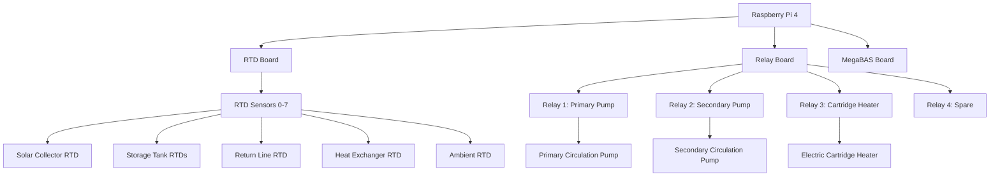

# Detailed Hardware Setup and Connection Guide

## 🎯 **Overview**

This comprehensive guide covers the complete hardware setup for the Solar Heating System v3, including component specifications, wiring diagrams, connection procedures, and troubleshooting.

## 🔧 **Hardware Components**

### **Core Hardware Requirements**

| Component | Model | Purpose | Quantity | Specifications |
|-----------|-------|---------|----------|----------------|
| **Raspberry Pi** | Pi 4 Model B | System controller | 1 | 4GB RAM, 32GB+ microSD |
| **RTD Board** | Sequent Microsystems RTD | Temperature sensing | 1 | 8-channel RTD input |
| **Relay Board** | Sequent Microsystems 4RelInd | Pump/heater control | 1 | 4-channel relay output |
| **MegaBAS Board** | Sequent Microsystems MegaBAS | Additional I/O | 1 | 8-channel analog input |
| **Power Supply** | 5V/3A | System power | 1 | 5V DC, 3A minimum |
| **microSD Card** | Class 10 | System storage | 1 | 32GB+ recommended |

### **Temperature Sensors**

| Sensor | Type | Range | Accuracy | Location | Purpose |
|--------|------|-------|----------|----------|---------|
| **RTD 0** | PT1000 | -50°C to 200°C | ±0.1°C | Solar Collector | Primary heating source |
| **RTD 1** | PT1000 | -50°C to 200°C | ±0.1°C | Storage Tank Top | Hot water storage |
| **RTD 2** | PT1000 | -50°C to 200°C | ±0.1°C | Storage Tank Bottom | Cold water storage |
| **RTD 3** | PT1000 | -50°C to 200°C | ±0.1°C | Return Line | System return temperature |
| **RTD 4** | PT1000 | -50°C to 200°C | ±0.1°C | Heat Exchanger | Heat transfer efficiency |
| **RTD 5** | PT1000 | -50°C to 200°C | ±0.1°C | Ambient | Environmental monitoring |
| **RTD 6** | PT1000 | -50°C to 200°C | ±0.1°C | Spare | Future expansion |
| **RTD 7** | PT1000 | -50°C to 200°C | ±0.1°C | Spare | Future expansion |

### **Control Relays**

| Relay | Purpose | Load | Voltage | Current | Control |
|-------|---------|------|---------|---------|---------|
| **Relay 1** | Primary Pump | 230V AC | 230V | 10A | Primary circulation pump |
| **Relay 2** | Secondary Pump | 230V AC | 230V | 10A | Secondary circulation pump |
| **Relay 3** | Cartridge Heater | 230V AC | 230V | 16A | Electric cartridge heater |
| **Relay 4** | Spare | 230V AC | 230V | 10A | Future expansion |

## 🔌 **Wiring Diagrams**

### **System Overview**



### **RTD Sensor Wiring**

```
RTD Board Connections:
┌─────────────────────────────────────┐
│  RTD Board (Sequent Microsystems)   │
├─────────────────────────────────────┤
│  Channel 0: Solar Collector RTD     │
│  Channel 1: Storage Tank Top RTD    │
│  Channel 2: Storage Tank Bottom RTD │
│  Channel 3: Return Line RTD         │
│  Channel 4: Heat Exchanger RTD      │
│  Channel 5: Ambient RTD             │
│  Channel 6: Spare RTD               │
│  Channel 7: Spare RTD               │
└─────────────────────────────────────┘

RTD Sensor Wiring (3-wire PT1000):
┌─────────────────────────────────────┐
│  RTD Sensor (PT1000)                │
├─────────────────────────────────────┤
│  Wire 1: Red (RTD+)                 │
│  Wire 2: White (RTD-)               │
│  Wire 3: Blue (Compensation)        │
└─────────────────────────────────────┘
```

### **Relay Board Wiring**

```
Relay Board Connections:
┌─────────────────────────────────────┐
│  4RelInd Board (Sequent Microsystems)│
├─────────────────────────────────────┤
│  Relay 1: Primary Pump Control      │
│  Relay 2: Secondary Pump Control    │
│  Relay 3: Cartridge Heater Control  │
│  Relay 4: Spare Control             │
└─────────────────────────────────────┘

Relay Output Wiring:
┌─────────────────────────────────────┐
│  Relay Output (NO/NC)               │
├─────────────────────────────────────┤
│  NO: Normally Open (Load ON)        │
│  NC: Normally Closed (Load OFF)     │
│  COM: Common (Power Source)         │
└─────────────────────────────────────┘
```

## 🔧 **Installation Procedures**

### **Step 1: Raspberry Pi Setup**

```bash
# 1. Flash Raspberry Pi OS to microSD card
# 2. Enable SSH and configure network
# 3. Update system packages
sudo apt update && sudo apt upgrade -y

# 4. Install required packages
sudo apt install -y python3 python3-pip python3-venv git

# 5. Create system user
sudo useradd -m -s /bin/bash solar_heating
sudo usermod -aG sudo solar_heating
sudo usermod -aG i2c solar_heating
sudo usermod -aG spi solar_heating
sudo usermod -aG gpio solar_heating
```

### **Step 2: Hardware Interface Setup**

```bash
# 1. Enable I2C and SPI interfaces
sudo raspi-config
# Navigate to: Interfacing Options > I2C > Enable
# Navigate to: Interfacing Options > SPI > Enable

# 2. Install Sequent Microsystems libraries
cd /home/solar_heating
git clone https://github.com/SequentMicrosystems/rtd-rpi.git
cd rtd-rpi
make
sudo make install

git clone https://github.com/SequentMicrosystems/4relind-rpi.git
cd 4relind-rpi
make
sudo make install

git clone https://github.com/SequentMicrosystems/megabas-rpi.git
cd megabas-rpi
make
sudo make install

# 3. Test hardware connections
sudo rtd -a
sudo 4relind -a
sudo megabas -a
```

### **Step 3: System Installation**

```bash
# 1. Clone the solar heating system
cd /home/solar_heating
git clone https://github.com/DonHugo/sun_heat_and_ftx.git
cd sun_heat_and_ftx

# 2. Create virtual environment
python3 -m venv venv
source venv/bin/activate

# 3. Install Python dependencies
pip install -r python/v3/requirements.txt

# 4. Set up systemd service
sudo cp python/v3/solar_heating_v3.service /etc/systemd/system/
sudo systemctl daemon-reload
sudo systemctl enable solar_heating_v3.service
```

### **Step 4: Hardware Connection Script**

```bash
# Run the hardware connection script
cd /home/solar_heating/sun_heat_and_ftx/python/v3
chmod +x connect_hardware.sh
./connect_hardware.sh
```

## 🔌 **Connection Details**

### **RTD Board Connections**

```python
# RTD Board Configuration
RTD_BOARD_CONFIG = {
    "stack": 0,  # Board stack address
    "channels": 8,  # Number of RTD channels
    "sensor_type": "PT1000",  # RTD sensor type
    "wiring": "3-wire",  # Wiring configuration
    "calibration": {
        "offset": 0.0,  # Temperature offset
        "gain": 1.0     # Temperature gain
    }
}

# RTD Channel Mapping
RTD_CHANNELS = {
    0: "solar_collector_temp",
    1: "storage_tank_top_temp", 
    2: "storage_tank_bottom_temp",
    3: "return_line_temp",
    4: "heat_exchanger_temp",
    5: "ambient_temp",
    6: "spare_rtd_6",
    7: "spare_rtd_7"
}
```

### **Relay Board Connections**

```python
# Relay Board Configuration
RELAY_BOARD_CONFIG = {
    "stack": 0,  # Board stack address
    "relays": 4,  # Number of relays
    "voltage": "230V",  # Operating voltage
    "current": "10A",   # Maximum current per relay
    "type": "NO/NC"     # Relay type
}

# Relay Channel Mapping
RELAY_CHANNELS = {
    1: "primary_pump",
    2: "secondary_pump", 
    3: "cartridge_heater",
    4: "spare_relay_4"
}
```

### **MegaBAS Board Connections**

```python
# MegaBAS Board Configuration
MEGABAS_BOARD_CONFIG = {
    "stack": 0,  # Board stack address
    "channels": 8,  # Number of analog input channels
    "voltage_range": "0-10V",  # Input voltage range
    "resolution": "12-bit",    # ADC resolution
    "type": "differential"     # Input type
}

# MegaBAS Channel Mapping
MEGABAS_CHANNELS = {
    1: "megabas_sensor_1",
    2: "megabas_sensor_2",
    3: "megabas_sensor_3", 
    4: "megabas_sensor_4",
    5: "megabas_sensor_5",
    6: "megabas_sensor_6",
    7: "megabas_sensor_7",
    8: "megabas_sensor_8"
}
```

## 🔧 **Hardware Interface Code**

### **RTD Temperature Reading**

```python
import rtd
import time

class RTDInterface:
    def __init__(self, stack=0):
        self.stack = stack
        self.rtd = rtd.RTD(stack)
        
    def read_temperature(self, channel):
        """Read temperature from RTD channel"""
        try:
            # Read raw RTD value
            raw_value = self.rtd.getRIn1K(self.stack, channel)
            
            if raw_value == 60:  # Error value
                return None
            
            # Convert to temperature (PT1000)
            temperature = self._convert_to_temperature(raw_value)
            
            # Validate temperature range
            if -50 <= temperature <= 200:
                return round(temperature, 1)
            else:
                return None
                
        except Exception as e:
            logger.error(f"Error reading RTD channel {channel}: {e}")
            return None
    
    def _convert_to_temperature(self, raw_value):
        """Convert raw RTD value to temperature"""
        # PT1000 conversion formula
        # R = 1000 * (1 + 0.00385 * T)
        # T = (R/1000 - 1) / 0.00385
        
        resistance = raw_value
        temperature = (resistance / 1000.0 - 1.0) / 0.00385
        return temperature
```

### **Relay Control**

```python
import lib4relind

class RelayInterface:
    def __init__(self, stack=0):
        self.stack = stack
        self.relay = lib4relind.Relay(stack)
        
    def set_relay_state(self, channel, state):
        """Set relay state (True=ON, False=OFF)"""
        try:
            if state:
                self.relay.setRelayOn(self.stack, channel)
            else:
                self.relay.setRelayOff(self.stack, channel)
            
            logger.info(f"Relay {channel} set to {'ON' if state else 'OFF'}")
            return True
            
        except Exception as e:
            logger.error(f"Error setting relay {channel}: {e}")
            return False
    
    def get_relay_state(self, channel):
        """Get current relay state"""
        try:
            state = self.relay.getRelayState(self.stack, channel)
            return state == 1
        except Exception as e:
            logger.error(f"Error reading relay {channel}: {e}")
            return False
```

### **MegaBAS Interface**

```python
import megabas

class MegaBASInterface:
    def __init__(self, stack=0):
        self.stack = stack
        self.megabas = megabas.MegaBAS(stack)
        
    def read_analog_input(self, channel):
        """Read analog input from MegaBAS channel"""
        try:
            # Read raw analog value
            raw_value = self.megabas.getRIn1K(self.stack, channel)
            
            if raw_value == 60:  # Error value
                return None
            
            # Convert to voltage (0-10V range)
            voltage = (raw_value / 4095.0) * 10.0
            
            return round(voltage, 3)
            
        except Exception as e:
            logger.error(f"Error reading MegaBAS channel {channel}: {e}")
            return None
```

## 🛠️ **Hardware Testing**

### **Connection Test Script**

```python
#!/usr/bin/env python3
"""
Hardware Connection Test Script
"""

import sys
import time
from hardware_interface import HardwareInterface

def test_hardware_connections():
    """Test all hardware connections"""
    print("🔧 Testing Hardware Connections")
    print("=" * 50)
    
    # Initialize hardware interface
    hardware = HardwareInterface(simulation_mode=False)
    
    # Test RTD sensors
    print("\n🌡️ Testing RTD Temperature Sensors...")
    for sensor_id in range(8):
        temp = hardware.read_rtd_temperature(sensor_id)
        if temp is not None:
            print(f"  RTD {sensor_id}: {temp}°C ✅")
        else:
            print(f"  RTD {sensor_id}: ERROR ❌")
    
    # Test relay outputs
    print("\n🔌 Testing Relay Outputs...")
    for relay_id in range(1, 5):
        # Test relay ON
        if hardware.set_relay_state(relay_id, True):
            print(f"  Relay {relay_id}: ON ✅")
            time.sleep(1)
            
            # Test relay OFF
            if hardware.set_relay_state(relay_id, False):
                print(f"  Relay {relay_id}: OFF ✅")
            else:
                print(f"  Relay {relay_id}: OFF ERROR ❌")
        else:
            print(f"  Relay {relay_id}: ON ERROR ❌")
    
    # Test MegaBAS inputs
    print("\n📊 Testing MegaBAS Analog Inputs...")
    for channel in range(1, 9):
        value = hardware.read_megabas_analog_input(channel)
        if value is not None:
            print(f"  MegaBAS {channel}: {value}V ✅")
        else:
            print(f"  MegaBAS {channel}: ERROR ❌")
    
    print("\n✅ Hardware connection test completed!")

if __name__ == "__main__":
    test_hardware_connections()
```

### **Individual Component Tests**

```bash
# Test RTD board
sudo rtd -a
sudo rtd -r 0 0  # Read channel 0 on stack 0

# Test relay board
sudo 4relind -a
sudo 4relind -o 0 1 1  # Turn on relay 1 on stack 0
sudo 4relind -o 0 1 0  # Turn off relay 1 on stack 0

# Test MegaBAS board
sudo megabas -a
sudo megabas -r 0 1  # Read channel 1 on stack 0
```

## 🔍 **Troubleshooting**

### **Common Hardware Issues**

1. **RTD Sensor Reading Errors**
   ```bash
   # Check sensor wiring
   sudo rtd -r 0 0  # Should return temperature value
   
   # Check for loose connections
   # Verify 3-wire RTD wiring (Red, White, Blue)
   ```

2. **Relay Not Switching**
   ```bash
   # Test relay manually
   sudo 4relind -o 0 1 1  # Turn on relay 1
   sudo 4relind -o 0 1 0  # Turn off relay 1
   
   # Check relay load connections
   # Verify NO/NC/COM wiring
   ```

3. **MegaBAS Reading Errors**
   ```bash
   # Test analog input
   sudo megabas -r 0 1  # Should return voltage value
   
   # Check input signal levels
   # Verify 0-10V input range
   ```

### **Hardware Diagnostics**

```python
def diagnose_hardware_issues():
    """Diagnose common hardware issues"""
    issues = []
    
    # Check RTD sensors
    for sensor_id in range(8):
        temp = hardware.read_rtd_temperature(sensor_id)
        if temp is None:
            issues.append(f"RTD sensor {sensor_id} not responding")
        elif temp < -50 or temp > 200:
            issues.append(f"RTD sensor {sensor_id} reading out of range: {temp}°C")
    
    # Check relay outputs
    for relay_id in range(1, 5):
        if not hardware.set_relay_state(relay_id, True):
            issues.append(f"Relay {relay_id} not responding to ON command")
        if not hardware.set_relay_state(relay_id, False):
            issues.append(f"Relay {relay_id} not responding to OFF command")
    
    # Check MegaBAS inputs
    for channel in range(1, 9):
        value = hardware.read_megabas_analog_input(channel)
        if value is None:
            issues.append(f"MegaBAS channel {channel} not responding")
        elif value < 0 or value > 10:
            issues.append(f"MegaBAS channel {channel} reading out of range: {value}V")
    
    return issues
```

## 📋 **Installation Checklist**

### **Pre-Installation**

- [ ] Raspberry Pi 4 (4GB RAM) ready
- [ ] 32GB+ microSD card prepared
- [ ] All hardware boards available
- [ ] RTD sensors installed in system
- [ ] Relay loads (pumps, heaters) connected
- [ ] Power supplies available
- [ ] Network connection established

### **Hardware Installation**

- [ ] RTD sensors wired to RTD board
- [ ] Relay outputs connected to loads
- [ ] MegaBAS inputs connected (if used)
- [ ] Power supplies connected
- [ ] All boards stacked and secured
- [ ] Wiring checked and secured

### **Software Installation**

- [ ] Raspberry Pi OS installed
- [ ] I2C and SPI interfaces enabled
- [ ] Sequent Microsystems libraries installed
- [ ] Solar heating system cloned
- [ ] Python dependencies installed
- [ ] Systemd service configured

### **Testing and Validation**

- [ ] RTD sensors reading correctly
- [ ] Relay outputs switching properly
- [ ] MegaBAS inputs reading (if used)
- [ ] System starting automatically
- [ ] MQTT communication working
- [ ] Home Assistant integration active

## 📚 **Related Documentation**

- **`DETAILED_SOLAR_HEATING_V3_IMPLEMENTATION.md`** - Core system implementation
- **`DETAILED_TASKMASTER_AI_INTEGRATION.md`** - AI integration details
- **`DETAILED_HOME_ASSISTANT_INTEGRATION.md`** - Smart home integration
- **`DETAILED_DEPLOYMENT_GUIDE.md`** - Production deployment
- **`USER_GUIDE_SOLAR_HEATING_V3.md`** - User operation guide

---

**This guide provides complete hardware setup and connection details for the Solar Heating System v3. Follow the procedures carefully to ensure reliable system operation.**
