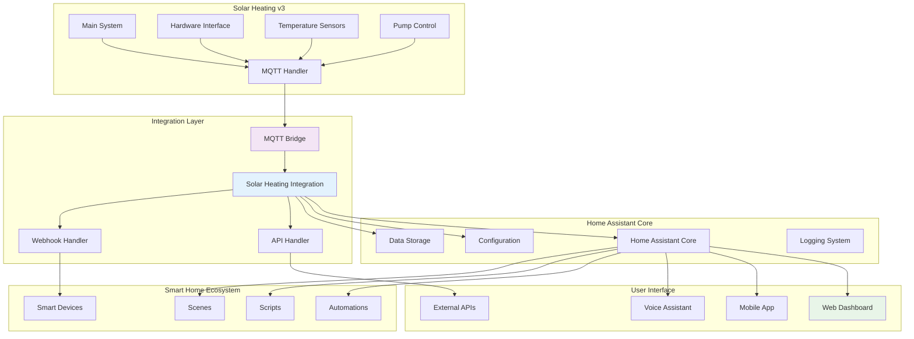
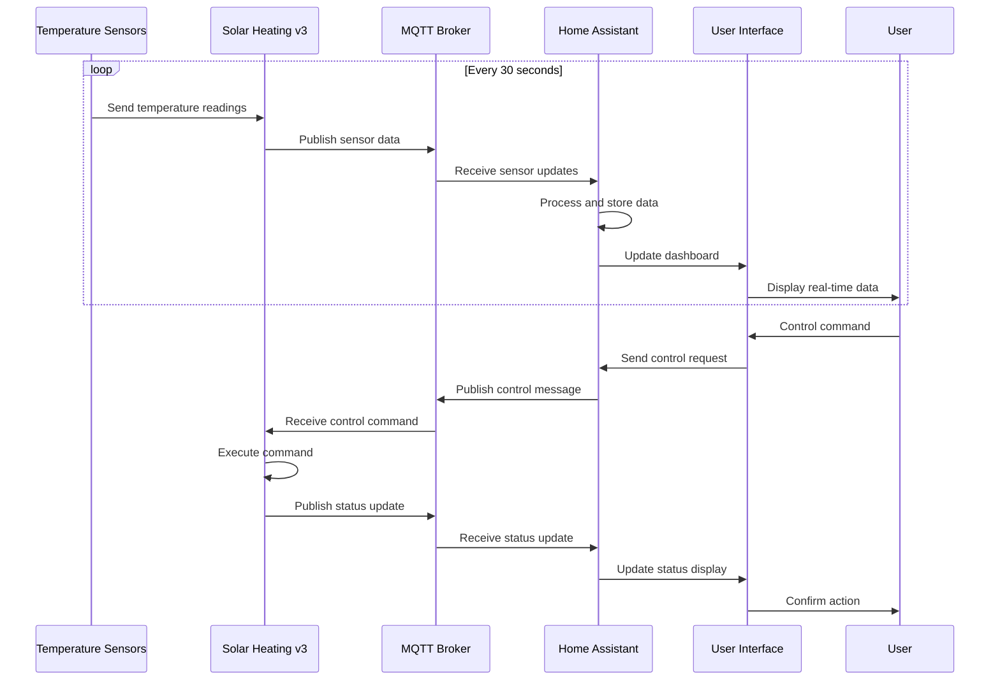
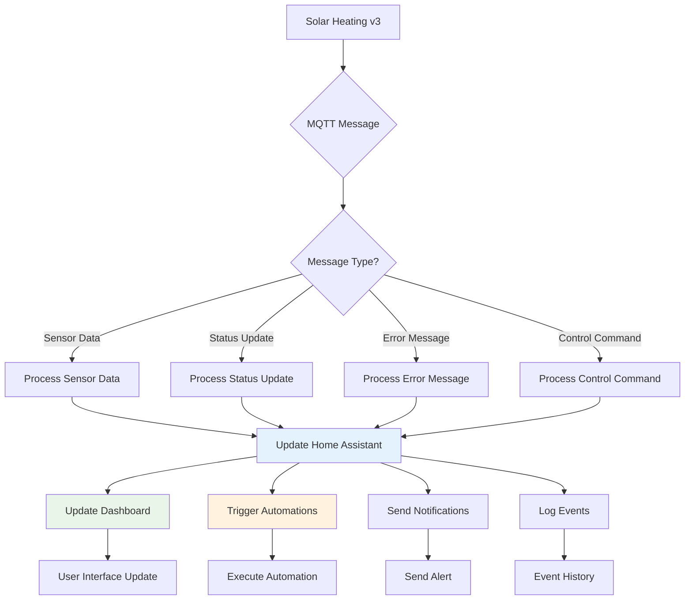
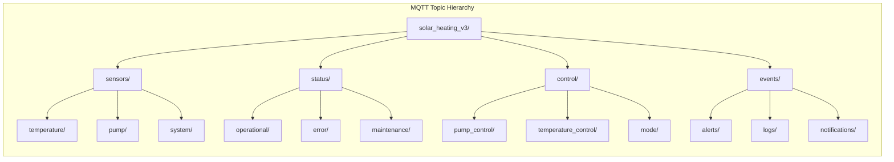
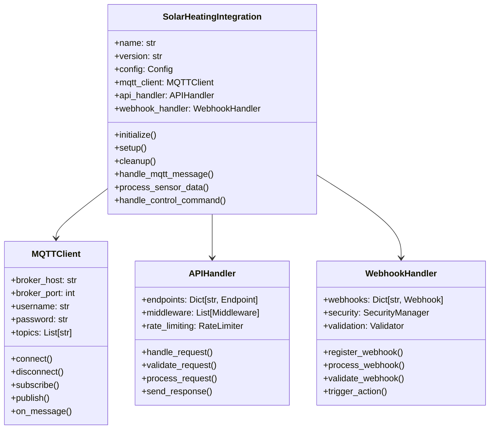
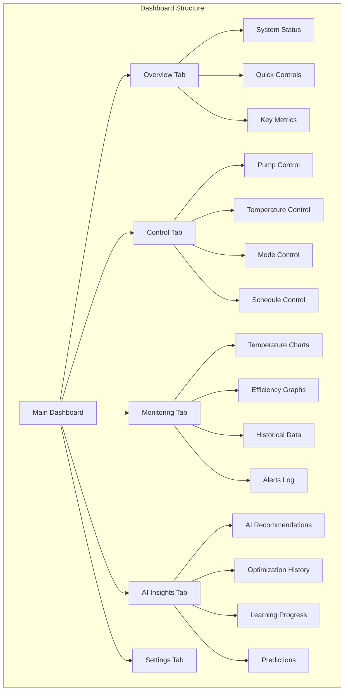
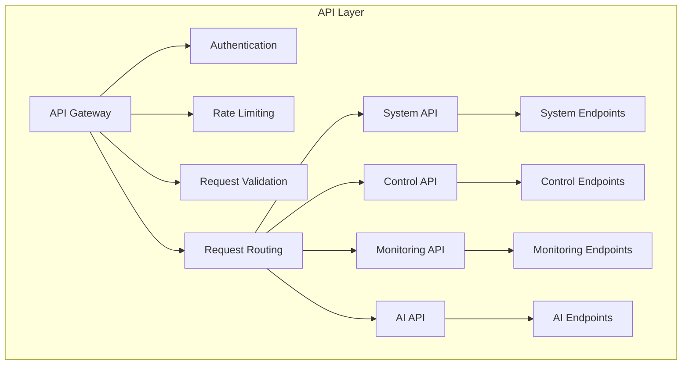
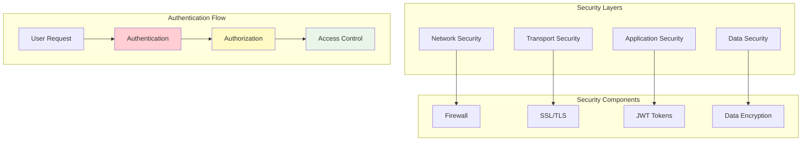
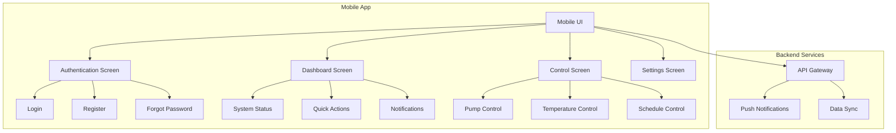

# Design: Home Assistant Integration

## 🏗️ **How the Integration Works**

This document explains the technical design and architecture of the Home Assistant integration, including how the integration components interact, the communication protocols, and the integration points with your solar heating system and smart home ecosystem.

## 🏛️ **System Architecture**

### **High-Level Integration Architecture**



### **Component Responsibilities**

| Component | Responsibility | Key Functions |
|-----------|----------------|---------------|
| **Integration Layer** | Core integration logic | MQTT communication, data processing, device management |
| **MQTT Bridge** | Message routing | Route messages between systems, handle protocol conversion |
| **API Handler** | External API management | REST API endpoints, webhook handling, external integrations |
| **Webhook Handler** | Webhook processing | Process incoming webhooks, trigger automations |
| **User Interface** | User interaction | Web dashboard, mobile app, voice control |

## 🔄 **Integration Workflow**

### **Data Flow Architecture**



### **Integration Communication Flow**



## 🔌 **MQTT Communication Design**

### **MQTT Topic Structure**



### **MQTT Message Formats**

```python
# Sensor Data Message
{
    "topic": "solar_heating_v3/sensors/temperature/collector",
    "payload": {
        "temperature": 75.2,
        "unit": "celsius",
        "timestamp": "2024-01-15T10:30:00Z",
        "sensor_id": "collector_temp_01",
        "status": "active"
    }
}

# Control Command Message
{
    "topic": "solar_heating_v3/control/pump_control",
    "payload": {
        "command": "start",
        "parameters": {
            "speed": "normal",
            "duration": 300
        },
        "timestamp": "2024-01-15T10:30:00Z",
        "user_id": "user_001"
    }
}

# Status Update Message
{
    "topic": "solar_heating_v3/status/operational",
    "payload": {
        "system_mode": "auto",
        "pump_status": "running",
        "current_temperature": 72.1,
        "target_temperature": 70.0,
        "efficiency": 0.85,
        "timestamp": "2024-01-15T10:30:00Z"
    }
}
```

## 🏠 **Home Assistant Integration Components**

### **Integration Core Architecture**



### **Device Discovery and Management**

```python
class DeviceManager:
    def __init__(self, integration):
        self.integration = integration
        self.devices = {}
        self.discovery_queue = []
        
    def discover_devices(self):
        """Discover solar heating devices via MQTT"""
        # Subscribe to discovery topics
        self.integration.mqtt_client.subscribe("solar_heating_v3/discovery/#")
        
        # Send discovery request
        discovery_message = {
            "command": "discover",
            "timestamp": datetime.utcnow().isoformat()
        }
        
        self.integration.mqtt_client.publish(
            "solar_heating_v3/discovery/request",
            discovery_message
        )
    
    def handle_device_discovery(self, message):
        """Handle device discovery responses"""
        device_info = message.payload
        
        # Create Home Assistant device entity
        device_entity = self.create_device_entity(device_info)
        
        # Register device with Home Assistant
        self.register_device(device_entity)
        
        # Store device reference
        self.devices[device_info['device_id']] = device_entity
    
    def create_device_entity(self, device_info):
        """Create Home Assistant entity for discovered device"""
        if device_info['type'] == 'temperature_sensor':
            return TemperatureSensorEntity(device_info)
        elif device_info['type'] == 'pump_control':
            return PumpControlEntity(device_info)
        elif device_info['type'] == 'system_control':
            return SystemControlEntity(device_info)
        else:
            return GenericDeviceEntity(device_info)
```

## 📊 **Dashboard and User Interface Design**

### **Dashboard Layout Architecture**



### **Dashboard Component Design**

```python
class DashboardManager:
    def __init__(self, integration):
        self.integration = integration
        self.dashboards = {}
        self.widgets = {}
        
    def create_main_dashboard(self):
        """Create the main solar heating dashboard"""
        dashboard_config = {
            'title': 'Solar Heating System',
            'type': 'custom:grid-layout',
            'views': [
                self.create_overview_view(),
                self.create_control_view(),
                self.create_monitoring_view(),
                self.create_ai_insights_view(),
                self.create_settings_view()
            ]
        }
        
        return self.create_dashboard('main', dashboard_config)
    
    def create_overview_view(self):
        """Create the overview dashboard view"""
        return {
            'title': 'Overview',
            'type': 'custom:grid-layout',
            'cards': [
                self.create_system_status_card(),
                self.create_quick_controls_card(),
                self.create_key_metrics_card(),
                self.create_weather_card(),
                self.create_efficiency_card()
            ]
        }
    
    def create_system_status_card(self):
        """Create system status display card"""
        return {
            'type': 'custom:solar-heating-status-card',
            'title': 'System Status',
            'entities': [
                'sensor.solar_heating_system_status',
                'sensor.solar_heating_pump_status',
                'sensor.solar_heating_mode'
            ],
            'show_controls': True,
            'show_efficiency': True
        }
    
    def create_quick_controls_card(self):
        """Create quick control buttons card"""
        return {
            'type': 'custom:button-card',
            'title': 'Quick Controls',
            'buttons': [
                {
                    'name': 'Start Pump',
                    'service': 'switch.turn_on',
                    'target': 'switch.solar_heating_pump'
                },
                {
                    'name': 'Stop Pump',
                    'service': 'switch.turn_off',
                    'target': 'switch.solar_heating_pump'
                },
                {
                    'name': 'Auto Mode',
                    'service': 'input_select.select_option',
                    'target': 'input_select.solar_heating_mode',
                    'option': 'auto'
                }
            ]
        }
```

## 🔧 **API and Webhook Design**

### **REST API Architecture**



### **API Endpoint Design**

```python
class APIEndpoint:
    def __init__(self, integration):
        self.integration = integration
        self.rate_limiter = RateLimiter()
        self.authenticator = Authenticator()
        
    def get_system_status(self, request):
        """Get current system status"""
        try:
            # Rate limiting
            if not self.rate_limiter.allow_request(request):
                return self.rate_limit_response()
            
            # Authentication
            if not self.authenticator.authenticate(request):
                return self.unauthorized_response()
            
            # Get system status
            status = self.integration.get_system_status()
            
            return {
                'status': 'success',
                'data': status,
                'timestamp': datetime.utcnow().isoformat()
            }
            
        except Exception as e:
            return self.error_response(str(e))
    
    def control_pump(self, request):
        """Control pump operation"""
        try:
            # Validate request
            command = request.json.get('command')
            parameters = request.json.get('parameters', {})
            
            if not self.validate_pump_command(command, parameters):
                return self.validation_error_response()
            
            # Execute command
            result = self.integration.control_pump(command, parameters)
            
            return {
                'status': 'success',
                'data': result,
                'timestamp': datetime.utcnow().isoformat()
            }
            
        except Exception as e:
            return self.error_response(str(e))
    
    def get_temperature_history(self, request):
        """Get temperature history data"""
        try:
            # Parse parameters
            start_time = request.args.get('start_time')
            end_time = request.args.get('end_time')
            sensor_id = request.args.get('sensor_id')
            
            # Get historical data
            history = self.integration.get_temperature_history(
                start_time, end_time, sensor_id
            )
            
            return {
                'status': 'success',
                'data': history,
                'timestamp': datetime.utcnow().isoformat()
            }
            
        except Exception as e:
            return self.error_response(str(e))
```

### **Webhook Handler Design**

```python
class WebhookHandler:
    def __init__(self, integration):
        self.integration = integration
        self.webhooks = {}
        self.security_manager = SecurityManager()
        
    def register_webhook(self, webhook_id, config):
        """Register a new webhook"""
        webhook = {
            'id': webhook_id,
            'url': config['url'],
            'events': config.get('events', ['all']),
            'headers': config.get('headers', {}),
            'security': config.get('security', {}),
            'enabled': config.get('enabled', True)
        }
        
        self.webhooks[webhook_id] = webhook
        return webhook
    
    def process_webhook(self, webhook_id, payload):
        """Process incoming webhook"""
        webhook = self.webhooks.get(webhook_id)
        if not webhook or not webhook['enabled']:
            return False
        
        # Validate webhook
        if not self.validate_webhook(webhook, payload):
            return False
        
        # Process webhook based on type
        webhook_type = payload.get('type')
        
        if webhook_type == 'temperature_alert':
            return self.handle_temperature_alert(payload)
        elif webhook_type == 'pump_status_change':
            return self.handle_pump_status_change(payload)
        elif webhook_type == 'system_error':
            return self.handle_system_error(payload)
        else:
            return self.handle_generic_webhook(payload)
    
    def handle_temperature_alert(self, payload):
        """Handle temperature alert webhook"""
        temperature = payload.get('temperature')
        sensor_id = payload.get('sensor_id')
        threshold = payload.get('threshold')
        
        # Create Home Assistant notification
        notification_data = {
            'title': 'Temperature Alert',
            'message': f'Temperature {temperature}°C on sensor {sensor_id} exceeded threshold {threshold}°C',
            'priority': 'high'
        }
        
        self.integration.send_notification(notification_data)
        
        # Trigger automation if configured
        self.integration.trigger_automation('temperature_alert', payload)
        
        return True
```

## 🔐 **Security and Authentication Design**

### **Security Architecture**



### **Authentication Implementation**

```python
class Authenticator:
    def __init__(self, config):
        self.config = config
        self.jwt_secret = config.get('jwt_secret')
        self.session_timeout = config.get('session_timeout', 3600)
        self.max_attempts = config.get('max_attempts', 5)
        
    def authenticate_request(self, request):
        """Authenticate incoming request"""
        # Check for API key
        api_key = request.headers.get('X-API-Key')
        if api_key and self.validate_api_key(api_key):
            return True
        
        # Check for JWT token
        auth_header = request.headers.get('Authorization')
        if auth_header and auth_header.startswith('Bearer '):
            token = auth_header.split(' ')[1]
            return self.validate_jwt_token(token)
        
        # Check for session cookie
        session_id = request.cookies.get('session_id')
        if session_id:
            return self.validate_session(session_id)
        
        return False
    
    def validate_jwt_token(self, token):
        """Validate JWT token"""
        try:
            payload = jwt.decode(token, self.jwt_secret, algorithms=['HS256'])
            
            # Check expiration
            if payload.get('exp', 0) < time.time():
                return False
            
            # Check user permissions
            user_id = payload.get('user_id')
            permissions = payload.get('permissions', [])
            
            return self.check_user_permissions(user_id, permissions)
            
        except jwt.InvalidTokenError:
            return False
    
    def create_jwt_token(self, user_id, permissions):
        """Create JWT token for user"""
        payload = {
            'user_id': user_id,
            'permissions': permissions,
            'iat': time.time(),
            'exp': time.time() + self.session_timeout
        }
        
        return jwt.encode(payload, self.jwt_secret, algorithm='HS256')
```

## 📱 **Mobile and Remote Access Design**

### **Mobile App Architecture**



### **Remote Access Implementation**

```python
class RemoteAccessManager:
    def __init__(self, integration):
        self.integration = integration
        self.remote_users = {}
        self.access_logs = []
        
    def enable_remote_access(self, user_id, config):
        """Enable remote access for user"""
        remote_config = {
            'user_id': user_id,
            'enabled': True,
            'ip_whitelist': config.get('ip_whitelist', []),
            'access_level': config.get('access_level', 'read_only'),
            'expires_at': config.get('expires_at'),
            'created_at': datetime.utcnow()
        }
        
        self.remote_users[user_id] = remote_config
        return remote_config
    
    def validate_remote_access(self, request, user_id):
        """Validate remote access request"""
        user_config = self.remote_users.get(user_id)
        if not user_config or not user_config['enabled']:
            return False
        
        # Check expiration
        if user_config['expires_at'] and user_config['expires_at'] < datetime.utcnow():
            return False
        
        # Check IP whitelist
        client_ip = request.remote_addr
        if user_config['ip_whitelist'] and client_ip not in user_config['ip_whitelist']:
            return False
        
        # Log access
        self.log_access(user_id, client_ip, request.path)
        
        return True
    
    def log_access(self, user_id, client_ip, endpoint):
        """Log remote access attempt"""
        access_log = {
            'user_id': user_id,
            'client_ip': client_ip,
            'endpoint': endpoint,
            'timestamp': datetime.utcnow(),
            'success': True
        }
        
        self.access_logs.append(access_log)
        
        # Keep only last 1000 logs
        if len(self.access_logs) > 1000:
            self.access_logs = self.access_logs[-1000:]
```

## 🔗 **Related Documentation**

- **[Requirements Document](REQUIREMENTS_HOME_ASSISTANT.md)** - What we built and why
- **[Implementation Guide](IMPLEMENTATION_HOME_ASSISTANT.md)** - Technical implementation details
- **[User Guide](USER_GUIDE_HOME_ASSISTANT.md)** - How to use the integration
- **[Summary](SUMMARY_HOME_ASSISTANT.md)** - Complete integration overview
- **[System Overview](../SYSTEM_OVERVIEW.md)** - Complete system understanding
- **[Component Map](../COMPONENT_MAP.md)** - System component relationships

---

**This document explains how the Home Assistant integration works at a technical level, including the integration architecture, communication protocols, and user interface design. It serves as the technical foundation for integration implementation and maintenance.**
