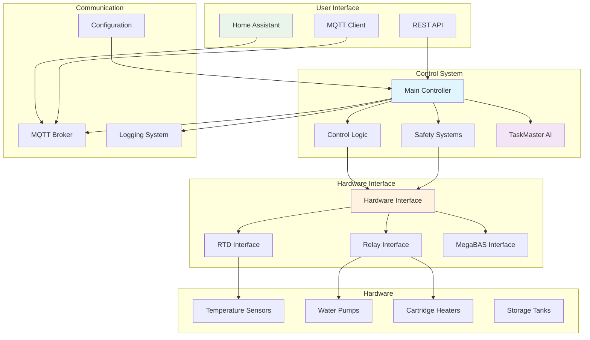
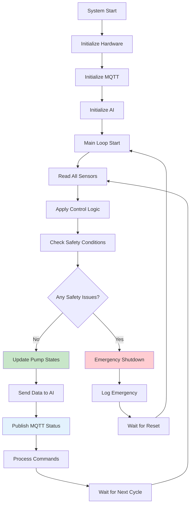
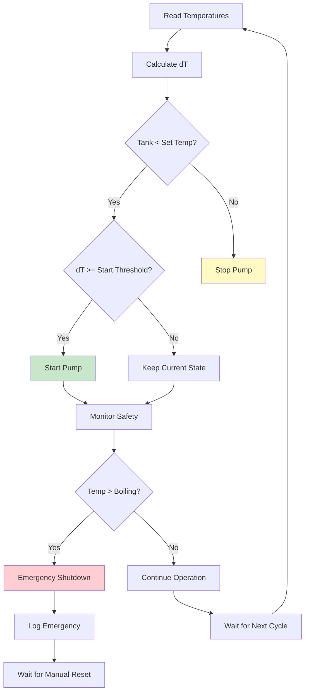
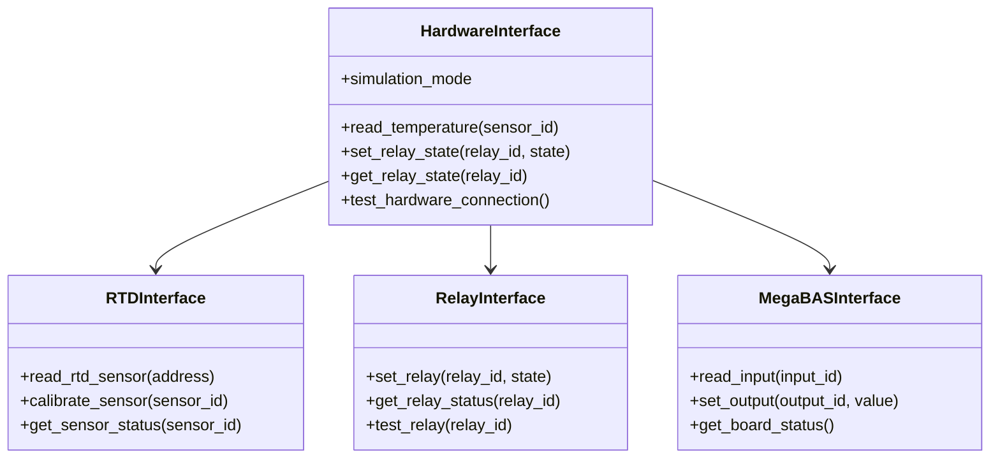
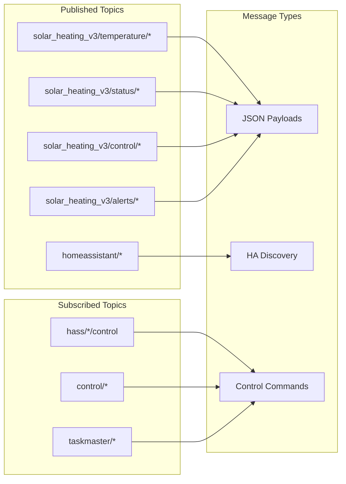
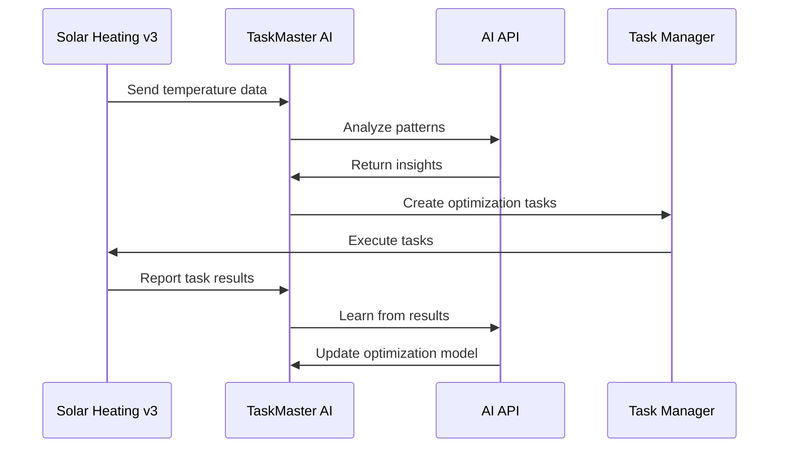
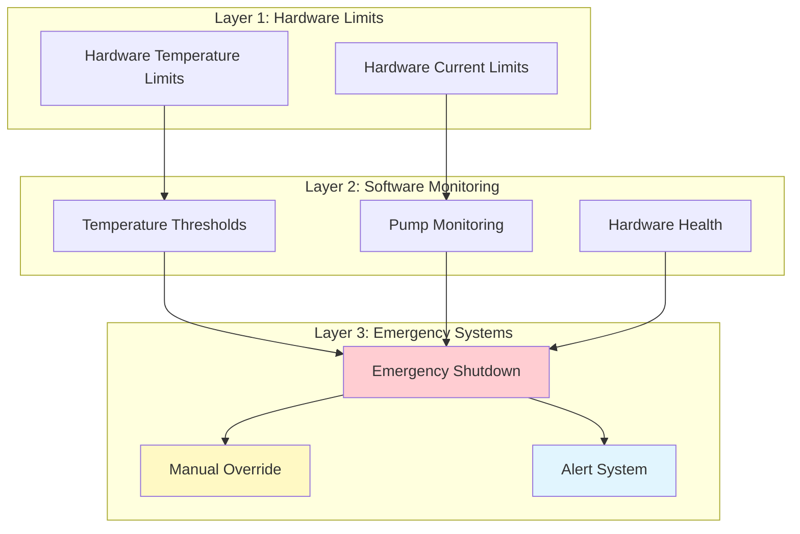
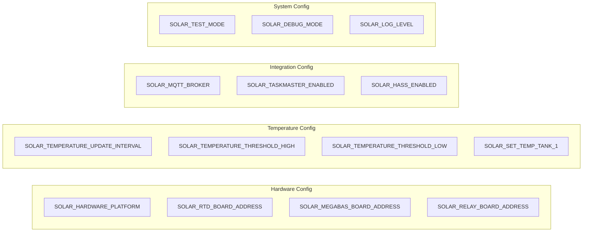
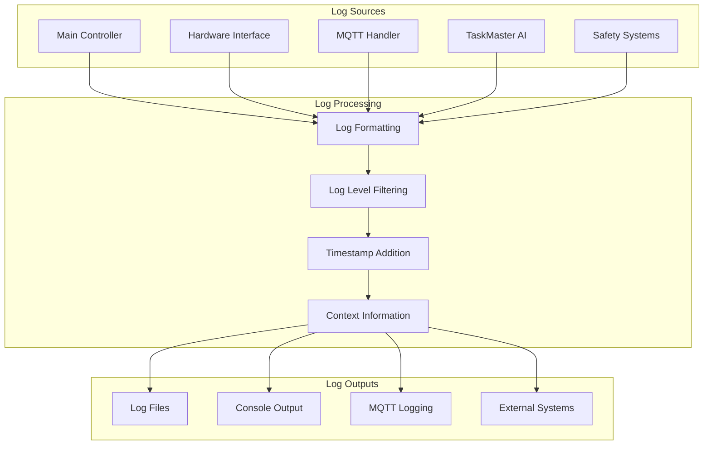
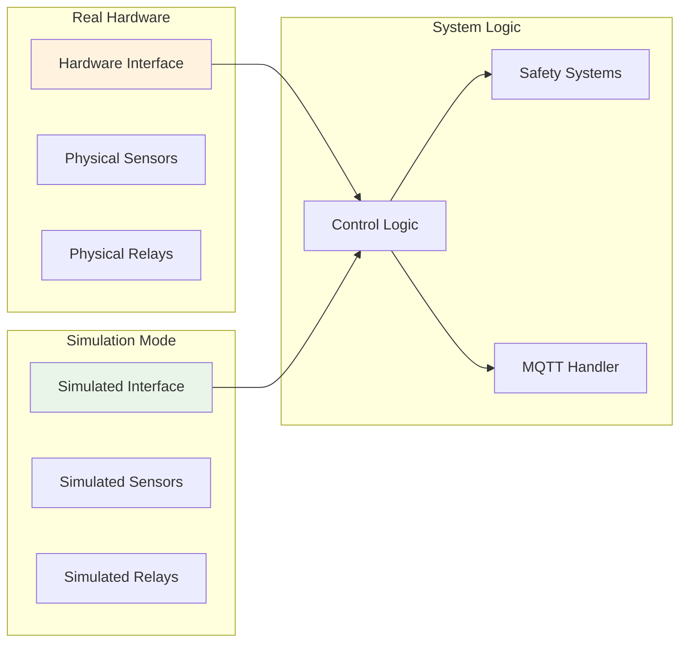

# Design: Solar Heating System v3

## 🏗️ **How the System Works**

This document explains the technical design and architecture of the Solar Heating v3 system, including how all components interact, the control logic, and the data flow.

## 🏛️ **System Architecture**

### **High-Level Architecture**



### **Component Responsibilities**

| Component | Responsibility | Key Functions |
|-----------|----------------|---------------|
| **Main Controller** | System orchestration | Temperature monitoring, pump control, safety monitoring |
| **Control Logic** | Temperature-based decisions | Pump start/stop logic, threshold management |
| **Safety Systems** | System protection | Emergency shutdown, temperature limits, hardware monitoring |
| **Hardware Interface** | Hardware abstraction | Sensor reading, relay control, hardware testing |
| **MQTT Handler** | Communication | Status publishing, command processing, Home Assistant integration |
| **TaskMaster AI** | Intelligence | Optimization, task creation, predictive insights |

## 🔄 **System Workflow**

### **Main Control Loop**



### **Temperature Control Logic**



## 🔧 **Control Logic Details**

### **Pump Control Algorithm**

The system uses a sophisticated temperature difference (dT) algorithm for pump control:

```python
def calculate_pump_state(solar_temp, tank_temp, set_temp, dT_start, dT_stop):
    dT = solar_temp - tank_temp
    
    # Safety check - emergency shutdown at boiling
    if solar_temp > BOILING_TEMPERATURE:
        return "EMERGENCY_SHUTDOWN"
    
    # Check if tank needs heating
    if tank_temp < set_temp:
        # Start pump if temperature difference is sufficient
        if dT >= dT_start:
            return "START_PUMP"
        else:
            return "KEEP_CURRENT_STATE"
    else:
        # Stop pump if tank is hot enough or dT is too low
        if dT <= dT_stop:
            return "STOP_PUMP"
        else:
            return "KEEP_CURRENT_STATE"
```

### **Temperature Thresholds**

| Parameter | Description | Default Value | Configurable |
|-----------|-------------|---------------|--------------|
| `set_temp_tank_1` | Target tank temperature | 70.0°C | ✅ Yes |
| `dTStart_tank_1` | Start pump threshold | 8.0°C | ✅ Yes |
| `dTStop_tank_1` | Stop pump threshold | 4.0°C | ✅ Yes |
| `temp_threshold_high` | High temperature warning | 80.0°C | ✅ Yes |
| `temp_threshold_low` | Low temperature warning | 20.0°C | ✅ Yes |
| `temp_kok` | Boiling temperature | 150.0°C | ✅ Yes |

## 🏗️ **Hardware Interface Design**

### **Hardware Abstraction Layer**



### **Hardware Mapping**

| Hardware Component | Interface | Address | Purpose |
|-------------------|-----------|---------|---------|
| **RTD Board** | RTD Interface | 0 | Temperature sensors |
| **MegaBAS Board** | MegaBAS Interface | 3 | Input/output control |
| **Relay Board** | Relay Interface | 2 | Pump and heater control |

### **Sensor Configuration**

| Sensor ID | Location | Type | Purpose |
|-----------|----------|------|---------|
| 0 | Solar Collector | RTD | Solar panel temperature |
| 1 | Storage Tank | RTD | Tank water temperature |
| 2 | Return Line | RTD | Return water temperature |
| 3 | Heat Exchanger | RTD | Heat exchanger temperature |

## 📡 **MQTT Communication Design**

### **Topic Structure**



### **Message Format**

**Temperature Data**:
```json
{
    "temperature": 75.2,
    "unit": "°C",
    "timestamp": "2024-01-15T10:30:00Z",
    "sensor_id": "solar_collector",
    "status": "normal"
}
```

**Pump Status**:
```json
{
    "pump_id": "primary",
    "status": "running",
    "power": 120,
    "flow_rate": 2.5,
    "timestamp": "2024-01-15T10:30:00Z"
}
```

**Control Commands**:
```json
{
    "action": "start_pump",
    "pump_id": "primary",
    "reason": "manual_override",
    "timestamp": "2024-01-15T10:30:00Z"
}
```

## 🤖 **AI Integration Design**

### **TaskMaster AI Integration**



### **AI Data Flow**

1. **Data Collection**: System sends real-time temperature and status data
2. **Pattern Analysis**: AI analyzes temperature patterns and system behavior
3. **Task Creation**: AI creates optimization tasks based on analysis
4. **Task Execution**: System executes AI-recommended tasks
5. **Result Learning**: AI learns from task results to improve future recommendations

## 🚨 **Safety System Design**

### **Safety Layers**



### **Safety Triggers**

| Safety Condition | Trigger | Action | Recovery |
|------------------|---------|--------|----------|
| **Boiling Temperature** | Solar temp > 150°C | Emergency shutdown | Manual reset required |
| **High Temperature** | Any temp > 80°C | Warning alert | Automatic monitoring |
| **Low Temperature** | Any temp < 20°C | Warning alert | Automatic monitoring |
| **Pump Failure** | Pump not responding | Alert and stop | Manual intervention |
| **Hardware Error** | Communication failure | Alert and retry | Automatic retry |

## 🔧 **Configuration Management**

### **Environment Variables**



### **Configuration Loading**

```python
def load_configuration():
    config = {
        'hardware': load_hardware_config(),
        'temperature': load_temperature_config(),
        'integration': load_integration_config(),
        'system': load_system_config()
    }
    
    # Validate configuration
    validate_config(config)
    
    # Set defaults for missing values
    set_defaults(config)
    
    return config
```

## 📊 **Monitoring and Logging Design**

### **Logging Architecture**



### **Log Levels**

| Level | Description | Use Case |
|-------|-------------|----------|
| **DEBUG** | Detailed debugging information | Development and troubleshooting |
| **INFO** | General information messages | Normal operation monitoring |
| **WARNING** | Warning conditions | Potential issues |
| **ERROR** | Error conditions | System errors |
| **CRITICAL** | Critical conditions | Safety and emergency situations |

## 🧪 **Testing and Simulation Design**

### **Simulation Mode**



### **Testing Capabilities**

1. **Unit Testing**: Individual component testing
2. **Integration Testing**: Component interaction testing
3. **System Testing**: Full system functionality testing
4. **Performance Testing**: Response time and throughput testing
5. **Safety Testing**: Emergency condition testing

## 🔗 **Related Documentation**

- **[Requirements Document](REQUIREMENTS_SOLAR_HEATING_V3.md)** - What we built and why
- **[Implementation Guide](IMPLEMENTATION_SOLAR_HEATING_V3.md)** - Technical implementation details
- **[User Guide](USER_GUIDE_SOLAR_HEATING_V3.md)** - How to use the system
- **[System Overview](../SYSTEM_OVERVIEW.md)** - Complete system understanding
- **[Component Map](../COMPONENT_MAP.md)** - System component relationships

---

**This document explains how the Solar Heating v3 system works at a technical level, including the architecture, control logic, and integration points. It serves as the technical foundation for implementation and maintenance.**
