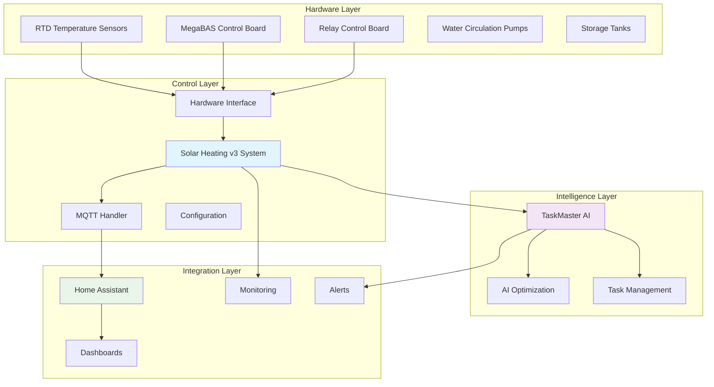
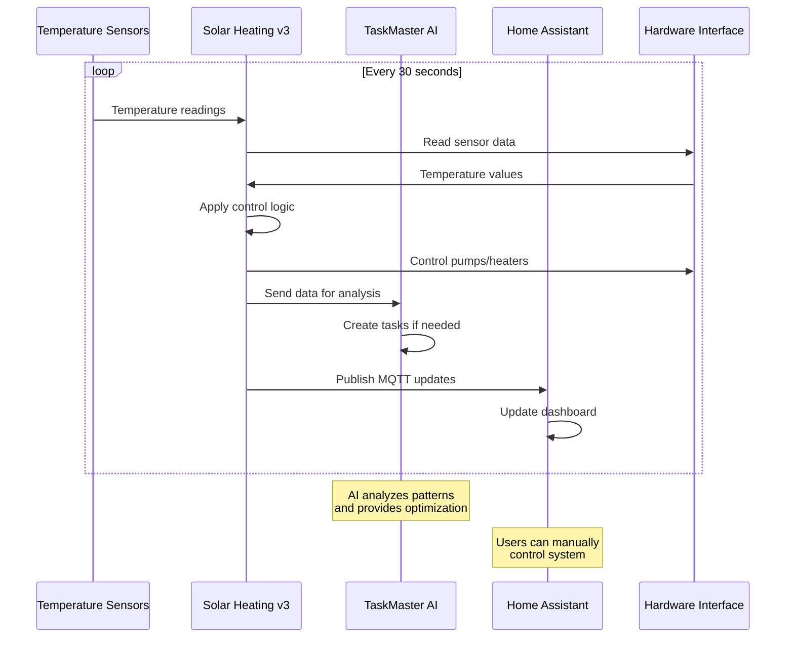
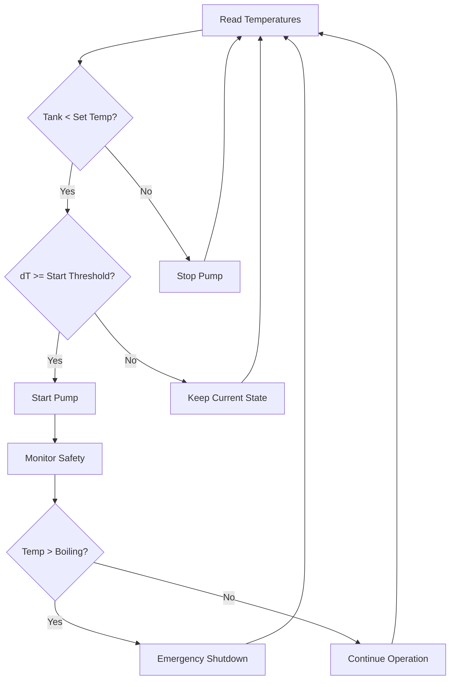
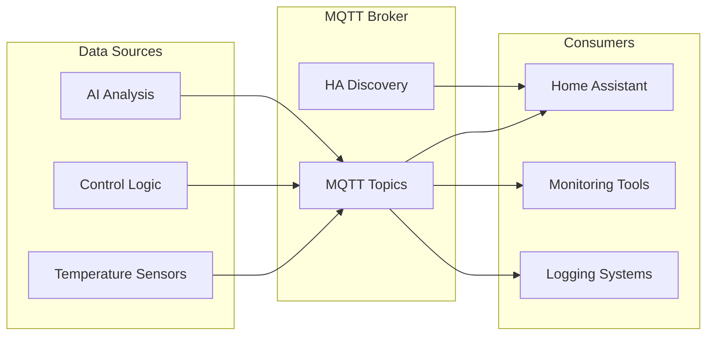

# Solar Heating System - Complete System Overview

A comprehensive guide to understanding how all components of your intelligent solar heating system work together.

## 🎯 **What This Document Covers**

This is your **master system overview** - the one document that explains everything about your solar heating system, how all components work together, and how to get started quickly.

**If you're new here**: Start reading from the top and work your way down.  
**If you need specific details**: Use the navigation links to jump to component-specific documentation.

## 🏗️ **System Architecture Overview**

Your solar heating system is built with a **modular, intelligent architecture** that combines hardware control, AI optimization, and smart home integration.



## 🚀 **Quick Start Guide**

### **Get Running in 5 Minutes**

1. **Clone and Setup**:
   ```bash
   cd python/v3
   source venv/bin/activate
   pip install -r requirements.txt
   ```

2. **Configure Environment**:
   ```bash
   cp ../../config/env.example .env
   # Edit .env with your settings
   ```

3. **Start the System**:
   ```bash
   python main_system.py
   ```

4. **Access Home Assistant**: Open your HA dashboard to see live data

5. **Enable TaskMaster AI**: Set your API key and watch AI optimization begin

## 🔧 **Core Components Deep Dive**

### **1. Solar Heating System v3** 🏠
**Purpose**: The heart of your system - controls temperature, pumps, and safety systems

**What it does**:
- Monitors temperature sensors every 30 seconds
- Controls water circulation pumps based on temperature logic
- Manages safety systems (emergency shutdown at boiling)
- Provides MQTT communication for integration

**Key Features**:
- Intelligent pump control with configurable thresholds
- Real-time temperature monitoring
- Emergency safety systems
- Simulation mode for testing

**Files**: `python/v3/main_system.py`, `python/v3/hardware_interface.py`

### **2. TaskMaster AI Integration** 🤖
**Purpose**: Adds AI-powered intelligence and optimization to your system

**What it does**:
- Creates intelligent tasks based on sensor data
- Provides AI-powered system optimization recommendations
- Automates decision-making for pump and valve control
- Learns from your system's performance patterns

**Key Features**:
- Automatic task creation when thresholds are exceeded
- AI-driven efficiency recommendations
- Predictive maintenance insights
- Integration with existing hardware

**Files**: `taskmaster/taskmaster_service.py`, `taskmaster/taskmaster_integration.py`

### **3. Home Assistant Integration** 🏡
**Purpose**: Smart home control and monitoring dashboard

**What it does**:
- Provides real-time system status
- Offers manual control over pumps and heaters
- Shows temperature graphs and energy consumption
- Integrates with your existing smart home ecosystem

**Key Features**:
- Live temperature monitoring
- Pump and heater controls
- Energy consumption tracking
- Mobile-friendly dashboards

**Files**: `docs/HOME_ASSISTANT_SETUP.md`, `docs/home_assistant_dashboard_v3.yaml`

### **4. Hardware Interface** ⚡
**Purpose**: Abstracts Sequent Microsystems hardware for easy control

**What it does**:
- Reads temperature from RTD sensors
- Controls relay outputs for pumps and heaters
- Handles MegaBAS board communication
- Provides simulation mode for testing

**Key Features**:
- Hardware abstraction layer
- Simulation mode for development
- Error handling and diagnostics
- Easy hardware testing

**Files**: `python/v3/hardware_interface.py`, `python/v3/connect_hardware.sh`

## 🔄 **How Everything Works Together**

### **System Workflow**



### **Temperature Control Logic**



## 📊 **Data Flow Architecture**

### **MQTT Topic Structure**

```
solar_heating_v3/
├── temperature/
│   ├── solar_collector     # Solar panel temperature
│   ├── storage_tank        # Tank temperature
│   ├── return_line         # Return water temperature
│   └── heat_exchanger      # Heat exchanger temperature
├── status/
│   ├── system              # Overall system status
│   ├── pump/primary        # Primary pump status
│   └── energy              # Energy calculations
├── control/
│   ├── pump                # Pump control commands
│   └── heater              # Heater control commands
└── alerts/
    ├── high_temperature    # High temp warnings
    ├── low_temperature     # Low temp warnings
    └── emergency           # Emergency conditions
```

### **Integration Points**



## 🎛️ **Control and Automation**

### **Automatic Control**

Your system automatically controls pumps based on:

1. **Temperature Difference (dT)**: Start when dT ≥ `dTStart_tank_1`, stop when dT ≤ `dTStop_tank_1`
2. **Storage Tank Temperature**: Maintain tank at `set_temp_tank_1` ± hysteresis
3. **Safety Conditions**: Emergency shutdown at boiling temperature
4. **AI Recommendations**: TaskMaster AI can override normal operation

### **Manual Control**

Users can manually control via:
- **Home Assistant Dashboard**: Web interface for manual control
- **MQTT Commands**: Direct MQTT messages for automation
- **API Endpoints**: REST API for external integration

### **AI Automation**

TaskMaster AI provides:
- **Predictive Control**: Anticipate temperature changes
- **Efficiency Optimization**: Suggest optimal pump timing
- **Maintenance Alerts**: Predict when maintenance is needed
- **Learning**: Adapts to your usage patterns

## 🔍 **Monitoring and Observability**

### **Real-time Monitoring**

- **Temperature Graphs**: Live temperature trends
- **Pump Status**: Current pump operation state
- **Energy Consumption**: Real-time energy calculations
- **System Alerts**: Immediate notification of issues

### **Historical Data**

- **Temperature History**: Long-term temperature trends
- **Energy Analysis**: Daily/monthly energy consumption
- **Performance Metrics**: System efficiency over time
- **Maintenance Logs**: Historical maintenance activities

### **Alerting System**

- **High Temperature**: Alert when temperatures exceed safe limits
- **Low Temperature**: Warning when system isn't heating effectively
- **Pump Failures**: Immediate alert if pumps stop working
- **AI Insights**: TaskMaster AI recommendations and alerts

## 🚨 **Safety and Reliability**

### **Safety Systems**

1. **Emergency Shutdown**: Automatic shutdown at boiling temperature
2. **Temperature Limits**: Configurable high/low temperature thresholds
3. **Pump Monitoring**: Continuous monitoring of pump operation
4. **Hardware Diagnostics**: Regular hardware health checks

### **Reliability Features**

1. **Watchdog System**: Automatic restart if system becomes unresponsive
2. **Error Recovery**: Automatic recovery from common errors
3. **Logging**: Comprehensive logging for troubleshooting
4. **Simulation Mode**: Test system without affecting hardware

## 🔧 **Configuration and Customization**

### **Environment Variables**

Key configuration options:

```bash
# Hardware Configuration
SOLAR_HARDWARE_PLATFORM=raspberry_pi_zero_2_w
SOLAR_RTD_BOARD_ADDRESS=0
SOLAR_MEGABAS_BOARD_ADDRESS=3
SOLAR_RELAY_BOARD_ADDRESS=2

# Temperature Control
SOLAR_TEMPERATURE_UPDATE_INTERVAL=30
SOLAR_TEMPERATURE_THRESHOLD_HIGH=80.0
SOLAR_TEMPERATURE_THRESHOLD_LOW=20.0
SOLAR_SET_TEMP_TANK_1=70.0

# AI Integration
SOLAR_TASKMASTER_ENABLED=true
SOLAR_TASKMASTER_API_KEY=your_api_key_here
```

### **Customization Options**

- **Temperature Thresholds**: Adjust heating and cooling temperatures
- **Update Intervals**: Change how often sensors are read
- **AI Behavior**: Configure TaskMaster AI sensitivity and behavior
- **Dashboard Layout**: Customize Home Assistant dashboard appearance

## 📈 **Performance and Scalability**

### **System Requirements**

- **Hardware**: Raspberry Pi Zero 2 W (minimum)
- **Memory**: 512MB RAM
- **Storage**: 1GB free space
- **Network**: Stable MQTT connection

### **Performance Metrics**

- **Temperature Update Rate**: 30 seconds (configurable)
- **MQTT Latency**: < 1 second
- **Control Response Time**: < 5 seconds
- **System Uptime**: > 99.9%

### **Scalability**

The system is designed to scale:
- **Additional Sensors**: Easy to add more temperature sensors
- **Multiple Tanks**: Support for multiple storage tanks
- **Extended Monitoring**: Add more monitoring points
- **AI Enhancement**: Expand TaskMaster AI capabilities

## 🚀 **Getting Started Paths**

### **Path 1: Quick Demo (5 minutes)**
1. Run in simulation mode
2. See basic temperature monitoring
3. Understand control logic

### **Path 2: Full Setup (30 minutes)**
1. Configure hardware connections
2. Set up MQTT broker
3. Configure Home Assistant
4. Enable TaskMaster AI

### **Path 3: Production Deployment (2 hours)**
1. Deploy to Raspberry Pi
2. Configure production settings
3. Set up monitoring and alerts
4. Test all safety systems

## 🔗 **Component Documentation Links**

### **Detailed Component Guides**

- **[Solar Heating v3](python/v3/README.md)** - Core system implementation
- **[TaskMaster AI](taskmaster/README_TASKMASTER.md)** - AI integration details
- **[Home Assistant](docs/HOME_ASSISTANT_SETUP.md)** - Smart home integration
- **[Hardware Setup](python/v3/connect_hardware.sh)** - Hardware connection guide
- **[Deployment](python/deployment/README.md)** - Production deployment

### **Component-Specific Documentation**

- **[Rate of Change Sensors](docs/RATE_OF_CHANGE_SENSORS_SUMMARY.md)** - Advanced sensor features
- **[Real-time Energy](docs/REALTIME_ENERGY_SENSOR_SETUP.md)** - Energy monitoring
- **[Monitoring Options](docs/MONITORING_OPTIONS.md)** - System monitoring
- **[Watchdog System](docs/WATCHDOG_SYSTEM.md)** - Reliability features

## 🎯 **Next Steps**

### **For New Users**
1. **Read this overview** to understand the complete system
2. **Follow the Quick Start** to get running quickly
3. **Explore component docs** for specific features you need

### **For Existing Users**
1. **Review component docs** for new features
2. **Check monitoring setup** for optimal performance
3. **Explore AI features** for system optimization

### **For Developers**
1. **Review architecture** for integration points
2. **Check API documentation** for external integration
3. **Explore customization** options for your needs

## 🤝 **Support and Community**

### **Documentation**
- **This Overview**: Complete system understanding
- **Component Docs**: Detailed feature information
- **API Reference**: Integration and development
- **Troubleshooting**: Common issues and solutions

### **Getting Help**
1. **Check this overview** for system understanding
2. **Review component docs** for specific features
3. **Check troubleshooting** for common issues
4. **Review logs** for detailed error information

---

**Remember**: This document is your **master reference** for understanding how everything works together. Use the navigation links to dive deeper into specific components, or start here for the complete picture.

**Happy heating!** 🔥☀️
