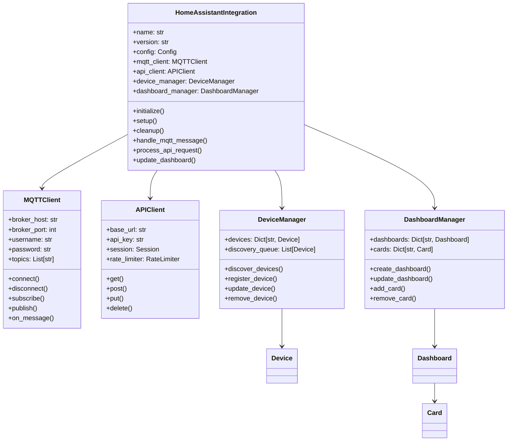

# Implementation: Home Assistant Integration

## 🔧 **Technical Implementation Details**

This document provides the technical implementation details for the Home Assistant integration, including code structure, key components, and implementation patterns.

## 🏗️ **Code Architecture**

### **File Structure**

```
home_assistant_integration/
├── __init__.py                    # Package initialization
├── manifest.json                  # Integration manifest
├── config_flow.py                 # Configuration flow
├── const.py                       # Constants and configuration
├── translations/                  # Multi-language support
│   └── en.json                   # English translations
├── services.yaml                  # Service definitions
├── sensor.py                      # Sensor entities
├── switch.py                      # Switch entities
├── climate.py                     # Climate entities
├── binary_sensor.py               # Binary sensor entities
├── api/                           # API implementation
│   ├── __init__.py
│   ├── client.py                  # API client
│   ├── endpoints.py               # API endpoints
│   └── webhooks.py                # Webhook handling
├── mqtt/                          # MQTT implementation
│   ├── __init__.py
│   ├── client.py                  # MQTT client
│   ├── discovery.py               # Device discovery
│   └── handlers.py                # Message handlers
├── dashboard/                     # Dashboard components
│   ├── __init__.py
│   ├── cards.py                   # Custom cards
│   ├── layouts.py                 # Dashboard layouts
│   └── themes.py                  # Custom themes
└── utils/                         # Utility functions
    ├── __init__.py
    ├── helpers.py                 # Helper functions
    ├── validators.py              # Data validation
    └── converters.py              # Data conversion
```

### **Core Classes and Relationships**



## 🔌 **MQTT Integration Implementation**

### **MQTT Client Implementation**

```python
import paho.mqtt.client as mqtt
import json
import logging
from typing import Dict, List, Callable, Optional
from datetime import datetime

class MQTTClient:
    def __init__(self, config: Dict):
        self.config = config
        self.client = mqtt.Client()
        self.connected = False
        self.subscribed_topics = set()
        self.message_handlers = {}
        self.logger = logging.getLogger(__name__)
        
        # Configure MQTT client
        self.client.on_connect = self.on_connect
        self.client.on_disconnect = self.on_disconnect
        self.client.on_message = self.on_message
        self.client.on_subscribe = self.on_subscribe
        
        # Set authentication if provided
        if config.get('username') and config.get('password'):
            self.client.username_pw_set(config['username'], config['password'])
        
        # Set TLS if enabled
        if config.get('use_tls', False):
            self.client.tls_set()
    
    def connect(self) -> bool:
        """Connect to MQTT broker"""
        try:
            host = self.config.get('host', 'localhost')
            port = self.config.get('port', 1883)
            keepalive = self.config.get('keepalive', 60)
            
            self.logger.info(f"Connecting to MQTT broker {host}:{port}")
            self.client.connect(host, port, keepalive)
            
            # Start the loop in a separate thread
            self.client.loop_start()
            
            return True
            
        except Exception as e:
            self.logger.error(f"Failed to connect to MQTT broker: {e}")
            return False
    
    def disconnect(self):
        """Disconnect from MQTT broker"""
        try:
            self.client.loop_stop()
            self.client.disconnect()
            self.connected = False
            self.logger.info("Disconnected from MQTT broker")
        except Exception as e:
            self.logger.error(f"Error disconnecting from MQTT broker: {e}")
    
    def on_connect(self, client, userdata, flags, rc):
        """Callback when connected to MQTT broker"""
        if rc == 0:
            self.connected = True
            self.logger.info("Connected to MQTT broker")
            
            # Resubscribe to topics
            for topic in self.subscribed_topics:
                self.client.subscribe(topic)
        else:
            self.logger.error(f"Failed to connect to MQTT broker with code {rc}")
    
    def on_disconnect(self, client, userdata, rc):
        """Callback when disconnected from MQTT broker"""
        self.connected = False
        if rc != 0:
            self.logger.warning(f"Unexpected disconnection from MQTT broker with code {rc}")
        else:
            self.logger.info("Disconnected from MQTT broker")
    
    def subscribe(self, topic: str, handler: Callable = None) -> bool:
        """Subscribe to MQTT topic"""
        try:
            if not self.connected:
                self.logger.warning("Cannot subscribe: not connected to MQTT broker")
                return False
            
            # Subscribe to topic
            result, mid = self.client.subscribe(topic)
            
            if result == mqtt.MQTT_ERR_SUCCESS:
                self.subscribed_topics.add(topic)
                if handler:
                    self.message_handlers[topic] = handler
                self.logger.info(f"Subscribed to topic: {topic}")
                return True
            else:
                self.logger.error(f"Failed to subscribe to topic {topic}")
                return False
                
        except Exception as e:
            self.logger.error(f"Error subscribing to topic {topic}: {e}")
            return False
    
    def publish(self, topic: str, payload: Dict, qos: int = 0, retain: bool = False) -> bool:
        """Publish message to MQTT topic"""
        try:
            if not self.connected:
                self.logger.warning("Cannot publish: not connected to MQTT broker")
                return False
            
            # Convert payload to JSON string
            if isinstance(payload, dict):
                payload = json.dumps(payload)
            
            # Publish message
            result = self.client.publish(topic, payload, qos, retain)
            
            if result.rc == mqtt.MQTT_ERR_SUCCESS:
                self.logger.debug(f"Published to topic {topic}: {payload}")
                return True
            else:
                self.logger.error(f"Failed to publish to topic {topic}")
                return False
                
        except Exception as e:
            self.logger.error(f"Error publishing to topic {topic}: {e}")
            return False
    
    def on_message(self, client, userdata, msg):
        """Callback when message received from MQTT broker"""
        try:
            topic = msg.topic
            payload = msg.payload.decode('utf-8')
            
            self.logger.debug(f"Received message on topic {topic}: {payload}")
            
            # Parse JSON payload
            try:
                data = json.loads(payload)
            except json.JSONDecodeError:
                self.logger.warning(f"Invalid JSON payload on topic {topic}")
                return
            
            # Call registered handler for this topic
            if topic in self.message_handlers:
                handler = self.message_handlers[topic]
                handler(topic, data)
            else:
                # Default message handling
                self.handle_message(topic, data)
                
        except Exception as e:
            self.logger.error(f"Error handling MQTT message: {e}")
    
    def handle_message(self, topic: str, data: Dict):
        """Default message handler"""
        # Route message based on topic structure
        if topic.startswith('solar_heating_v3/sensors/'):
            self.handle_sensor_data(topic, data)
        elif topic.startswith('solar_heating_v3/status/'):
            self.handle_status_update(topic, data)
        elif topic.startswith('solar_heating_v3/events/'):
            self.handle_event(topic, data)
        else:
            self.logger.debug(f"No handler for topic: {topic}")
    
    def handle_sensor_data(self, topic: str, data: Dict):
        """Handle sensor data messages"""
        sensor_type = topic.split('/')[2]  # Extract sensor type from topic
        sensor_id = data.get('sensor_id', 'unknown')
        
        # Update Home Assistant entity
        self.update_sensor_entity(sensor_type, sensor_id, data)
    
    def handle_status_update(self, topic: str, data: Dict):
        """Handle status update messages"""
        status_type = topic.split('/')[2]  # Extract status type from topic
        
        # Update Home Assistant entity
        self.update_status_entity(status_type, data)
    
    def handle_event(self, topic: str, data: Dict):
        """Handle event messages"""
        event_type = topic.split('/')[2]  # Extract event type from topic
        
        # Process event
        self.process_event(event_type, data)
```

### **Device Discovery Implementation**

```python
class DeviceDiscovery:
    def __init__(self, integration):
        self.integration = integration
        self.discovered_devices = {}
        self.discovery_timeout = 30  # seconds
        self.logger = logging.getLogger(__name__)
        
    def start_discovery(self):
        """Start device discovery process"""
        try:
            # Subscribe to discovery topics
            self.integration.mqtt_client.subscribe("solar_heating_v3/discovery/#")
            
            # Send discovery request
            discovery_request = {
                "command": "discover",
                "timestamp": datetime.utcnow().isoformat(),
                "request_id": self.generate_request_id()
            }
            
            self.integration.mqtt_client.publish(
                "solar_heating_v3/discovery/request",
                discovery_request
            )
            
            # Set discovery timeout
            self.schedule_discovery_timeout()
            
            self.logger.info("Device discovery started")
            
        except Exception as e:
            self.logger.error(f"Failed to start device discovery: {e}")
    
    def handle_discovery_response(self, topic: str, data: Dict):
        """Handle device discovery response"""
        try:
            device_id = data.get('device_id')
            device_type = data.get('device_type')
            device_info = data.get('device_info', {})
            
            if not device_id or not device_type:
                self.logger.warning("Invalid discovery response: missing device_id or device_type")
                return
            
            # Create device entity
            device_entity = self.create_device_entity(device_type, device_info)
            
            if device_entity:
                # Register device with Home Assistant
                self.register_device(device_id, device_entity)
                
                # Store discovered device
                self.discovered_devices[device_id] = {
                    'type': device_type,
                    'info': device_info,
                    'entity': device_entity,
                    'discovered_at': datetime.utcnow()
                }
                
                self.logger.info(f"Discovered device: {device_id} ({device_type})")
            
        except Exception as e:
            self.logger.error(f"Error handling discovery response: {e}")
    
    def create_device_entity(self, device_type: str, device_info: Dict):
        """Create Home Assistant entity for discovered device"""
        try:
            if device_type == 'temperature_sensor':
                return self.create_temperature_sensor(device_info)
            elif device_type == 'pump_control':
                return self.create_pump_control(device_info)
            elif device_type == 'system_control':
                return self.create_system_control(device_info)
            elif device_type == 'efficiency_monitor':
                return self.create_efficiency_monitor(device_info)
            else:
                self.logger.warning(f"Unknown device type: {device_type}")
                return None
                
        except Exception as e:
            self.logger.error(f"Error creating device entity: {e}")
            return None
    
    def create_temperature_sensor(self, device_info: Dict):
        """Create temperature sensor entity"""
        from .sensor import TemperatureSensor
        
        return TemperatureSensor(
            name=device_info.get('name', 'Temperature Sensor'),
            unique_id=device_info.get('unique_id'),
            device_class=device_info.get('device_class', 'temperature'),
            unit_of_measurement=device_info.get('unit', '°C'),
            icon=device_info.get('icon', 'mdi:thermometer')
        )
    
    def create_pump_control(self, device_info: Dict):
        """Create pump control entity"""
        from .switch import PumpControl
        
        return PumpControl(
            name=device_info.get('name', 'Pump Control'),
            unique_id=device_info.get('unique_id'),
            icon=device_info.get('icon', 'mdi:pump')
        )
    
    def register_device(self, device_id: str, device_entity):
        """Register device with Home Assistant"""
        try:
            # Add device to Home Assistant
            self.integration.add_entities([device_entity])
            
            # Update device registry
            self.update_device_registry(device_id, device_entity)
            
            self.logger.info(f"Registered device {device_id} with Home Assistant")
            
        except Exception as e:
            self.logger.error(f"Failed to register device {device_id}: {e}")
    
    def update_device_registry(self, device_id: str, device_entity):
        """Update Home Assistant device registry"""
        try:
            # Get or create device entry
            device_registry = self.integration.hass.helpers.device_registry.async_get()
            
            device_entry = device_registry.async_get_or_create(
                config_entry_id=self.integration.entry.entry_id,
                identifiers={("solar_heating_v3", device_id)},
                name=device_entity.name,
                manufacturer="Solar Heating v3",
                model=device_entity.device_class,
                sw_version="1.0.0"
            )
            
            # Update entity with device info
            device_entity.device_info = device_entry
            
        except Exception as e:
            self.logger.error(f"Failed to update device registry: {e}")
```

## 🏠 **Home Assistant Entity Implementation**

### **Temperature Sensor Entity**

```python
import logging
from homeassistant.components.sensor import SensorEntity
from homeassistant.config_entries import ConfigEntry
from homeassistant.core import HomeAssistant
from homeassistant.helpers.entity import DeviceInfo
from homeassistant.const import (
    ATTR_TEMPERATURE,
    CONF_NAME,
    CONF_UNIQUE_ID,
    TEMP_CELSIUS,
    TEMP_FAHRENHEIT
)

class TemperatureSensor(SensorEntity):
    """Temperature sensor entity for solar heating system."""
    
    def __init__(self, name: str, unique_id: str, device_class: str = 'temperature',
                 unit_of_measurement: str = TEMP_CELSIUS, icon: str = 'mdi:thermometer'):
        self._name = name
        self._unique_id = unique_id
        self._device_class = device_class
        self._unit_of_measurement = unit_of_measurement
        self._icon = icon
        self._state = None
        self._attributes = {}
        self.logger = logging.getLogger(__name__)
    
    @property
    def name(self) -> str:
        """Return the name of the sensor."""
        return self._name
    
    @property
    def unique_id(self) -> str:
        """Return the unique ID of the sensor."""
        return self._unique_id
    
    @property
    def device_class(self) -> str:
        """Return the device class of the sensor."""
        return self._device_class
    
    @property
    def unit_of_measurement(self) -> str:
        """Return the unit of measurement of the sensor."""
        return self._unit_of_measurement
    
    @property
    def icon(self) -> str:
        """Return the icon of the sensor."""
        return self._icon
    
    @property
    def state(self) -> float:
        """Return the state of the sensor."""
        return self._state
    
    @property
    def extra_state_attributes(self) -> dict:
        """Return the state attributes of the sensor."""
        return self._attributes
    
    def update_temperature(self, temperature: float, timestamp: str = None):
        """Update the temperature reading."""
        try:
            # Convert temperature if needed
            if self._unit_of_measurement == TEMP_FAHRENHEIT:
                temperature = self.celsius_to_fahrenheit(temperature)
            
            # Update state
            self._state = round(temperature, 1)
            
            # Update attributes
            self._attributes = {
                'last_updated': timestamp or datetime.utcnow().isoformat(),
                'unit': self._unit_of_measurement,
                'device_class': self._device_class
            }
            
            # Notify Home Assistant of state change
            self.async_write_ha_state()
            
            self.logger.debug(f"Updated temperature sensor {self._name}: {self._state}{self._unit_of_measurement}")
            
        except Exception as e:
            self.logger.error(f"Error updating temperature sensor {self._name}: {e}")
    
    def celsius_to_fahrenheit(self, celsius: float) -> float:
        """Convert Celsius to Fahrenheit."""
        return (celsius * 9/5) + 32
    
    def fahrenheit_to_celsius(self, fahrenheit: float) -> float:
        """Convert Fahrenheit to Celsius."""
        return (fahrenheit - 32) * 5/9
```

### **Pump Control Entity**

```python
from homeassistant.components.switch import SwitchEntity
from homeassistant.const import (
    CONF_NAME,
    CONF_UNIQUE_ID,
    ATTR_DEVICE_CLASS
)

class PumpControl(SwitchEntity):
    """Pump control entity for solar heating system."""
    
    def __init__(self, name: str, unique_id: str, icon: str = 'mdi:pump'):
        self._name = name
        self._unique_id = unique_id
        self._icon = icon
        self._state = False
        self._attributes = {}
        self.logger = logging.getLogger(__name__)
    
    @property
    def name(self) -> str:
        """Return the name of the switch."""
        return self._name
    
    @property
    def unique_id(self) -> str:
        """Return the unique ID of the switch."""
        return self._unique_id
    
    @property
    def icon(self) -> str:
        """Return the icon of the switch."""
        return self._icon
    
    @property
    def is_on(self) -> bool:
        """Return true if the switch is on."""
        return self._state
    
    @property
    def extra_state_attributes(self) -> dict:
        """Return the state attributes of the switch."""
        return self._attributes
    
    async def async_turn_on(self, **kwargs):
        """Turn the pump on."""
        try:
            # Send pump start command via MQTT
            command = {
                "command": "start",
                "parameters": kwargs.get('parameters', {}),
                "timestamp": datetime.utcnow().isoformat(),
                "user_id": "home_assistant"
            }
            
            await self.hass.async_add_executor_job(
                self.send_pump_command,
                "solar_heating_v3/control/pump_control",
                command
            )
            
            # Update local state
            self._state = True
            self._attributes.update({
                'last_command': 'start',
                'last_command_time': command['timestamp'],
                'command_parameters': kwargs.get('parameters', {})
            })
            
            # Notify Home Assistant of state change
            self.async_write_ha_state()
            
            self.logger.info(f"Pump {self._name} turned on")
            
        except Exception as e:
            self.logger.error(f"Error turning on pump {self._name}: {e}")
    
    async def async_turn_off(self, **kwargs):
        """Turn the pump off."""
        try:
            # Send pump stop command via MQTT
            command = {
                "command": "stop",
                "parameters": kwargs.get('parameters', {}),
                "timestamp": datetime.utcnow().isoformat(),
                "user_id": "home_assistant"
            }
            
            await self.hass.async_add_executor_job(
                self.send_pump_command,
                "solar_heating_v3/control/pump_control",
                command
            )
            
            # Update local state
            self._state = False
            self._attributes.update({
                'last_command': 'stop',
                'last_command_time': command['timestamp'],
                'command_parameters': kwargs.get('parameters', {})
            })
            
            # Notify Home Assistant of state change
            self.async_write_ha_state()
            
            self.logger.info(f"Pump {self._name} turned off")
            
        except Exception as e:
            self.logger.error(f"Error turning off pump {self._name}: {e}")
    
    def update_pump_status(self, status: str, timestamp: str = None):
        """Update the pump status."""
        try:
            # Update state based on status
            if status.lower() in ['running', 'on', 'active']:
                self._state = True
            elif status.lower() in ['stopped', 'off', 'inactive']:
                self._state = False
            
            # Update attributes
            self._attributes.update({
                'status': status,
                'last_status_update': timestamp or datetime.utcnow().isoformat()
            })
            
            # Notify Home Assistant of state change
            self.async_write_ha_state()
            
            self.logger.debug(f"Updated pump status {self._name}: {status}")
            
        except Exception as e:
            self.logger.error(f"Error updating pump status {self._name}: {e}")
    
    def send_pump_command(self, topic: str, command: dict):
        """Send pump command via MQTT."""
        try:
            # Get MQTT client from integration
            mqtt_client = self.hass.data.get('solar_heating_v3_mqtt_client')
            if mqtt_client:
                mqtt_client.publish(topic, command)
            else:
                self.logger.error("MQTT client not available")
                
        except Exception as e:
            self.logger.error(f"Error sending pump command: {e}")
```

## 📊 **Dashboard Implementation**

### **Dashboard Manager**

```python
class DashboardManager:
    def __init__(self, integration):
        self.integration = integration
        self.dashboards = {}
        self.custom_cards = {}
        self.logger = logging.getLogger(__name__)
        
    def create_main_dashboard(self):
        """Create the main solar heating dashboard"""
        try:
            dashboard_config = {
                'title': 'Solar Heating System',
                'type': 'custom:grid-layout',
                'views': [
                    self.create_overview_view(),
                    self.create_control_view(),
                    self.create_monitoring_view(),
                    self.create_ai_insights_view(),
                    self.create_settings_view()
                ]
            }
            
            dashboard = self.create_dashboard('main', dashboard_config)
            self.dashboards['main'] = dashboard
            
            self.logger.info("Main dashboard created successfully")
            return dashboard
            
        except Exception as e:
            self.logger.error(f"Failed to create main dashboard: {e}")
            return None
    
    def create_overview_view(self):
        """Create the overview dashboard view"""
        return {
            'title': 'Overview',
            'type': 'custom:grid-layout',
            'cards': [
                self.create_system_status_card(),
                self.create_quick_controls_card(),
                self.create_key_metrics_card(),
                self.create_weather_card(),
                self.create_efficiency_card()
            ]
        }
    
    def create_system_status_card(self):
        """Create system status display card"""
        return {
            'type': 'custom:solar-heating-status-card',
            'title': 'System Status',
            'entities': [
                'sensor.solar_heating_system_status',
                'sensor.solar_heating_pump_status',
                'sensor.solar_heating_mode'
            ],
            'show_controls': True,
            'show_efficiency': True,
            'layout': 'vertical'
        }
    
    def create_quick_controls_card(self):
        """Create quick control buttons card"""
        return {
            'type': 'custom:button-card',
            'title': 'Quick Controls',
            'buttons': [
                {
                    'name': 'Start Pump',
                    'service': 'switch.turn_on',
                    'target': 'switch.solar_heating_pump',
                    'icon': 'mdi:play',
                    'color': 'green'
                },
                {
                    'name': 'Stop Pump',
                    'service': 'switch.turn_off',
                    'target': 'switch.solar_heating_pump',
                    'icon': 'mdi:stop',
                    'color': 'red'
                },
                {
                    'name': 'Auto Mode',
                    'service': 'input_select.select_option',
                    'target': 'input_select.solar_heating_mode',
                    'option': 'auto',
                    'icon': 'mdi:auto-fix',
                    'color': 'blue'
                }
            ],
            'layout': 'horizontal'
        }
    
    def create_key_metrics_card(self):
        """Create key metrics display card"""
        return {
            'type': 'custom:mini-graph-card',
            'title': 'Key Metrics',
            'entities': [
                'sensor.solar_heating_collector_temperature',
                'sensor.solar_heating_tank_temperature',
                'sensor.solar_heating_efficiency'
            ],
            'hours_to_show': 24,
            'points_per_hour': 2,
            'aggregate_func': 'avg'
        }
    
    def create_weather_card(self):
        """Create weather information card"""
        return {
            'type': 'custom:weather-card',
            'title': 'Weather Conditions',
            'entity': 'weather.home',
            'show_forecast': True,
            'forecast_days': 3
        }
    
    def create_efficiency_card(self):
        """Create efficiency monitoring card"""
        return {
            'type': 'custom:gauge-card',
            'title': 'System Efficiency',
            'entity': 'sensor.solar_heating_efficiency',
            'min': 0,
            'max': 100,
            'unit': '%',
            'severity': {
                'red': 0,
                'yellow': 50,
                'green': 80
            }
        }
    
    def create_control_view(self):
        """Create the control dashboard view"""
        return {
            'title': 'Control',
            'type': 'custom:grid-layout',
            'cards': [
                self.create_pump_control_card(),
                self.create_temperature_control_card(),
                self.create_mode_control_card(),
                self.create_schedule_control_card()
            ]
        }
    
    def create_pump_control_card(self):
        """Create pump control card"""
        return {
            'type': 'custom:solar-heating-pump-control',
            'title': 'Pump Control',
            'entity': 'switch.solar_heating_pump',
            'show_status': True,
            'show_controls': True,
            'show_history': True
        }
    
    def create_temperature_control_card(self):
        """Create temperature control card"""
        return {
            'type': 'custom:solar-heating-temperature-control',
            'title': 'Temperature Control',
            'entities': [
                'sensor.solar_heating_collector_temperature',
                'sensor.solar_heating_tank_temperature',
                'input_number.solar_heating_target_temperature'
            ],
            'show_setpoint': True,
            'show_controls': True
        }
    
    def create_monitoring_view(self):
        """Create the monitoring dashboard view"""
        return {
            'title': 'Monitoring',
            'type': 'custom:grid-layout',
            'cards': [
                self.create_temperature_charts_card(),
                self.create_efficiency_graphs_card(),
                self.create_historical_data_card(),
                self.create_alerts_log_card()
            ]
        }
    
    def create_temperature_charts_card(self):
        """Create temperature charts card"""
        return {
            'type': 'custom:mini-graph-card',
            'title': 'Temperature Trends',
            'entities': [
                'sensor.solar_heating_collector_temperature',
                'sensor.solar_heating_tank_temperature',
                'sensor.solar_heating_ambient_temperature'
            ],
            'hours_to_show': 48,
            'points_per_hour': 4,
            'aggregate_func': 'avg',
            'show_points': False,
            'line_width': 2
        }
    
    def create_ai_insights_view(self):
        """Create the AI insights dashboard view"""
        return {
            'title': 'AI Insights',
            'type': 'custom:grid-layout',
            'cards': [
                self.create_ai_recommendations_card(),
                self.create_optimization_history_card(),
                self.create_learning_progress_card(),
                self.create_predictions_card()
            ]
        }
    
    def create_ai_recommendations_card(self):
        """Create AI recommendations card"""
        return {
            'type': 'custom:solar-heating-ai-recommendations',
            'title': 'AI Recommendations',
            'max_recommendations': 5,
            'show_confidence': True,
            'show_actions': True
        }
```

## 🔧 **API Implementation**

### **API Client Implementation**

```python
import aiohttp
import asyncio
import logging
from typing import Dict, List, Optional, Any
from datetime import datetime

class APIClient:
    def __init__(self, config: Dict):
        self.config = config
        self.base_url = config.get('base_url')
        self.api_key = config.get('api_key')
        self.session = None
        self.rate_limiter = RateLimiter()
        self.logger = logging.getLogger(__name__)
        
    async def __aenter__(self):
        """Async context manager entry"""
        self.session = aiohttp.ClientSession(
            headers={
                'Authorization': f'Bearer {self.api_key}',
                'Content-Type': 'application/json'
            }
        )
        return self
    
    async def __aexit__(self, exc_type, exc_val, exc_tb):
        """Async context manager exit"""
        if self.session:
            await self.session.close()
    
    async def get(self, endpoint: str, params: Dict = None) -> Optional[Dict]:
        """Make GET request to API"""
        try:
            if not self.rate_limiter.allow_request():
                await self.rate_limiter.wait()
            
            url = f"{self.base_url}{endpoint}"
            
            async with self.session.get(url, params=params) as response:
                if response.status == 200:
                    data = await response.json()
                    self.logger.debug(f"GET {endpoint}: {data}")
                    return data
                else:
                    self.logger.error(f"GET {endpoint} failed: {response.status}")
                    return None
                    
        except Exception as e:
            self.logger.error(f"Error in GET request to {endpoint}: {e}")
            return None
    
    async def post(self, endpoint: str, data: Dict = None) -> Optional[Dict]:
        """Make POST request to API"""
        try:
            if not self.rate_limiter.allow_request():
                await self.rate_limiter.wait()
            
            url = f"{self.base_url}{endpoint}"
            
            async with self.session.post(url, json=data) as response:
                if response.status in [200, 201]:
                    data = await response.json()
                    self.logger.debug(f"POST {endpoint}: {data}")
                    return data
                else:
                    self.logger.error(f"POST {endpoint} failed: {response.status}")
                    return None
                    
        except Exception as e:
            self.logger.error(f"Error in POST request to {endpoint}: {e}")
            return None
    
    async def get_system_status(self) -> Optional[Dict]:
        """Get current system status"""
        return await self.get('/api/system/status')
    
    async def get_temperature_history(self, start_time: str = None, 
                                    end_time: str = None, sensor_id: str = None) -> Optional[Dict]:
        """Get temperature history data"""
        params = {}
        if start_time:
            params['start_time'] = start_time
        if end_time:
            params['end_time'] = end_time
        if sensor_id:
            params['sensor_id'] = sensor_id
        
        return await self.get('/api/sensors/temperature/history', params)
    
    async def control_pump(self, command: str, parameters: Dict = None) -> Optional[Dict]:
        """Control pump operation"""
        data = {
            'command': command,
            'parameters': parameters or {},
            'timestamp': datetime.utcnow().isoformat()
        }
        
        return await self.post('/api/control/pump', data)
    
    async def set_temperature(self, target_temp: float, sensor_id: str = None) -> Optional[Dict]:
        """Set target temperature"""
        data = {
            'target_temperature': target_temp,
            'sensor_id': sensor_id,
            'timestamp': datetime.utcnow().isoformat()
        }
        
        return await self.post('/api/control/temperature', data)
```

## 🔗 **Related Documentation**

- **[Requirements Document](REQUIREMENTS_HOME_ASSISTANT.md)** - What we built and why
- **[Design Document](DESIGN_HOME_ASSISTANT.md)** - How the integration works
- **[User Guide](USER_GUIDE_HOME_ASSISTANT.md)** - How to use the integration
- **[Summary](SUMMARY_HOME_ASSISTANT.md)** - Complete integration overview
- **[System Overview](../SYSTEM_OVERVIEW.md)** - Complete system understanding
- **[Component Map](../COMPONENT_MAP.md)** - System component relationships

---

**This document provides the technical implementation details for the Home Assistant integration, including code structure, key components, and implementation patterns. It serves as the technical reference for developers and maintainers.**
